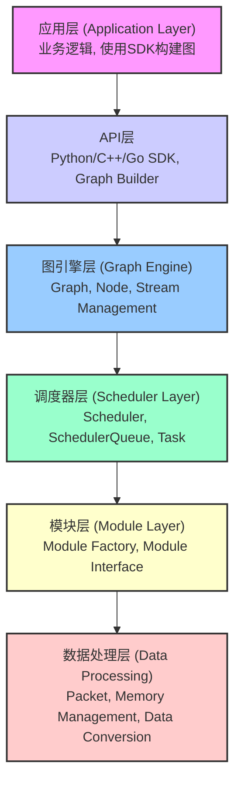
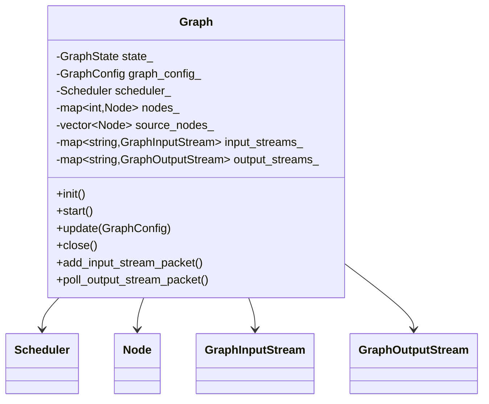
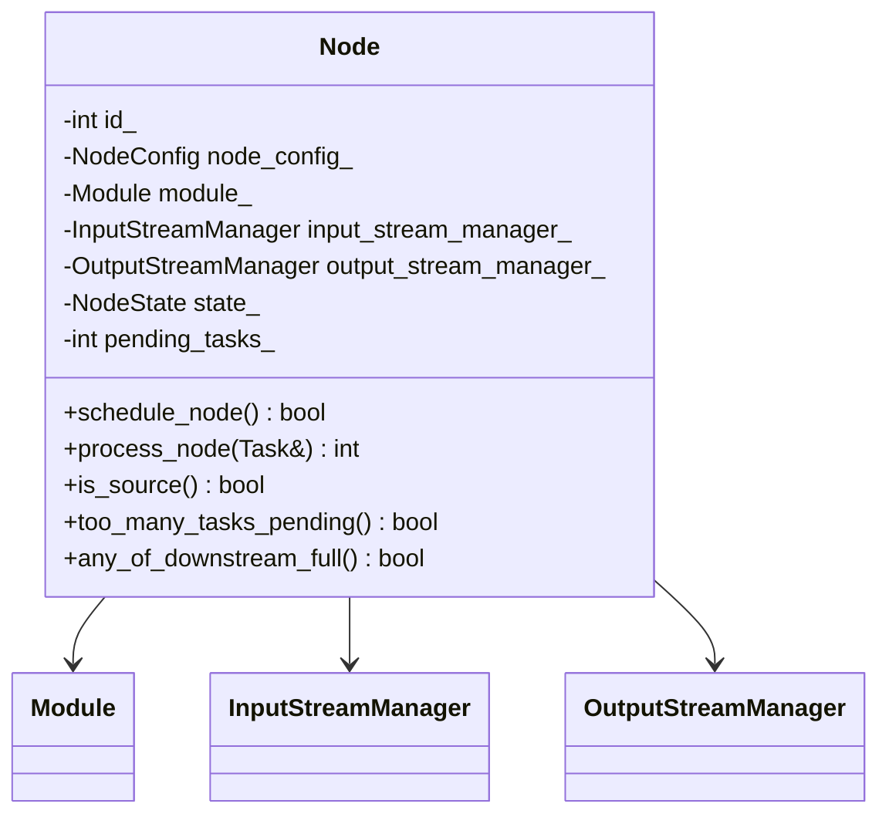
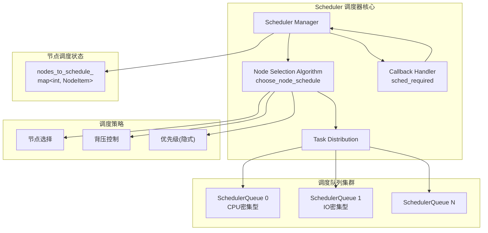
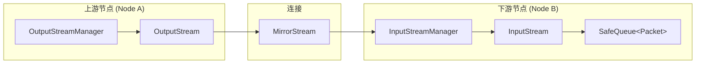
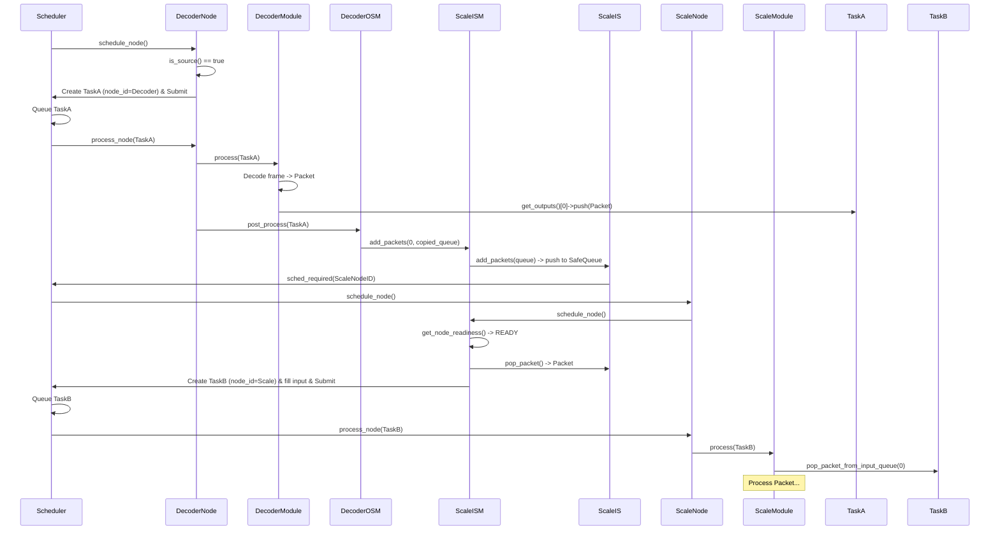

## **BMF (Babit Multimedia Framework) 学习笔记**

### **1. 引言与概述**

**BMF (Babit Multimedia Framework)** 是由字节跳动开发的一款**跨平台、多语言、可定制**的高性能多媒体处理框架。该框架具备强大的 **GPU 加速**能力，已在字节跳动内部生产环境稳定运行超过4年，日处理视频量超过20亿。

**核心特性:**

- **跨平台:** 支持 Linux, macOS, Windows (部分)。
- **多语言接口:** 提供 Python, C++, Go SDK。
- **高度可定制:** 模块化设计，易于扩展和开发自定义处理单元。
- **高性能:** 具备 GPU 加速能力，采用零拷贝等内存优化策略。
- **动态图编辑:** 支持运行时修改处理流程。

### **2. 核心概念**

理解 BMF 的基本构建块至关重要：

- **Graph (图):** 整个多媒体处理流程的抽象表示，通常是一个有向无环图 (DAG)。它是 BMF 的核心调度单元。
- **Node (节点):** 图中的基本处理单元，每个节点封装一个具体的处理逻辑（如解码、缩放、编码）。
- **Module (模块):** 节点内部实际执行处理逻辑的单元。可以是 C++, Python 或 Go 实现的，支持插件化加载。
- **Stream (流):** 连接节点的数据通道，数据以 Packet 的形式在流中传递。
- **Packet (数据包):** 在 Stream 中流动的基本数据单元。可以是视频帧 (`VideoFrame`)、音频帧 (`AudioFrame`) 或其他自定义数据。
- **Task (任务):** 调度器进行调度的基本单元。它封装了某节点一次执行所需的所有输入数据、输出队列以及节点信息。

### **3. 整体架构层次**

BMF 采用分层架构设计，各层职责分明：

Code snippet

- **应用层:** 用户使用 BMF SDK 构建具体的媒体处理应用。
- **API层:** 提供给用户的编程接口，用于构建和控制 Graph。
- **图引擎层:** 负责 Graph 的生命周期管理、节点的创建与连接、流的管理。
- **调度器层:** 核心调度逻辑，负责 Task 的创建、分发和执行。
- **模块层:** 管理 Module 的加载、创建和执行。
- **数据处理层:** 定义数据的基本单元 (Packet) 和内存管理策略。

### **4. 核心组件详解**

#### **4.1 Graph (图引擎)**

- **核心职责:** 管理整个处理流程，包括节点的生命周期、连接关系和状态。
- **关键特性:**
  - **DAG 结构:** 使用有向无环图描述处理流程。
  - **动态更新:** 支持运行时添加、删除、重置节点 (`Graph::update`)。
  - **状态管理:** 具有完整的生命周期控制（初始化、运行、暂停、关闭）。
  - **输入/输出管理:** `GraphInputStream` 和 `GraphOutputStream` 作为图与外部交互的接口。

Code snippet

#### **4.2 Node (节点)**

- **核心职责:** 封装一个 Module 实例，管理输入输出流，执行具体的处理任务。
- **关键特性:**
  - **模块封装:** 每个 Node 包含一个 Module 实例。
  - **流管理:** 独立的 `InputStreamManager` 和 `OutputStreamManager`。
  - **状态追踪:** 详细的执行状态 (`NodeState`) 监控 (NOT_INITED, RUNNING, PENDING, CLOSED)。
  - **任务计数:** `pending_tasks_` 用于背压控制。

Code snippet

#### **4.3 Scheduler (调度器)**

- **核心职责:** 决定哪个 Node 的 Task 应该被执行，并将 Task 分发给工作线程。
- **关键特性:**
  - **多队列调度:** 支持多个 `SchedulerQueue`，可用于区分不同类型的任务（CPU密集、IO密集等）。
  - **节点选择策略 (`choose_node_schedule`)**:
    - 避免调度阻塞的源节点 (`any_of_downstream_full`)。
    - 避免调度积压过多任务的节点 (`too_many_tasks_pending`)。
    - 选择最早可调度时间的节点。
  - **背压控制:** 通过检查节点状态（`too_many_tasks_pending`, `any_of_downstream_full`）来决定是否将节点加入待调度队列 (`to_schedule_queue`)。
  - **回调机制:** 通过 `SchedulerCallBack` 与 Graph 和 Node 进行通信。
  - **`sched_required`**: 关键的回调接口，由 `InputStreamManager` 或 `Node` 调用，通知调度器某个节点可能需要被调度。它会检查节点状态和上下游情况，并决定是否将节点加入调度队列。支持回溯检查上游节点，以确保数据依赖满足或在关闭时通知上游。

Code snippet

#### **4.4 Stream (流) 系统**

- **核心职责:** 定义数据如何在节点间流动。
- **关键组件:**
  - **InputStream:** 接收上游节点的数据，内部包含一个 `SafeQueue<Packet>` 用于缓冲。
  - **OutputStream:** 将处理结果发送给下游节点，通过 `MirrorStream` 连接到下游的 `InputStream`。
  - **InputStreamManager:** 管理一个节点的所有 `InputStream`，核心作用是根据配置的**同步策略**决定节点何时可以处理数据，并负责创建 `Task`。
    - **策略模式:** 提供了多种同步策略实现（均为 `InputStreamManager` 的子类）：
      - `ImmediateInputStreamManager`: 任何流有数据即可处理，低延迟。
      - `DefaultInputManager`: 基于时间戳同步，等待所有流具有相同最小时间戳的数据。
      - `ServerInputStreamManager`: 支持 EOF/EOS 处理，用于长连接服务。
      - `FrameSyncInputStreamManager`: 严格的帧级别同步，等待所有流的相同时间戳帧都到达。
      - `ClockBasedSyncInputStreamManager`: 基于一个指定的时钟流来同步其他流。
    - **成员变量**: `node_id_`, `input_streams_`(map), `callback_`, `stream_id_list_`, `upstream_nodes_`(set), `stream_done_`(map) 等，用于管理流、状态和与调度器通信。
  - **OutputStreamManager:** 管理一个节点的所有 `OutputStream`，负责将 `Task` 处理完成后的输出 `Packet` 通过 `MirrorStream` 传播给所有连接的下游 `InputStreamManager`。
    - **`post_process(Task&)`**: 从 `Task` 的 `outputs_queue_` 中取出 `Packet`，调用 `OutputStream::propagate_packets()`。
    - **`any_of_downstream_full()`**: 检查下游是否已满，用于背压。
  - **MirrorStream:** 连接 `OutputStream` 和下游 `InputStreamManager` 的结构体，包含指向下游 `InputStreamManager` 的指针和目标 `stream_id`。
- **数据流转:** `OutputStream` -> `MirrorStream` -> `InputStreamManager::add_packets` -> `InputStream::add_packets` -> `SafeQueue<Packet>`

Code snippet

#### **4.5 Packet (数据包)**

- **核心职责:** BMF 中流动的基本数据单元。
- **关键实现:**
  - **类型安全:** 可以包含 `VideoFrame`, `AudioFrame`, `BMFAVPacket`(通用FFmpeg包) 或任何自定义类型数据。
  - **时间戳:** `timestamp_` (微秒), `time_` (秒)。
  - **零拷贝:** `Packet` 内部通常使用 `std::shared_ptr` (或类似引用计数机制，如 `RefPtr<PacketImpl>`) 指向实际数据 (`VideoFrame`, `AudioFrame` 等)，避免在节点间传递时不必要的内存拷贝。
  - **`VideoFrame`**: BMF 对视频帧的封装，可以包装 CPU 或 GPU 内存 (如 `hmp::Tensor`)，包含 `pts_`, `time_base_`, 宽高，格式等信息。可以与 FFmpeg 的 `AVFrame` 或 OpenCV 的 `Mat` 互相转换。

#### **4.6 Task (任务)**

- **核心职责:** 调度器进行调度的基本单元，封装了一次节点执行所需的所有信息和数据。
- **关键结构:**
  - `node_id_` (int): **目标节点ID**。标识这个 `Task` 应该由哪个 `Node` 来处理。
  - `timestamp_` (int64_t): 时间戳，用于流同步。
  - `inputs_queue_` (`PacketQueueMap`: `map<stream_id, queue<Packet>>`): 存储本次执行所需的所有输入 `Packet`，按输入流ID组织。
  - `outputs_queue_` (`PacketQueueMap`): 存储模块处理完成后产生的输出 `Packet`，按输出流ID组织。
- **作用:**
  - **数据载体:** 聚合输入数据，暂存输出数据。
  - **调度单元:** `Scheduler` 以 `Task` 为单位进行分发。
  - **同步信令:** `timestamp_` 传递同步信息。
  - **执行上下文:** 为 `Module::process` 提供统一的输入输出接口。
- **创建时机:**
  - **源节点:** 由源节点自己在 `schedule_node()` 中创建。
  - **非源节点:** 由其 `InputStreamManager` 在 `schedule_node()` 或 `fill_task_input()` 中，当满足同步条件时创建。

#### **4.7 Module (模块)**

- **核心职责:** 执行具体的处理逻辑。
- **关键特性:**
  - **统一接口:** 所有模块（C++, Python, Go）都需实现 `init()`, `process(Task&)`, `close()` 等核心方法。
  - **插件化:** 支持动态加载。
  - **多语言:** 可以混合使用不同语言实现的模块。
  - **`process(Task&)`**: 核心处理函数，通过 `Task` 对象获取输入 `Packet`，并将处理结果 `Packet` 放入 `Task` 的输出队列。

### **5. 数据流与处理流程**

#### **5.1 图的启动流程**

1. **构建 (Application/Builder):** 用户使用 SDK 定义节点和连接，生成 `GraphConfig`。
2. **初始化 (Graph):**
   - `Graph` 对象根据 `GraphConfig` 创建 `Scheduler`。
   - 调用 `init_nodes()`，为每个 `NodeConfig` 创建 `Node` 实例。
   - `Node` 构造函数中创建 `Module` 实例、`InputStreamManager`、`OutputStreamManager`，并调用 `Module::init()`。
   - 调用 `add_all_mirrors_for_output_stream()`，根据 `GraphConfig` 中的连接信息，建立 `OutputStream` 到下游 `InputStreamManager` 的 `MirrorStream` 连接。
3. **启动 (Graph & Scheduler):**
   - `Graph::start()` 调用 `Scheduler::start()`。
   - `Scheduler` 启动工作线程。
   - `Scheduler` 将所有 **源节点 (Source Node)** 加入待调度列表 (`nodes_to_schedule_`)。
4. **运行:** 图进入等待数据或事件触发的状态。

#### **5.2 单帧数据的流转 (以 Decode -> Scale 为例)**

1. **源节点 (Decoder) 创建 Task**:
   - `Scheduler` 触发 `Decoder::schedule_node()`。
   - `Decoder` 判定自己是源节点 (`is_source()` 为 true)。
   - `Decoder` 创建一个 `Task` (`node_id` 为 Decoder 的 ID, `inputs_queue_` 为空)。
   - `Decoder` 设置 `Task` 的时间戳 (`get_source_timestamp()`)。
   - `Decoder` 通过 `callback_.scheduler_cb(task)` 将 `Task` 提交给 `Scheduler`。
2. **调度与执行 (Decoder)**:
   - `Scheduler` 将 `Task` 加入 `SchedulerQueue`。
   - 工作线程执行 `Decoder::process_node(task)`。
   - 调用 `DecoderModule::process(task)`。
3. **模块处理 (Decoder)**:
   - `DecoderModule` 读取文件，解码得到 `AVFrame`。
   - 将 `AVFrame` 转换为 BMF `VideoFrame`。
   - 将 `VideoFrame` 封装成 `Packet`。
   - 调用 `task.get_outputs()[0]->push(packet)` 将 `Packet` 放入 `Task` 的输出队列 `outputs_queue_[0]`。
4. **数据传播 (Decoder -> Scale)**:
   - `Decoder::process_node` 执行完毕后，调用 `DecoderOSM::post_process(task)`。
   - `DecoderOSM` 遍历 `task.outputs_queue_[0]`。
   - 找到连接到 `Scale` 节点的 `OutputStream`。
   - 调用 `DecoderOS::propagate_packets(queue)`。
   - `DecoderOS` 遍历 `MirrorStream`，找到指向 `ScaleISM` 的连接。
   - 调用 `ScaleISM::add_packets(0, copied_queue)`。
5. **下游接收 (Scale)**:
   - `ScaleISM` 找到 `stream_id = 0` 对应的 `ScaleIS`。
   - 调用 `ScaleIS::add_packets(copied_queue)`。
   - `Packet` 被放入 `ScaleIS` 内部的 `SafeQueue`。
   - `ScaleIS` 通过 `callback_.sched_required(scale_node_id, false)` 通知 `Scheduler`。
6. **下游调度 (Scale)**:
   - `Scheduler` 收到 `sched_required` 调用。
   - 检查 `ScaleNode` 状态 (非关闭、任务未满、下游未满)。
   - 将 `ScaleNode` 加入 `nodes_to_schedule_` 或直接放入 `SchedulerQueue`。
   - `Scheduler` 触发 `ScaleNode::schedule_node()`。
7. **下游 Task 创建 (Scale)**:
   - `ScaleNode` 调用 `ScaleISM::schedule_node()`。
   - `ScaleISM` (假设是 `DefaultInputManager`) 调用 `get_node_readiness()`，检查 `ScaleIS` (stream_id=0) 是否有数据。
   - 如果就绪，调用 `fill_task_input(task)`:
     - 创建新的 `Task` (`node_id` 为 Scale 的 ID)。
     - 从 `ScaleIS::queue_` 中 `pop_packet()`，获取解码后的 `Packet`。
     - 调用 `task.fill_input_packet(0, packet)` 将 `Packet` 放入新 `Task` 的 `inputs_queue_[0]`。
     - 通过 `callback_.scheduler_cb(task)` 将新 `Task` 提交给 `Scheduler`。
8. **下游执行 (Scale)**:
   - `Scheduler` 调度执行 `ScaleNode::process_node(task)`。
   - 调用 `ScaleModule::process(task)`，模块从 `task.inputs_queue_[0]` 获取 `Packet` 进行处理... 流程继续。

**流程图:**

Code snippet

### **6. 内存管理**

- **HMP (Heterogeneous Memory Pool):** BMF 使用 HMP 管理 CPU 和 GPU 内存，支持零拷贝数据共享。
- **引用计数:** `Packet`, `VideoFrame` 等核心数据结构使用 `shared_ptr` 或类似机制自动管理内存生命周期，避免内存泄漏和悬空指针。
- **数据转换:** 提供 CPU/GPU、不同框架（FFmpeg, OpenCV, PyTorch）之间的数据格式转换后端。

### **7. 动态图更新**

- BMF 支持在运行时修改图结构：
  - **`dynamic_add`:** 添加新的节点和连接。
  - **`dynamic_remove`:** 移除节点和连接。
  - **`dynamic_reset`:** 更新现有节点的配置 (`option`)。
- 这使得可以实现动态拉流、切换布局、调整参数等高级功能。

### **8. 实际应用案例分析 (Broadcaster Demo)**

`bmf/demo/broadcaster` 项目是理解 BMF 实际应用的好例子：

- **目标:** 实现一个多画面导播和直播推流应用。
- **核心模块:**
  - `WallClock`: 提供稳定的时间基准。
  - `StreamHub`: 核心同步模块，使用 `JitterBuffer` 缓存和对齐多路输入流，根据 `WallClock` 输出“帧组”列表。
  - `VideoLayout`: 自定义 Python 模块，接收视频帧组，使用 OpenCV (通过 `cv_frame.py`) 进行画面合成。
  - `AudioMix`: 自定义 Python 模块，接收音频帧组，使用 NumPy 进行混音。
  - `ffmpeg_decoder`/`ffmpeg_encoder`: 标准 BMF 模块。
  - `http_server`: 提供外部控制接口。
- **关键技术:**
  - **动态图操作:** 使用 `dynamic_add` 添加新源，使用 `dynamic_reset` 更新 `StreamHub` 的 `pad_infos`、`VideoLayout` 的布局参数、`AudioMix` 的音量参数。
  - **多语言混合:** Python 模块负责控制和自定义逻辑，C++ 模块负责高性能编解码。
  - **同步机制:** `WallClock` + `StreamHub` + `JitterBuffer` 确保了多路异步流的同步处理。