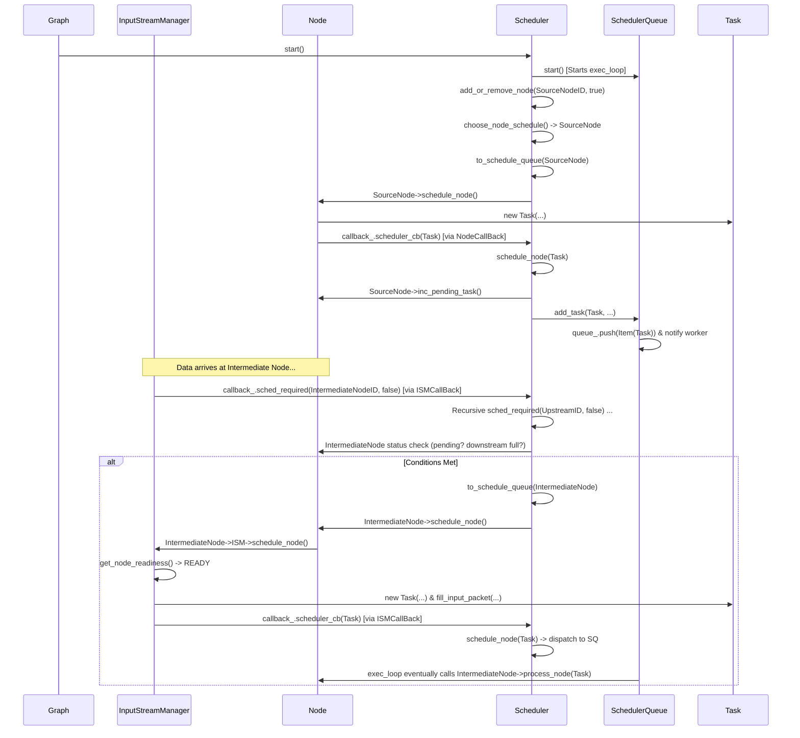

## **BMF 学习笔记: Scheduler 调度系统详解**

调度系统是 BMF 引擎的心脏，负责决定哪个 `Node` 的 `Task` 应该在何时被哪个工作线程执行。它主要由 `Scheduler` (协调器)、`SchedulerQueue` (工作单元) 和 `SafeQueue`/`SafePriorityQueue` (线程安全队列) 组成。

### **1. `SafeQueue` & `SafePriorityQueue` (`safe_queue.h`)**

#### **1.1 设计理念与核心职责**

`SafeQueue` 和 `SafePriorityQueue` 是 BMF 内部使用的基础**线程安全队列**模板类。它们为多线程环境下的数据共享提供了基本的、带锁的入队和出队操作。

1. **线程安全 (Thread Safety):**
   - 核心职责是保证多个线程可以同时对队列进行 `push` 和 `pop` 操作而不会导致数据竞争或状态损坏。
   - **为何这样设计?** BMF 的 `Scheduler` 使用多个工作线程 (`SchedulerQueue`) 并发处理 `Task`，同时 `InputStream` 也可能由不同的线程写入和读取。线程安全是必需的。
   - **实现方式:** 内部使用 `std::mutex` (`m_mutex`) 对所有公共方法（`push`, `pop`, `front`, `size`, `empty`, 赋值操作符）进行加锁 (`std::lock_guard` 或 `std::unique_lock`)。
2. **基本队列功能 (Basic Queue Functionality):**
   - `SafeQueue` 内部包装了 `std::queue`，提供先进先出 (FIFO) 的行为。
   - `SafePriorityQueue` 内部包装了 `std::priority_queue`，允许元素根据定义的比较操作符（`operator<`）进行排序。
   - **为何这样设计?** 利用标准库提供的、经过良好测试和优化的队列容器作为底层实现，减少了重复开发。
3. **可选容量限制 (Optional Capacity Limit):**
   - 提供了 `set_max_num_items()` 方法，但 `push` 操作的实现只是在 *将要* 超过限制时返回 `false`，并没有阻塞或抛出异常，所以这个限制更像是一个“建议”而非严格强制。`SafeQueue` 主要用于 `InputStream` 中，其大小限制由 `Node` 的 `max_pending_tasks_` 控制更为严格。
   - **为何这样设计?** 提供一个简单的机制来尝试限制队列大小，但 BMF 的主要反压机制依赖于 `Node` 状态检查。
4. **调试与追踪 (Debugging & Tracing):**
   - `SafeQueue` 包含 `set_identifier` 和 `BMF_TRACE_QUEUE_INFO`，用于在性能追踪中记录队列的状态。
   - **为何这样设计?** 在复杂的异步系统中，追踪队列长度对于调试性能瓶颈和死锁问题非常有帮助。

#### **1.2 核心接口与成员变量 (`SafeQueue`)**

C++

```c++
// safe_queue.h (SafeQueue 中文注释)
template <class T> class SafeQueue {
 public:
  SafeQueue() = default; // 默认构造
  SafeQueue(SafeQueue &&sq); // 移动构造
  SafeQueue(std::shared_ptr<std::queue<T>> &queue); // 从 std::queue 构造 (用于拷贝Task输出?)
  SafeQueue(const SafeQueue &sq); // 拷贝构造

  ~SafeQueue(); // 析构函数

  // 设置队列最大容量 (0表示无限制)
  void set_max_num_items(unsigned int max_num_items);
  // 设置标识符 (用于追踪)
  void set_identifier(std::string const &identifier);

  /** @brief 向队列尾部添加元素
   * @param item 要添加的元素
   * @return bool 如果队列未超限则添加成功返回 true，否则 false
   */
  bool push(const T &item);
  /** @brief 向队列尾部添加元素 (移动语义)
   */
  bool push(const T &&item);

  /** @brief 查看队首元素 (不移除)
   * @param item (输出参数) 用于接收队首元素的引用
   * @return bool 如果队列非空返回 true，否则 false
   */
  bool front(T &item);

  /** @brief 从队首移除一个元素
   * @param item (输出参数) 用于接收移除元素的引用
   * @return bool 如果队列非空则移除成功返回 true，否则 false
   */
  bool pop(T &item);

  /** @brief 获取队列当前大小
   * @return size_t 队列中的元素数量
   */
  size_t size() const;

  /** @brief 检查队列是否为空
   * @return bool 如果为空返回 true
   */
  bool empty() const;

  // 拷贝赋值与移动赋值操作符
  SafeQueue &operator=(const SafeQueue &sq);
  SafeQueue &operator=(SafeQueue &&sq);

 private:
  std::queue<T> m_queue;           // 底层 std::queue
  mutable std::mutex m_mutex;     // 互斥锁，保护 m_queue 的访问
  unsigned int m_max_num_items = 0; // 最大容量限制
  std::string identifier_;         // 队列标识符 (用于追踪)
};

// SafePriorityQueue 结构类似，但使用 std::priority_queue，提供 top() 而非 front()
```

- `SafeQueue` 是 BMF 中 `InputStream` 用于缓冲 `Packet` 的核心数据结构。
- `SafePriorityQueue<Item>` 被 `SchedulerQueue` 用于存储待执行的 `Task`（包裹在 `Item` 中）。

### **2. `SchedulerQueue` (`scheduler_queue.h`, `scheduler_queue.cpp`) - 工作单元**


#### **2.1 设计理念与核心职责**

`SchedulerQueue` 代表了一个**独立的工作线程及其关联的任务队列**。它是 BMF 调度系统中的实际**执行者**。

1. **并发执行 (Concurrent Execution):**
   - 每个 `SchedulerQueue` 实例拥有一个独立的 `std::thread` (`exec_thread_`)，负责执行分配给它的 `Task`。`Scheduler` 可以创建多个 `SchedulerQueue` 来实现任务的并行处理。
   - **为何这样设计?** 利用多核 CPU 提高处理吞吐量。可以将不同类型（如 CPU 密集 vs IO 密集）或不同优先级（虽然 BMF 优先级较弱）的任务分配到不同的队列/线程。
2. **任务排队与优先级 (Task Queuing & Priority):**
   - 内部使用 `SafePriorityQueue<Item>` 来存储待执行的任务 (`Item` 包装了 `Task` 和优先级)。
   - **为何这样设计?**
     - **队列:** 解耦任务的提交和执行。`Scheduler` 可以快速将 `Task` 放入队列，而工作线程可以按照自己的节奏取出并执行。
     - **优先级队列:** 允许对任务进行排序。BMF 中 `Item` 的 `operator<` 主要基于 `Task` 的 `timestamp_`（时间戳越小，优先级越高）和 `node_id_`（ID 越小，优先级越高，作为时间戳相同时的打破僵局规则）。这确保了 BMF 倾向于按时间顺序处理数据包。
3. **状态管理与控制 (State Management & Control):**
   - 维护自身状态 (`state_`: INITED, RUNNING, PAUSED, TERMINATING, TERMINATED)。
   - 支持暂停 (`pause()`) 和恢复 (`resume()`)。
   - **为何这样设计?** 提供了对工作线程生命周期和执行状态的精细控制，便于 `Scheduler` 和 `Graph` 进行管理（如 `Graph::pause_running`）。
4. **高效等待 (Efficient Waiting):**
   - 当任务队列为空时，工作线程 (`exec_loop`) 使用 `std::condition_variable` (`con_var_`) 和 `std::mutex` (`con_var_mutex_`) 进入**阻塞等待**状态，避免空转 CPU。当新任务通过 `add_task` 加入队列时，会 `notify_one` 唤醒等待的线程。
   - **为何这样设计?** 显著降低 CPU 消耗，提高系统效率。
5. **异常处理 (Exception Handling):**
   - 工作线程的 `exec_loop` 会捕获 `exec(Task&)` 中发生的异常。
   - 捕获到的异常指针 (`eptr_`) 会被存储，并通过 `callback_.exception_` 通知 `Scheduler`。
   - **为何这样设计?** 防止单个 `Node` 或 `Module` 的异常导致整个工作线程甚至整个 BMF 进程崩溃。将异常传递给上层（`Scheduler` -> `Graph`）进行统一处理（通常是停止整个图）。

#### **2.2 `Item` 结构与优先级**

C++

```c++
// scheduler_queue.cpp (Item 的比较操作符)
// 注意: std::priority_queue 默认是最大堆，所以 < 操作符定义的是“优先级更低”
bool operator<(const Item &lhs, const Item &rhs) {
    // 时间戳大的优先级低 (后执行)
    if (lhs.task.timestamp() > rhs.task.timestamp()) {
        return true; // lhs 优先级低于 rhs
    }
    // 时间戳相同时，节点ID大的优先级低 (后执行)
    else if (lhs.task.timestamp() == rhs.task.timestamp()) {
        if (lhs.task.node_id_ > rhs.task.node_id_)
            return true; // lhs 优先级低于 rhs
    }
    // 其他情况 lhs 优先级不低于 rhs
    return false;
}
```

- **优先级:** 时间戳小的优先，ID 小的优先。这保证了 BMF 倾向于按数据产生的顺序来处理。

#### **2.3 核心接口与成员变量**

C++

```c++
// scheduler_queue.h (关键接口和成员中文注释)
BEGIN_BMF_ENGINE_NS
USE_BMF_SDK_NS

// 任务队列中的元素，包含任务和优先级
class Item { /*...*/ Task task; int priority; /*...*/ };

// SchedulerQueue 的回调接口
class SchedulerQueueCallBack {
 public:
  // 回调: 根据 Node ID 获取 Node 实例
  std::function<int(int, std::shared_ptr<Node> &)> get_node_;
  // 回调: 向 Scheduler 报告执行 Task 时发生的异常
  std::function<int(int)> exception_; // 参数是发生异常的 Node ID
};

// 调度器队列类，代表一个工作线程
class SchedulerQueue {
 public:
  // --- 状态与控制 ---
  bool paused_ = false;       // 是否处于暂停请求状态
  State paused_state_;      // 暂停前的状态
  State state_;             // 当前队列/线程状态
  bool exception_catch_flag_ = false; // 是否已捕获异常
  std::exception_ptr eptr_;  // 捕获到的异常指针

  // --- 核心组件 ---
  int id_;                   // 队列的唯一 ID
  std::thread exec_thread_;  // 工作线程对象
  SchedulerQueueCallBack callback_; // 回调函数集合
  SafePriorityQueue<Item> queue_; // 存储待执行任务的线程安全优先队列
  std::condition_variable con_var_; // 条件变量，用于等待任务
  std::mutex con_var_mutex_;        // 配合条件变量使用的互斥锁

  // 构造函数
  SchedulerQueue(int id, SchedulerQueueCallBack callback);
  ~SchedulerQueue() = default; // 默认析构

  /** @brief 启动工作线程
   * @return 0 表示成功
   */
  int start();
  /** @brief 关闭工作线程
   * 设置状态为 TERMINATING, 唤醒线程, 等待线程结束 (join)
   * @return 0 表示成功
   */
  int close();
  /** @brief 请求暂停工作线程
   */
  void pause();
  /** @brief 恢复工作线程
   */
  void resume();

  /** @brief 向队列中添加一个任务
   * @param task 要添加的任务
   * @param priority 任务优先级 (当前实现似乎未使用?)
   * @return 0 表示成功
   */
  int add_task(Task &task, int priority);

  /** @brief (动态移除时) 从队列中移除属于特定 Node 的所有任务
   * 实现方式效率较低：弹出所有任务，过滤后重新压入。
   * @param node_id 要移除任务的节点 ID
   * @return 0 表示成功
   */
  int remove_node_task(int node_id);

 private:
  /** @brief 工作线程的主循环
   * @return 0 表示正常退出
   */
  int exec_loop();

  /** @brief 执行单个任务
   * 获取 Node 实例，调用 node->process_node(task)
   * @param task 要执行的任务
   * @return 0 表示成功
   */
  int exec(Task &task);

  /** @brief 内部暂停逻辑
   * 在 exec_loop 中被调用，实际阻塞线程直到 paused_ 变为 false
   */
  void internal_pause();

  /** @brief 从队列中弹出一个任务 (内部使用)
   * @return Item 弹出的任务项
   */
  Item pop_task(); // 注意: 返回的是 Item, 包含 Task 和 priority
};
END_BMF_ENGINE_NS
```

#### **2.4 关键实现详解 (`scheduler_queue.cpp`)**

- **`start()`**: 创建 `exec_thread_` 并运行 `exec_loop()`，设置线程名。
- **`close()`**: 设置 `state_ = State::TERMINATING`，`con_var_.notify_one()` 唤醒可能等待的线程，然后 `exec_thread_.join()` 等待线程结束。
- **`add_task()`**: 创建 `Item`，加锁 (`con_var_mutex_`)，调用 `queue_.push(item)`，然后 `con_var_.notify_one()` 唤醒工作线程。
- **`exec_loop()`**:
  - **核心循环 `while(true)`**:
    - 检查 `paused_` 状态，如果需要暂停则调用 `internal_pause()` 阻塞。
    - 检查退出条件 (`TERMINATING` 且队列空，或捕获到异常)。
    - **等待任务**: 使用 `std::unique_lock` 配合 `con_var_.wait()` 等待，条件是 `state_ == TERMINATING || !queue_.empty()`。
    - **处理任务**: 使用 `while (queue_.pop(item))` 循环处理队列中所有当前可用的任务。
    - **执行与异常捕获**: 在 `try-catch` 块中调用 `exec(item.task)`。如果捕获异常，设置 `exception_catch_flag_`，保存 `eptr_`，并通过 `callback_.exception_` 通知 `Scheduler`，然后 `break` 退出循环。
- **`exec(Task& task)`**:
  - 通过 `callback_.get_node_` 获取 `Node` 实例。
  - **调用 `node->process_node(task)` 执行核心处理逻辑**。

#### **2.5 与其他组件的交互**

- **`Scheduler`**: 创建 `SchedulerQueue`；调用 `start`, `close`, `pause`, `resume` 控制其生命周期和状态；调用 `add_task` 分配任务；通过 `SchedulerQueueCallBack::exception_` 接收异常通知。
- **`Node`**: 其 `process_node` 方法被 `SchedulerQueue::exec` 调用。
- **`Task`**: 被包裹在 `Item` 中，在 `queue_` 中存储和排序，最终被 `exec` 方法处理。
- **`SafePriorityQueue`**: 作为 `SchedulerQueue` 内部的任务存储。

### **3. `Scheduler` (`scheduler.h`, `scheduler.cpp`) - 协调器**

#### **3.1 设计理念与核心职责**

`Scheduler` 是 BMF 调度系统的**中央大脑**。它管理一个或多个 `SchedulerQueue`（工作线程），负责接收调度请求，根据一定的策略选择下一个应该被执行的 `Node`，创建并分发 `Task` 给对应的 `SchedulerQueue`。

1. **全局协调 (Global Coordination):**
   - 管理所有 `SchedulerQueue` 的生命周期和状态。
   - 维护一个**待调度节点列表 (`nodes_to_schedule_`)**，记录哪些节点可能需要被执行。
   - **为何这样设计?** 提供一个统一的视图和控制点，了解整个图的调度状态。
2. **调度决策 (Scheduling Decision):**
   - 实现 `choose_node_schedule()` 算法，根据节点状态（上次调度时间、反压状态）选择最合适的节点进行调度。
   - **为何这样设计?** 将调度策略集中在一个地方，便于修改和优化。BMF 的默认策略倾向于公平性（基于上次调度时间）并考虑反压。
3. **事件响应 (Event Response):**
   - 实现 `sched_required()` 方法，响应来自 `InputStreamManager` (数据到达) 或 `Node` (关闭) 的通知。这是驱动调度的关键入口。
   - **为何这样设计?** 实现事件驱动的调度，只有当状态变化时才触发调度检查，而不是盲目轮询。
4. **任务分发 (Task Dispatching):**
   - 当 `Node` 或 `InputStreamManager` 通过 `callback_.scheduler_cb` 提交一个 `Task` 后，`schedule_node(Task& task)` 方法负责根据 `Task` 中的 `node_id_` 找到目标 `Node`，获取其配置的 `scheduler_queue_id_`，并将 `Task` 添加到对应的 `SchedulerQueue` 中。
   - **为何这样设计?** 将 `Task` 路由到指定的执行队列，允许用户通过配置将不同节点分配给不同的线程池。
5. **反压处理与回溯 (Backpressure & Backtracking):**
   - `sched_required()` 在检查当前节点是否可调度前，会**递归调用 `sched_required()` 检查其所有上游节点**。
   - **为何这样设计 (回溯)?**
     - **传递反压信号:** 如果下游节点满了 (`any_of_downstream_full`) 或自身任务积压 (`too_many_tasks_pending`)，`sched_required` 在检查时就不会将该节点加入调度队列 (`to_schedule_queue`)。递归调用上游的 `sched_required` 实际上是将这种“暂时不可调度”的状态（或者说“调度需求”）向上传递。虽然这个实现看起来更像是“前向检查”而非严格的“反压通知”，但其效果是相似的：上游节点如果也因为下游（或下下游）的反压而无法被 `to_schedule_queue`，其自身的 `schedule_node` 就不会被调用，也就不会产生更多的数据。
     - **数据依赖确保 (隐含):** 虽然代码注释不多，但递归检查上游也可以理解为一种确保数据依赖的方式，即优先尝试调度更上游的节点，以期望它们能产生数据供下游使用。
     - **关闭通知:** 在节点关闭时 (`is_closed == true`)，`sched_required` 会显式地将所有上游节点加入调度队列 (`to_schedule_queue`)，这可能是为了让上游节点有机会处理关闭信号或剩余数据。
   - **反压检查点:** `choose_node_schedule` 和 `sched_required` 中都包含对 `too_many_tasks_pending()` 和 `any_of_downstream_full()` 的检查。
6. **超时检测 (Timeout Detection):**
   - 如果配置了 `time_out_`，会启动一个 `guard_thread_` (`alive_watch`)。
   - `to_schedule_queue` 在成功调用 `node->schedule_node` 后会更新 `last_schedule_clk_`。
   - `alive_watch` 检查当前时间与 `last_schedule_clk_` 的间隔，如果超过 `time_out_`，则认为图可能卡死，会设置异常并尝试关闭图。
   - **为何这样设计?** 防止图因死锁或其他问题完全停止运行而无法被检测到。

#### **3.2 核心接口与成员变量**

C++

```c++
// scheduler.h (关键接口和成员中文注释)
BEGIN_BMF_ENGINE_NS
USE_BMF_SDK_NS

// 存储在 nodes_to_schedule_ 中的节点信息
class NodeItem {
 public:
  NodeItem(std::shared_ptr<Node> node = nullptr);
  std::shared_ptr<Node> node_; // 节点指针
  int64_t last_scheduled_time_; // 上次尝试调度的时间 (clock())
  int nodes_ref_cnt_;          // 引用计数? (可能表示有多少事件触发了该节点的调度需求)
};

// Scheduler 的回调接口 (与 Graph 通信)
class SchedulerCallBack {
 public:
  // 回调: 根据 Node ID 获取 Node 实例
  std::function<int(int, std::shared_ptr<Node> &)> get_node_;
  // 回调: 向 Graph 报告 Node 关闭事件 (参数: node_id, is_exception)
  std::function<int(int, bool)> close_report_;
};

// 调度器核心类
class Scheduler {
 public:
  // 构造函数: 创建指定数量的 SchedulerQueue
  Scheduler(SchedulerCallBack callback, int scheduler_cnt = 1, double time_out = 0);
  ~Scheduler() = default; // 默认析构

  // --- 生命周期与控制 ---
  int start();  // 启动所有 SchedulerQueue 和 guard_thread
  int close();  // 关闭所有 SchedulerQueue 和 guard_thread
  void pause(); // 暂停所有 SchedulerQueue
  void resume();// 恢复所有 SchedulerQueue

  // --- 节点管理与调度请求 ---
  /** @brief 添加或移除需要调度的节点
   * 在图启动时添加源节点，或在 sched_required/反压解除时可能被调用(虽然主要是sched_required负责)。
   * 管理 nodes_to_schedule_ 映射和 nodes_ref_cnt_。
   * @param node_id 节点 ID
   * @param is_add true 表示添加/增加引用计数, false 表示减少引用计数/移除
   * @return 0 表示成功
   */
  int add_or_remove_node(int node_id, bool is_add);

  /** @brief 处理调度请求的核心函数 (由 ISM 或 Node 回调)
   * 检查节点状态、反压情况，并递归检查上游节点，最终决定是否调用 to_schedule_queue。
   * @param node_id 请求调度的节点 ID
   * @param is_closed 节点是否已关闭
   * @return 0 表示成功
   */
  int sched_required(int node_id, bool is_closed);

  /** @brief 选择下一个要调度的节点 (调度算法)
   * 遍历 nodes_to_schedule_，根据反压状态和 last_scheduled_time_ 选择。
   * @param start_time (似乎未使用?) 当前时间或基准时间
   * @param node (输出参数) 选择的节点指针
   * @return bool 是否成功选择了一个节点
   */
  bool choose_node_schedule(int64_t start_time, std::shared_ptr<Node> &node);

  /** @brief 尝试触发指定节点的 Task 创建
   * 调用 node->schedule_node()。
   * @param node 要尝试调度的节点
   * @return 0 表示成功 (调用完成，不代表一定创建了Task)
   */
  int to_schedule_queue(std::shared_ptr<Node> node);

  // --- 任务处理 ---
  /** @brief 接收 Node 或 ISM 创建的 Task，并分发到对应的 SchedulerQueue
   * (通过 SchedulerCallBack::scheduler_cb 被 Node/ISM 调用)
   * @param task 要调度的任务
   * @return 0 表示成功
   */
  int schedule_node(Task &task);

  /** @brief 清理指定节点在指定队列中的所有任务
   * @param node_id 节点 ID
   * @param scheduler_queue_id 队列 ID
   * @return 0 表示成功
   */
  int clear_task(int node_id, int scheduler_queue_id);

  // --- 超时检测 ---
  /** @brief 守护线程的执行函数
   * 定期检查 last_schedule_clk_ 与当前时间的间隔。
   * @return int
   */
  int alive_watch();

 public: // (部分公开成员，便于 Graph 或其他组件访问)
  bool paused_ = false; // 调度器暂停状态
  std::vector<std::shared_ptr<SchedulerQueue>> scheduler_queues_; // 管理的工作队列
  std::map<int, NodeItem> nodes_to_schedule_; // 可能需要调度的节点映射
  std::recursive_mutex node_mutex_; // 保护 nodes_to_schedule_
  std::mutex sched_mutex_;          // 保护 sched_required 中的调度决策?
  std::exception_ptr eptr_;         // 存储捕获到的异常
  bool exception_flag_ = false;     // 是否发生异常
  SchedulerCallBack callback_;      // 与 Graph 通信的回调
  double time_out_;                 // 超时阈值 (秒)
  std::thread guard_thread_;        // 守护线程
  std::chrono::steady_clock::time_point last_schedule_clk_; // 上次成功调度的时钟点

 private:
  bool thread_quit_ = false; // 控制守护线程退出
  // ... 其他内部变量 ...
};

END_BMF_ENGINE_NS
```

#### **3.3 关键实现详解 (`scheduler.cpp`)**

- **`add_or_remove_node()`**: 主要维护 `nodes_to_schedule_` 这个 map 和 `nodes_ref_cnt_`。当 `is_add` 为 true 时，会**立即尝试**调用 `choose_node_schedule` 和 `to_schedule_queue` 来调度一个节点，这看起来像是为了尽快启动处理流程或响应反压解除。
- **`sched_required()`**:
  - **核心逻辑**: 递归检查上游 -> 检查当前节点反压 -> 调用 `to_schedule_queue`。
  - **递归回溯**: `for (auto &node_id:input_stream_manager->upstream_nodes_) sched_required(node_id, false);` 这部分确保了当一个下游节点需要调度时，会先检查其所有上游节点是否也需要调度（可能是因为下游需要数据，或者上游自身也满足了调度条件）。
  - **反压检查**: `!node->too_many_tasks_pending() && !node->any_of_downstream_full()` 是关键的调度门槛。
- **`choose_node_schedule()`**: 遍历 `nodes_to_schedule_`，应用反压过滤条件，然后选择 `last_scheduled_time_` 最早的节点。更新选中节点的 `last_scheduled_time_`。
- **`to_schedule_queue()`**: 实际调用 `node->schedule_node()` 的地方。如果 `node->schedule_node()` 返回 true (表示成功创建并提交了 Task)，则更新 `last_schedule_clk_`。
- **`schedule_node(Task& task)`**: 接收 Task，根据 `task.node_id_` 找到 `Node`，获取 `node->get_scheduler_queue_id()`，然后调用 `scheduler_queues_[id]->add_task()`。
- **`alive_watch()`**: 简单的超时检查逻辑。


#### **3.4 与其他组件的交互流程图**


Code snippet



------

调度系统是 BMF 实现高性能、异步、反压控制的关键。`Scheduler` 作为中心协调者，通过 `sched_required` 响应事件，利用 `choose_node_schedule` 选择节点，并通过 `to_schedule_queue` 触发 `Node` 或 `InputStreamManager` 创建 `Task`，最终由 `schedule_node(Task&)` 将 `Task` 分发给 `SchedulerQueue` 执行。`SafePriorityQueue` 保证了任务的有序（基于时间戳）和线程安全处理。