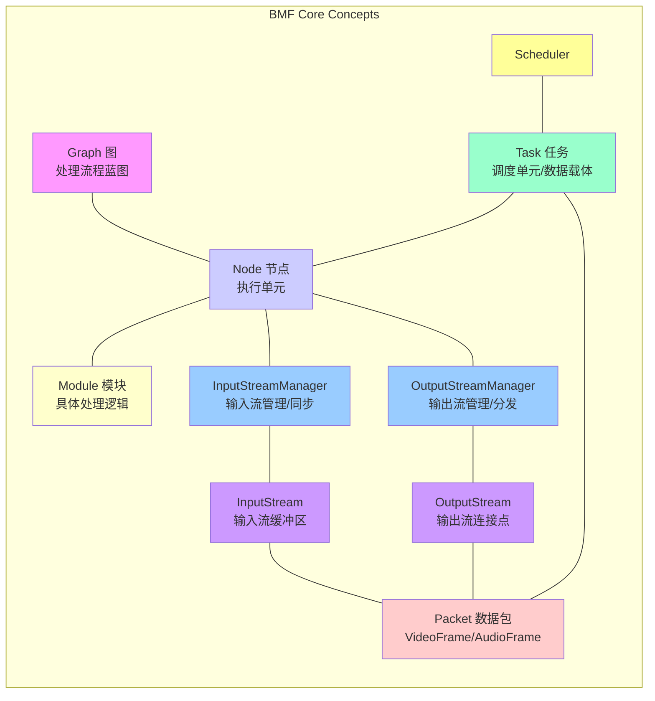
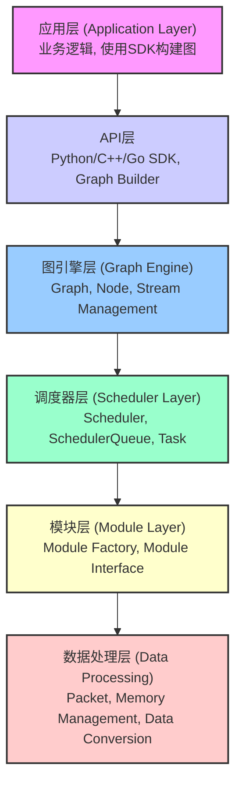
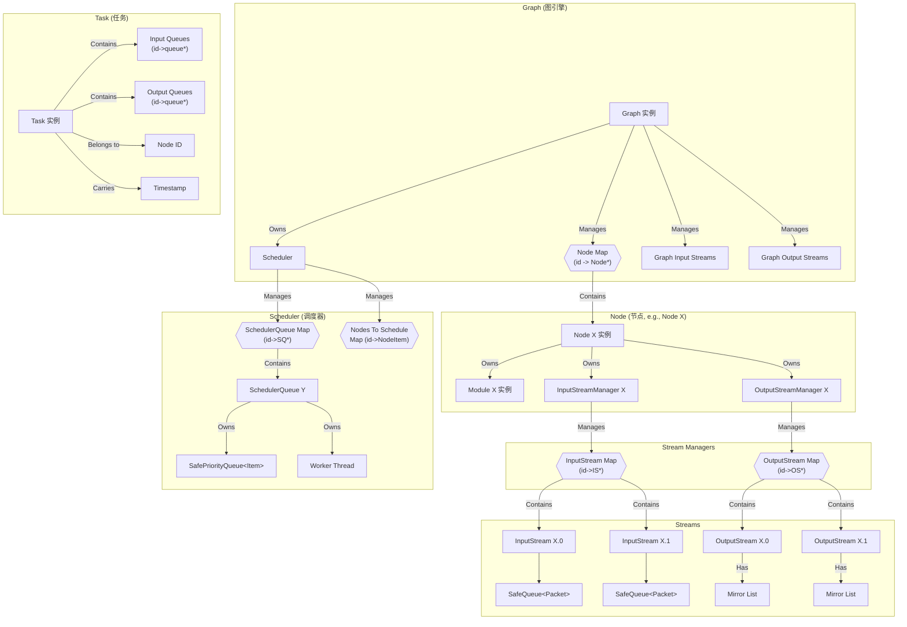
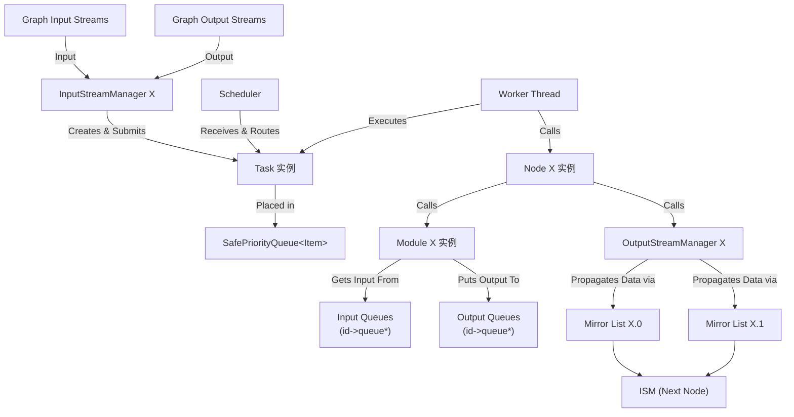
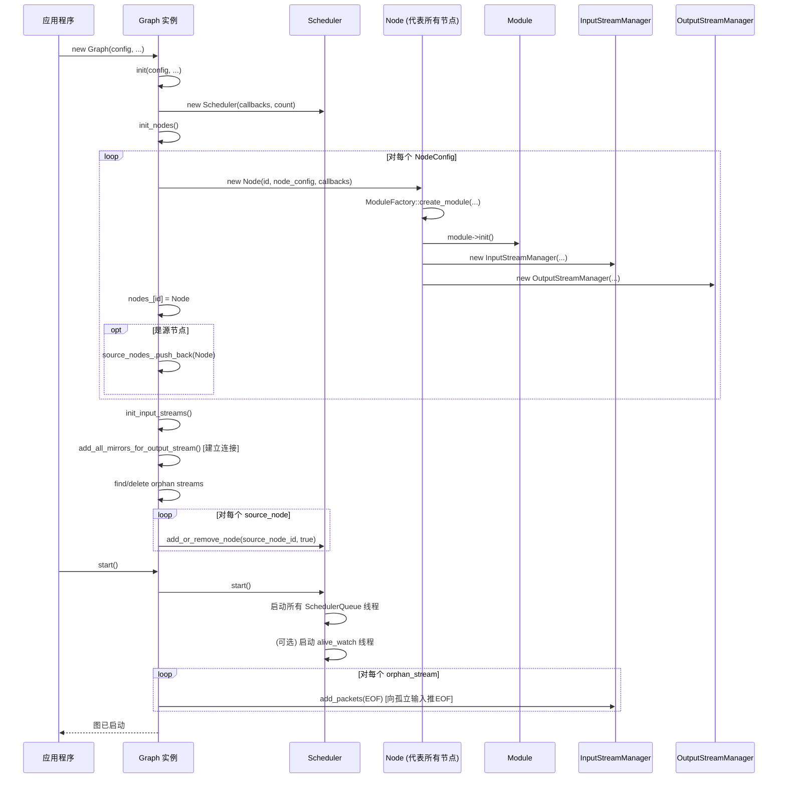
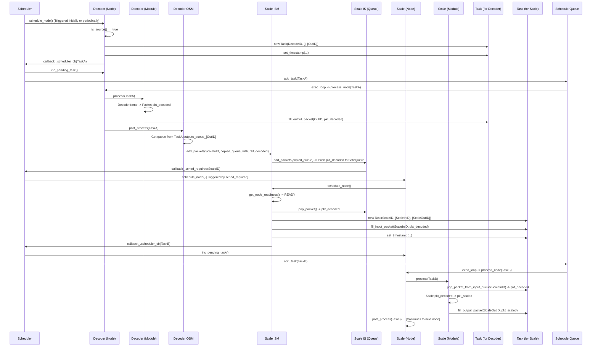
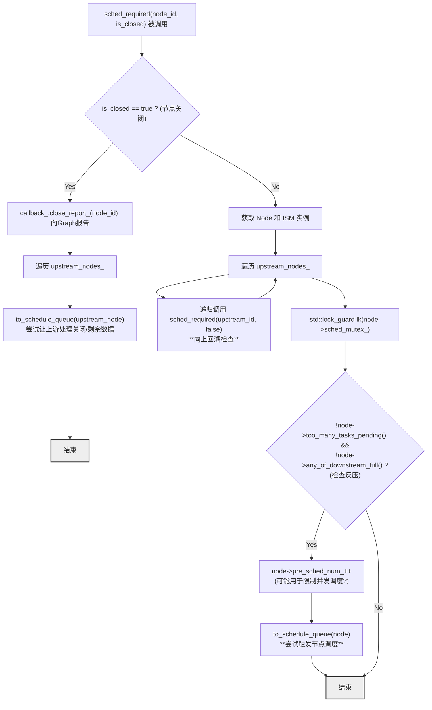

## **BMF (Babit Multimedia Framework) 深度解析学习笔记 (图文详解版)**

### **1. 引言与概述**

BMF 是一个高性能、模块化的流媒体处理框架。本笔记结合源码分析和图示，旨在清晰地展示其核心架构和工作原理。

**核心目标:** 实现高效、灵活、可扩展的流式多媒体处理。

### **2. 核心概念 (图示)**

Code snippet

### **3. 整体架构层次 (图示)**

BMF 采用清晰的分层设计：

Code snippet

### **4. 核心组件交互关系 (图示)**

这张图展示了主要组件如何协同工作：

Code snippet

### **5. 关键流程详解 (图示 + 说明)**

#### **5.1 图的初始化与启动流程**

Code snippet

**流程说明:**

1. **创建 Graph:** 应用程序根据配置创建 `Graph` 对象。
2. **核心 Init:** `Graph` 构造函数调用 `init` 方法。
3. **创建 Scheduler:** `Graph` 创建 `Scheduler` 实例，并设置好回调函数（`get_node_`, `close_report_`）。
4. **创建 Nodes:** `Graph::init_nodes` 遍历配置：
   - 为每个节点创建 `Node` 实例。
   - `Node` 构造函数负责创建 `Module` (通过 `ModuleFactory`) 并调用 `module->init()`，创建 `InputStreamManager` 和 `OutputStreamManager`。
   - 设置 `NodeCallBack` (用于 `Node` 与 `Scheduler` 通信)。
   - 将 `Node` 存入 `Graph::nodes_` map，源节点加入 `source_nodes_` 列表。
5. **创建图输入:** `Graph::init_input_streams` 创建 `GraphInputStream` 实例及其关联的虚拟 `OutputStreamManager`。
6. **建立连接:** `Graph::add_all_mirrors_for_output_stream` 遍历所有 `Node` 的 `OutputStream`，查找下游 `Node` 中标识符匹配的 `InputStream`，并创建 `MirrorStream` 连接。同时，下游 `InputStreamManager` 会记录上游节点 ID (`upstream_nodes_`)。图输入流的虚拟 `OutputStream` 也在此步骤连接到实际的下游节点。
7. **处理孤立流:** 查找并处理未连接的输入/输出流。
8. **启动 Scheduler:** `Graph::start` 调用 `Scheduler::start`，`Scheduler` 启动所有 `SchedulerQueue` 的工作线程和可选的守护线程。
9. **添加源节点:** `Graph` 将所有 `source_nodes_` 加入 `Scheduler` 的待调度列表 (`nodes_to_schedule_`)。
10. **启动完成:** 图现在准备就绪，`Scheduler` 将开始尝试调度源节点。

#### **5.2 单帧数据流转与处理 (Decode -> Scale)**

Code snippet

**流程说明:**

1. **源节点 Task 创建:** `Scheduler` 尝试调度 `DecodeNode`。`DecodeNode::schedule_node` 发现自己是源节点，创建 `TaskA` (无输入，有输出)，设置时间戳，通过回调 `scheduler_cb` 提交给 `Scheduler`。
2. **源节点 Task 执行:** `Scheduler` 将 `TaskA` 分配给一个 `SchedulerQueue`。工作线程执行 `DecodeNode::process_node(TaskA)`，进而调用 `DecodeModule::process(TaskA)`。模块解码数据，生成 `Packet pkt_decoded`，放入 `TaskA` 的输出队列 `outputs_queue_`。
3. **数据传播:** `DecodeNode` 处理完成后，调用 `DecodeOSM::post_process(TaskA)`。`DecodeOSM` 从 `TaskA` 的输出队列取出 `pkt_decoded` (通常会拷贝到一个新队列)，找到连接到下游 `ScaleISM` 的 `MirrorStream`，调用 `ScaleISM::add_packets()`。
4. **下游接收:** `ScaleISM::add_packets` 找到对应的 `ScaleIS`，调用 `ScaleIS::add_packets`，将 `pkt_decoded` 放入 `ScaleIS` 的内部 `SafeQueue`。
5. **下游调度请求:** `ScaleIS` 添加数据后，通过 `callback_.sched_required(ScaleID)` 通知 `Scheduler`。
6. **下游调度检查:** `Scheduler` 收到请求，调用 `ScaleNode::schedule_node` (间接通过 `sched_required` -> `to_schedule_queue`)。
7. **下游 Task 创建:** `ScaleNode` 调用 `ScaleISM::schedule_node`。`ScaleISM` 调用 `get_node_readiness` 检查 `ScaleIS` 是否有数据且满足同步策略。如果就绪，创建 `TaskB` (`node_id` 为 Scale 的 ID)，调用 `fill_task_input` 从 `ScaleIS` `pop` 出 `pkt_decoded` 并填充到 `TaskB` 的 `inputs_queue_`，设置时间戳，通过 `scheduler_cb` 提交 `TaskB` 给 `Scheduler`。
8. **下游 Task 执行:** `Scheduler` 将 `TaskB` 分配给 `SchedulerQueue` 执行。工作线程调用 `ScaleNode::process_node(TaskB)`，进而调用 `ScaleModule::process(TaskB)`。模块从 `TaskB` 的输入队列获取 `pkt_decoded`，处理后生成 `pkt_scaled`，放入 `TaskB` 的输出队列... 流程继续向下游传递。

#### **5.3 调度核心流程 (`sched_required`)**

`sched_required` 是驱动调度的关键，由 `InputStreamManager` (数据到达) 或 `Node` (关闭) 调用。

Code snippet

**流程说明:**

1. **判断关闭:** 如果是节点关闭通知，向 Graph 报告，并尝试调度所有上游节点。
2. **回溯上游:** 如果是正常调度请求，先递归调用 `sched_required` 检查所有直接上游节点。**为何回溯?** 可能是为了确保数据依赖的满足（优先让上游产生数据），或者是为了将反压状态向上传递（如果当前节点因为反压不能调度，上游节点在递归检查时也可能因此无法被加入队列）。
3. **检查当前节点:** 锁定节点调度锁 (`sched_mutex_`)。
4. **反压判断:** 检查当前节点是否任务积压 (`too_many_tasks_pending`) 或下游已满 (`any_of_downstream_full`)。
5. **加入调度队列 (尝试):** 如果反压条件不满足，调用 `to_schedule_queue(node)`。
6. **`to_schedule_queue()`**: 调用 `node->schedule_node()`。如果 `schedule_node` 成功创建并提交了 Task，则更新 `last_schedule_clk_` (用于超时检测)。

### **6. 内存管理与零拷贝**

- **核心:** `Packet` 和 `VideoFrame` / `AudioFrame` 内部使用 `std::shared_ptr` 或类似引用计数机制。
- **数据传递:** 当 `Packet` 在队列、`Task`、`Stream` 之间传递时，主要是智能指针的拷贝，实际的媒体数据（可能很大）**不发生拷贝**。
- **`OutputStream::propagate_packets` 中的拷贝:** 创建 `SafeQueue` 副本时，也是智能指针的拷贝，确保每个下游拿到的是指向**同一份**媒体数据的 `Packet`。
- **HMP:** BMF 底层使用 HMP 管理 CPU/GPU 内存，支持更底层的零拷贝。

### **7. 动态图编辑**

- 通过 `Graph::update(GraphConfig)` 实现。
- **`dynamic_add`:** 创建新 `Node`，并通过解析流标识符 (`alias.stream_name`) 动态地修改旧 `Node` 的 `InputStreamManager` 或 `OutputStreamManager` 来添加连接。
- **`dynamic_remove`:** 流程复杂，涉及暂停上下游节点 (`wait_paused`)，注入 `EOF`，等待数据处理完成 (`wait_on_stream_empty`)，断开连接 (`remove_stream`, `remove_upstream_nodes`)，关闭并移除节点，恢复下游节点。
- **`dynamic_reset`:** 调用 `Node::need_opt_reset()` 标记需要重置，`Node::process_node` 中检查标记并调用 `Module::dynamic_reset()`。

### **8. 总结**

BMF 通过精心设计的组件和交互机制，实现了高效、灵活、可扩展的流媒体处理：

- **Graph/Node/Module** 定义了清晰的处理结构。
- **Stream/Manager/Task** 构成了可靠的数据流转和同步机制。
- **Scheduler/Queue** 提供了异步并发执行和反压控制能力。
- **Factory/Manager/Registry** 实现了强大的模块化和插件化。
- **动态图编辑** 赋予了框架极高的灵活性。