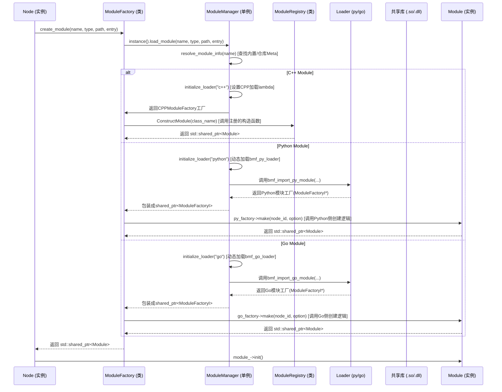

## **BMF 学习笔记: Module 接口, Factory, Manager, Registry & Functor 详解**

### **1. `bmf::sdk::Module` 接口 (`module.h` 片段)**

#### **1.1 设计理念**

`bmf::sdk::Module` 类是 BMF 框架中所有**处理单元的抽象基类**。它定义了一个**标准契约**，所有模块都必须遵守，无论其实现语言（C++、Python、Go）或具体功能（解码器、滤镜、编码器等）。

- **抽象 (Abstraction):** 将具体的处理步骤隐藏在一个通用接口之后。
- **多态 (Polymorphism):** 允许 BMF 引擎 (`Node`) 以统一的方式与不同的模块交互。
- **生命周期管理 (Lifecycle Management):** 定义了初始化、资源释放和状态重置的标准方法。
- **数据流契约 (Data Flow Contract):** 规定了模块如何通过 `Task` 对象接收输入和产生输出。

#### **1.2 核心接口方法**

```c++
// module.h (关键接口中文注释)
namespace bmf_sdk {

class BMF_SDK_API Module {
 public:
  /** @brief 构造函数
   * @param node_id 模块所属节点的唯一ID，默认为-1。
   * @param json_param 传递给模块的JSON配置选项，默认为空。
   */
  Module(int32_t node_id = -1, JsonParam json_param = JsonParam()) {
      configure_bmf_log(); // 确保日志系统已初始化
      node_id_ = node_id;   // 保存所属节点的ID
  };

  // --- 生命周期方法 ---

  /** @brief 初始化模块
   * 在模块实例创建后、处理任何数据之前调用，用于分配资源、初始化内部状态。
   * @return 0 表示成功，非 0 表示失败。
   */
  virtual int32_t init() { return 0; };

  /** @brief 重置模块
   * 将模块恢复到初始状态，以便重新使用（例如，在SERVER_MODE下处理完一个请求后）。
   * @return 0 表示成功，非 0 表示失败。
   */
  virtual int32_t reset() { return 0; };

  /** @brief 动态重置模块
   * 允许在运行时根据新的配置选项更新模块行为。
   * @param opt_reset 包含新配置选项的JsonParam。
   * @return 0 表示成功，非 0 表示失败。
   */
  virtual int32_t dynamic_reset(JsonParam opt_reset) { return 0; };

  /** @brief 关闭模块
   * 在模块不再需要时（如图关闭）调用，用于释放 init 中分配的资源。
   * @return 0 表示成功，非 0 表示失败。
   */
  virtual int32_t close() { return 0; };

  // --- 核心处理方法 ---

  /** @brief 处理传入的任务 (必须由子类实现 - 纯虚函数)
   * 模块从 task 的输入队列获取 Packet，执行处理逻辑，并将结果 Packet 放入 task 的输出队列。
   * @param task 需要处理的任务对象，包含输入/输出队列和元信息。
   * @return 0 表示成功，非 0 表示失败。
   */
  virtual int32_t process(Task &task) = 0; // 纯虚函数，子类必须实现

  // --- 可选实现的方法 ---

  /** @brief (已废弃或较少用) 通知模块进入冲洗(flush)模式
   * 用于处理模块内部可能缓存的数据。
   * @return 0 表示成功，非 0 表示失败。
   */
  virtual int32_t flush() { return 0; };

  /** @brief 获取模块期望的输入流信息 (元数据)
   * @param json_param 用于返回输入流信息的JsonParam对象。
   * @return 0 表示成功，非 0 表示失败。
   */
  virtual int32_t get_input_stream_info(JsonParam &json_param) { return 0; };
  /** @brief 设置模块的输入流信息 (由框架调用)
   * @param json_param 包含输入流信息的JsonParam对象。
   * @return 0 表示成功，非 0 表示失败。
   */
  virtual int32_t set_input_stream_info(JsonParam &json_param) { return 0; };
  /** @brief 设置模块的输出流信息 (由框架调用)
   * @param json_param 包含输出流信息的JsonParam对象。
   * @return 0 表示成功，非 0 表示失败。
   */
  virtual int32_t set_output_stream_info(JsonParam &json_param) { return 0; };
  /** @brief 获取模块期望的输出流信息 (元数据)
   * @param json_param 用于返回输出流信息的JsonParam对象。
   * @return 0 表示成功，非 0 表示失败。
   */
  virtual int32_t get_output_stream_info(JsonParam &json_param) { return 0; };

  /** @brief 获取模块自身的信息 (如版本、描述等)
   * @param json_param 用于返回模块信息的JsonParam对象。
   * @return 0 表示成功，非 0 表示失败。
   */
  virtual int32_t get_module_info(JsonParam &json_param) { return 0; };

  /** @brief 检查指定输入流是否需要进行“饥饿检查” (优化项)
   * 如果返回 true，框架可能会在调度源节点时调用 is_hungry()。
   * @param input_stream_id 输入流的ID。
   * @return bool 是否需要检查。
   */
  virtual bool need_hungry_check(int input_stream_id) { return false; };
  /** @brief 检查指定输入流当前是否“饥饿”(需要数据)
   * 用于配合 need_hungry_check，让源节点知道下游是否准备好接收数据。
   * @param input_stream_id 输入流的ID。
   * @return bool 是否需要数据。
   */
  virtual bool is_hungry(int input_stream_id) { return true; };

  /** @brief 检查模块是否为“无限”模块
   * 例如，一个循环播放或持续生成数据的模块。这会影响图的关闭逻辑。
   * @return bool 是否为无限模块。
   */
  virtual bool is_infinity() { return false; };

  /** @brief 设置一个回调函数
   * 允许模块调用 Graph 中定义的通用回调函数 (通过 ModuleCallbackLayer 传递)。
   * @param callback_endpoint 回调函数的 std::function 封装。
   */
  virtual void set_callback(std::function<CBytes(int64_t, CBytes)> callback_endpoint){};

  /** @brief 检查模块是否是一个子图 (Subgraph) 封装
   * @return bool 是否为子图。
   */
  virtual bool is_subgraph() { return false; };
  /** @brief 如果是子图，获取其内部的 Graph 配置
   * @param json_param 用于返回图配置的JsonParam对象。
   * @return bool 是否成功获取配置 (通常要求 is_subgraph() 为 true)。
   */
  virtual bool get_graph_config(JsonParam &json_param) { return false; }

  /** @brief 报告模块的统计信息 (用于监控)
   * @param json_param 用于返回统计信息的JsonParam对象。
   * @param hints 传递给统计计算的提示信息。
   * @return 0 表示成功，非 0 表示失败。
   */
  virtual int32_t report(JsonParam &json_param, int hints = 0) { return 0; };

  /** @brief 虚析构函数
   * 确保通过基类指针删除派生类对象时能正确调用派生类的析构函数。
   */
  virtual ~Module(){};

  int32_t node_id_ = -1; // 模块所属节点的ID (由Node或Factory设置)
};

} // namespace bmf_sdk
```

- **核心方法**: `init()`, `process(Task&)`, `close()` 是所有模块必须关注的。
- **动态性**: `dynamic_reset()` 提供了运行时调整行为的能力。
- **子图**: `is_subgraph()`, `get_graph_config()` 用于模块化地封装和复用整个处理流程。
- **优化**: `need_hungry_check()`, `is_hungry()` 用于特定场景下的性能优化。

### **2. `bmf_engine::ModuleFactory` (`module_factory.h`, `module_factory.cpp`)**

#### **2.1 设计理念**

`ModuleFactory` 作为创建 `Module` 实例的**统一入口点**，应用了**工厂模式**。它将 `Node`（模块的使用者）与具体的 `Module` 实现及其创建过程（可能涉及动态库加载、特定语言环境初始化等）解耦。它依赖 `ModuleManager` 来完成模块的查找和加载。

#### **2.2 核心接口与实现**

```c++
// module_factory.h & module_factory.cpp (关键部分中文注释)

class ModuleFactory {
 public:
  /** @brief 核心静态方法：创建模块实例
   * 根据提供的参数，查找、加载并实例化一个Module。
   * @param module_name 模块的类名 (例如 "CFFDecoderModule", "MyPythonModule")
   * @param node_id     将要容纳此模块的节点的ID
   * @param option      传递给模块构造函数的JsonParam配置
   * @param module_type 模块类型 ("c++", "python", "go")
   * @param module_path 模块文件/库的路径 (对于动态加载)
   * @param module_entry 模块入口点 (例如 Python: "my_module.MyClass", C++: "类名")
   * @param module (输出参数) 返回创建的模块实例的智能指针
   * @return ModuleInfo 包含解析后的模块元信息
   */
  static ModuleInfo create_module(std::string module_name, int node_id,
                                  JsonParam &option, std::string module_type,
                                  std::string module_path,
                                  std::string module_entry,
                                  std::shared_ptr<Module> &module);

  // --- 子图相关辅助方法 (内部调用 Module 的对应方法) ---
  // 获取已创建子图模块实例的内部Graph配置
  static JsonParam get_subgraph_config(std::shared_ptr<Module> module_instance);
  // 创建子图模块实例并获取其内部Graph配置 (封装了create_module和get_graph_config)
  static JsonParam create_and_get_subgraph_config(std::string module_info_str, int node_id, std::string option_str);
  // 测试已创建模块实例是否为子图
  static bool test_subgraph(std::shared_ptr<Module> module_instance);
  // 创建模块实例并测试其是否为子图 (封装了create_module和is_subgraph)
  static std::pair<bool, std::shared_ptr<Module>> create_and_test_subgraph(std::string module_info_str, int node_id, std::string option_str);
};

// --- 实现 ---
ModuleInfo ModuleFactory::create_module(/*...*/) {
    // 1. 获取 ModuleManager 单例 (负责查找和加载)
    auto &M = bmf_sdk::ModuleManager::instance();
    ModuleInfo module_info; // 用于接收模块元信息

    // 2. 调用 ModuleManager 加载模块并获取具体工厂 (ModuleFactoryI*)
    //    ModuleManager 会处理查找 (内置, 仓库), 动态加载库 (.so/.dll), 返回对应类型的工厂
    auto factory = M.load_module(module_name, module_type, module_path,
                                 module_entry, &module_info);

    // 3. 检查加载是否成功
    if (factory == nullptr) {
        throw std::runtime_error(fmt::format("创建模块 {} 失败", module_name));
    }

    // 4. 调用具体工厂 (例如 CPPModuleFactory) 的 make 方法创建 Module 实例
    //    将 node_id 和 option 传递给模块构造函数
    module = factory->make(node_id, option);

    // 5. 返回模块的元信息
    return module_info;
}

// 子图相关方法基本都是先调用 create_module，然后调用 module 实例的 is_subgraph() 或 get_graph_config()
// ... 实现细节 ...
```

- `create_module` 是最核心的方法，`Node` 在初始化时调用它来获取所需的 `Module` 实例。
- 它不直接创建 `Module`，而是委托给 `ModuleManager` 返回一个具体的工厂 (`ModuleFactoryI*`)，再调用该工厂的 `make` 方法。

### **3. `bmf::sdk::ModuleManager` (`module_manager.h`, `module_manager.cpp`)**

#### **3.1 设计理念**

`ModuleManager` 采用**单例模式**，作为 BMF 环境中所有可用模块的**中央注册中心和加载器**。它的主要职责是：

- **发现 (Discovery):** 从内置配置 (`BUILTIN_CONFIG.json`)、预定义的模块仓库 (`bmf_mods`) 以及可能的指定路径中查找可用的模块及其元信息 (`meta.info`)。
- **加载 (Loading):** 按需动态加载 C++、Python 或 Go 模块所需的共享库 (`.so`, `.dll`)。
- **解析 (Resolution):** 根据请求的模块名称，确定其正确的类型、库路径和入口点。
- **缓存 (Caching):** 缓存已加载的模块工厂 (`ModuleFactoryI*`) 和模块信息 (`ModuleInfo`)，避免重复加载和解析。
- **加载器管理 (Loader Management):** 管理不同模块类型（C++, Python, Go）的加载机制。例如，Python 加载器需要加载 `bmf_py_loader` 库并调用其导出函数来创建 Python 模块实例。

#### **3.2 核心接口与实现**

```C++
// module_manager.h & module_manager.cpp (关键部分中文注释)

class BMF_SDK_API ModuleManager {
    struct Private; // 使用 PIMPL 模式隐藏实现细节
    std::unique_ptr<Private> self;
    std::mutex m_mutex; // 保护多线程访问
    bool inited; // 初始化标记

protected:
    ModuleManager(); // 私有构造 (单例)
    void init();     // 初始化 (查找配置文件, 设置仓库路径)

public:
    // 获取全局唯一的 ModuleManager 实例
    static ModuleManager &instance();

    /** @brief 解析模块信息
     * 根据模块名称查找其完整的 ModuleInfo (类型, 路径, 入口点等)。
     * 查找顺序: 缓存 -> 内置配置 (BUILTIN_CONFIG.json) -> 仓库路径 (meta.info)
     * @param module_name 要查找的模块名称
     * @return const ModuleInfo* 如果找到则返回指针，否则返回 nullptr
     */
    const ModuleInfo *resolve_module_info(const std::string &module_name);

    /** @brief 获取所有已知的模块信息
     * 会触发一次对所有仓库的扫描以加载所有模块信息。
     * @return std::map<std::string, ModuleInfo> 模块名到信息的映射
     */
    const std::map<std::string, ModuleInfo> resolve_all_modules();

    /** @brief 加载模块并获取具体工厂接口 (ModuleFactoryI)
     * 这是 ModuleFactory::create_module 调用的核心函数。
     * 它会先解析模块信息，然后根据类型获取加载器，加载库(如果需要)，并返回工厂实例。
     * @param info 已解析或部分指定的 ModuleInfo
     * @param info_out (可选) 用于返回最终解析确认的完整 ModuleInfo
     * @return std::shared_ptr<ModuleFactoryI> 指向具体模块工厂的智能指针
     */
    std::shared_ptr<ModuleFactoryI> load_module(const ModuleInfo &info, ModuleInfo *info_out = nullptr);
    /** @brief 加载模块的重载版本 (更常用)
     * 允许只提供部分信息 (如名称)，ModuleManager 会尝试解析其余信息。
     */
    std::shared_ptr<ModuleFactoryI> load_module(
        const std::string &module_name, const std::string &module_type = {},
        const std::string &module_path = {},
        const std::string &module_entry = {}, ModuleInfo *info = nullptr);

    /** @brief 设置额外的模块仓库根目录
     * ModuleManager 会在这些目录下查找 Module_XXX/meta.info 文件。
     * @param path 仓库根目录路径
     * @return bool 是否成功添加
     */
    bool set_repo_root(const std::string &path);

    // --- 内部辅助方法 ---
    // 获取指定类型的模块加载器 (返回一个函数，该函数接收 ModuleInfo 并返回 ModuleFactoryI*)
    std::function<ModuleFactoryI *(const ModuleInfo &)> get_loader(const std::string module_type);
    // 解析 module_entry 字符串 (例如 "my_module.MyClass") 分离出文件名/模块名和类名
    std::tuple<std::string, std::string> parse_entry(const std::string &module_entry, bool file_system);
    // 根据路径推断模块类型 (c++, python, go)
    std::string infer_module_type(const std::string &path);

    // ... (JNI 和其他互斥锁) ...
};

// --- 实现细节 ---
// 初始化: 查找 BUILTIN_CONFIG.json, 设置默认仓库路径
void ModuleManager::init() { /* ... */ }

// 解析模块信息: 依次检查缓存 -> 内置 -> Meta 文件
const ModuleInfo *ModuleManager::resolve_module_info(const std::string &module_name) { /* ... */ }

// 加载模块: 解析信息 -> 检查缓存 -> 初始化加载器 -> 调用加载器 -> (可选)缓存工厂 -> 返回工厂
std::shared_ptr<ModuleFactoryI> ModuleManager::load_module(/*...*/) { /* ... */ }

// 初始化加载器: 动态加载 loader 库 (bmf_py_loader, bmf_go_loader), 设置加载 lambda
bool ModuleManager::initialize_loader(const std::string &module_type) { /* ... */ }

// CPPModuleFactory: C++ 模块的具体工厂实现 (ModuleFactoryI 的子类)
class CPPModuleFactory : public ModuleFactoryI {
    SharedLibrary lib_; // 动态库句柄 (如果需要)
    std::string class_name_; // C++ 类名
    std::string sdk_version_; // SDK 版本

public:
    CPPModuleFactory(const std::string &so_path, const std::string &class_name);
    const std::string &sdk_version() const override;
    // 核心创建方法: 调用 ModuleRegistry::ConstructModule 来实例化
    std::shared_ptr<Module> make(int32_t node_id = -1, const JsonParam &json_param = {}) override;
    const bool module_info(ModuleInfo &info) const override; // 获取元信息
};
```

- `ModuleManager` 是实现 BMF 插件化和多语言支持的关键。它通过配置文件和文件系统发现模块，并根据类型选择不同的加载策略。
- 对于 C++ 模块，它最终依赖 `ModuleRegistry` 来完成实例化。

### **4. `bmf::sdk::ModuleRegistry` (`module_registry.h`, `module_registry.cpp`)**

#### **4.1 设计理念**

`ModuleRegistry` 提供了一种**静态注册 C++ 模块构造函数**的机制。它利用 C++ 的静态初始化特性，允许模块在被链接或加载时**自动向一个全局注册表注册自己的构造函数**。

- **静态注册 (Static Registration):** 无需显式调用注册函数，模块通过在全局作用域定义 `ModuleRegister` 对象实现自注册。
- **解耦 (Decoupling):** `ModuleManager` 或 `CPPModuleFactory` 不需要知道所有 C++ 模块的具体类型，只需通过 `ModuleRegistry` 按名称查找并调用其注册的构造函数即可。
- **发现 (Discovery):** 使得链接器或动态加载器能够“发现”可用的 C++ 模块。

#### **4.2 核心接口与实现**

```c++
// module_registry.h & module_registry.cpp (关键部分中文注释)

BEGIN_BMF_SDK_NS // BMF SDK 命名空间

class BMF_SDK_API ModuleRegistry {
 public:
  // 定义构造函数指针类型: 接收 node_id 和 JsonParam, 返回 std::shared_ptr<Module>
  typedef std::shared_ptr<Module> (*Constructor)(int node_id, JsonParam json_param);

  // 定义注册表类型: 映射<模块名, pair<SDK版本, 构造函数指针>>
  typedef std::unordered_map<std::string, std::pair<std::string, Constructor>> ConstructorRegistry;

  // 获取全局唯一的注册表 (静态局部变量实现单例)
  static ConstructorRegistry &Registry();

  // 向注册表添加构造函数
  static void AddConstructor(std::string const &module_name,
                             std::string const &sdk_version,
                             Constructor constructor);

  // 根据模块名称查找并调用构造函数来创建模块实例
  static std::shared_ptr<Module> ConstructModule(std::string const &module_name,
                                                 int node_id = -1,
                                                 JsonParam json_param = JsonParam());

  // 根据模块名称获取其注册时使用的 SDK 版本
  static std::string GetModuleUsingSDKVersion(std::string const &module_name);

 private:
  ModuleRegistry() {} // 私有构造 (单例)
};

// 用于自动注册的辅助类
class BMF_SDK_API ModuleRegister {
 public:
  // 构造函数: 在全局对象构造时调用 ModuleRegistry::AddConstructor
  ModuleRegister(std::string const &module_name,
                 std::string const &sdk_version,
                 std::shared_ptr<Module> (*constructor)(int node_id, JsonParam json_param));
  // 兼容旧 SDK 版本的构造函数
  ModuleRegister(std::string const &module_name,
                 std::shared_ptr<Module> (*constructor)(int node_id, JsonParam json_param));
};

// --- 注册宏 (在模块的 .cpp 文件中使用) ---

// 注册构造函数宏: 定义一个全局 ModuleRegister 对象来实现自动注册
#define REGISTER_MODULE_CONSTRUCTOR(module_name, constructor)                  \
    static ::bmf_sdk::ModuleRegister r_constructor_##module_name(              \
        #module_name, BMF_SDK_VERSION, constructor);

// 注册类宏: 自动生成一个包装 new module_name(...) 的构造函数，并调用 REGISTER_MODULE_CONSTRUCTOR
#define REGISTER_MODULE_CLASS(module_name)                                     \
    /* 生成构造函数包装器 */                                                     \
    std::shared_ptr<::bmf_sdk::Module> Constructor_##module_name##Module(      \
        int node_id, ::bmf_sdk::JsonParam json_param) {                        \
        return std::shared_ptr<::bmf_sdk::Module>(                             \
            new module_name(node_id, json_param));                             \
    }                                                                          \
    /* 调用注册宏 */                                                             \
    REGISTER_MODULE_CONSTRUCTOR(module_name, Constructor_##module_name##Module);

// 注册模块元信息宏: 定义一个导出函数，允许 ModuleManager 获取模块的 ModuleInfo
#define REGISTER_MODULE_INFO(module_name, info)                                \
    extern "C" BMF_MODULE_EXPORT void register_##module_name##_info(           \
        ModuleInfo &info)

// 宏，用于确保静态库中的模块注册代码被链接器包含 (未使用HMP库时可能需要)
#define BMF_DECLARE_MODULE(module_name) /*...*/
#define BMF_IMPORT_MODULE(module_name) /*...*/

END_BMF_SDK_NS // BMF SDK 命名空间结束
```

- 开发者在实现 C++ 模块 `MyModule` 时，通常只需在 `my_module.cpp` 文件末尾添加 `REGISTER_MODULE_CLASS(MyModule)`。
- 当包含 `my_module.cpp` 的库被加载时，全局 `ModuleRegister` 对象会被构造，调用 `ModuleRegistry::AddConstructor`，将 `MyModule` 的构造函数指针（或包装器）存入全局注册表。
- 之后 `CPPModuleFactory` 就可以通过 `ModuleRegistry::ConstructModule("MyModule", ...)` 来创建 `MyModule` 实例了。

### **5. `bmf::sdk::ModuleFunctor` (`module_functor.h`, `module_functor.cpp`)**

#### **5.1 设计理念**

`ModuleFunctor` 提供了一种**同步调用** BMF 模块 `process` 方法的**便捷封装**。它允许你像调用普通函数一样来使用一个 BMF 模块，输入一组 `Packet`，直接得到输出的 `Packet`。

- **同步封装 (Synchronous Wrapper):** 将 BMF 异步的、基于 `Task` 的处理流程封装成一个同步的、函数式的接口。
- **简化调用 (Simplified Invocation):** 对于只需要单次、同步执行模块处理的场景（如测试、简单的脚本处理），避免了构建完整 Graph 和管理异步 `Task` 的复杂性。
- **类型安全 (Type Safety - `ModuleFunctorSafe`):** 模板化的 `ModuleFunctorSafe` 提供了编译期的类型检查，使得输入输出类型更明确。

#### **5.2 核心接口与实现**

```C++
// module_functor.h & module_functor.cpp (关键部分中文注释)
namespace bmf_sdk {

// 用于指示处理完成或遇到EOF的异常类型
class BMF_SDK_API ProcessDone : public std::runtime_error { /*...*/ };

// 核心的同步调用封装类
class BMF_SDK_API ModuleFunctor {
    struct Private; // PIMPL
    std::shared_ptr<Private> self;

  public:
    ModuleFunctor() = default;
    // 构造函数: 传入模块实例、输入流数量、输出流数量
    // 内部会调用 module->init() 并创建一个 Task
    ModuleFunctor(const std::shared_ptr<Module> &m, int ninputs, int noutputs);
    ~ModuleFunctor(); // 析构时会调用 module->close()

    // 获取内部的 Module 实例
    Module &module() const;

    // () 操作符重载: 同步执行一次 process 调用
    // 输入: vector<Packet>, 大小必须等于 ninputs
    // 输出: vector<Packet>, 大小等于 noutputs (如果某路无输出则为 nullptr Packet)
    // 可能会抛出 ProcessDone 异常
    std::vector<Packet> operator()(const std::vector<Packet> &inputs);

    /** @brief 分步执行: 先执行 process
     * @param inputs 输入 Packet 列表
     * @param cleanup 是否在执行前清理上次未 fetch 的输出 (默认为 true)
     * @return ModuleFunctor& 自身引用，支持链式调用
     */
    ModuleFunctor &execute(const std::vector<Packet> &inputs, bool cleanup = true);

    /** @brief 分步执行: 获取指定输出端口的所有 Packet
     * @param idx 输出端口索引 (从 0 开始)
     * @return std::vector<Packet> 该端口本次 execute 产生的所有 Packet
     * 可能会抛出 ProcessDone 异常 (如果遇到 EOF 且无数据)
     */
    std::vector<Packet> fetch(int idx);

    int ninputs() const; // 返回输入端口数量
    int noutputs() const; // 返回输出端口数量
    bool defined() const; // 检查是否已初始化

  private:
    // self->task: 用于 process 调用的 Task 对象
    // self->eofs: 记录每个输出端口是否已收到 EOF
};

// --- ModuleFunctorSafe: 类型安全的模板封装 ---
template <typename Inputs, typename Outputs> class ModuleFunctorSafe;

// 特化版本: Inputs 和 Outputs 都是 std::tuple
template <typename... IArgs, typename... OArgs>
class ModuleFunctorSafe<std::tuple<IArgs...>, std::tuple<OArgs...>> {
    ModuleFunctor impl; // 内部持有一个 ModuleFunctor 实例

  public:
    using Inputs = std::tuple<IArgs...>;
    using Outputs = std::tuple<OArgs...>;

    // 构造函数: 传入模块实例
    ModuleFunctorSafe(const std::shared_ptr<Module> &m);

    Module &module() const;

    // () 操作符重载: 类型安全的同步调用
    // 输入: IArgs... (直接传入参数，而非 vector<Packet>)
    // 输出: Outputs (std::tuple<OArgs...>)
    Outputs operator()(IArgs... args);

    // execute 和 fetch 的类型安全版本
    ModuleFunctorSafe &execute(IArgs... args, bool cleanup = true);
    template <int Port> auto fetch(); // 返回 vector<OArgs[Port]>

  protected:
    // ... (类型萃取和元编程辅助) ...
};

// --- 创建辅助函数 ---

// 创建类型安全的 ModuleFunctorSafe
template <typename Inputs, typename Outputs>
auto make_sync_func(const std::shared_ptr<Module> &module);

// 通过 ModuleInfo 创建类型安全的 ModuleFunctorSafe
template <typename Inputs, typename Outputs>
auto make_sync_func(const ModuleInfo &info, const JsonParam &option = {}, int32_t node_id = 0);

// 创建普通的 ModuleFunctor (需要手动指定输入输出数量)
BMF_SDK_API ModuleFunctor make_sync_func(const ModuleInfo &info,
                                         int32_t ninputs,
                                         int32_t noutputs,
                                         const JsonParam &option = {},
                                         int32_t node_id = 0);

} // namespace bmf_sdk

// --- 实现 ---
// ModuleFunctor 构造: 初始化 Private, 调用 module->init(), 创建 Task
// ModuleFunctor 析构: 调用 module->close()
// ModuleFunctor::execute: 填充 Task 输入, 清理输出(可选), 调用 module->process(), 处理异常
// ModuleFunctor::fetch: 从 Task 输出队列弹出 Packet, 处理 EOF
// ModuleFunctor::operator(): 调用 execute, 调用 fetch 获取每个输出, 处理 EOF
// make_sync_func: 调用 ModuleManager 加载模块, 创建 Functor
```

- `ModuleFunctor` 通过内部维护一个 `Task` 对象，模拟了 BMF 的 `process` 调用流程，但将其封装在一个同步接口后面。
- `execute` 对应调用 `module->process()`，`fetch` 对应从 `Task` 的 `outputs_queue_` 中取出结果。
- `operator()` 将 `execute` 和 `fetch` 组合起来，提供类似函数调用的体验。
- `ModuleFunctorSafe` 利用模板元编程提供了更方便、更安全的类型化接口。

### **6. `bmf::sdk::ModuleTag` (`module_tag.h`, `module_tag.cpp`)**

#### **6.1 设计理念**

`ModuleTag` 提供了一种**类型化的方式来标记模块的功能类别**。它使用枚举值和位运算，允许一个模块被赋予一个或多个标签。

- **分类 (Categorization):** 便于对模块进行分类管理和查找。
- **元信息 (Metadata):** 作为模块 `ModuleInfo` 的一部分，提供了关于模块用途的额外信息。
- **可组合 (Composable):** 可以使用位或 (`|`) 操作符组合多个标签。

#### **6.2 核心接口与实现**

```C++
// module_tag.h & module_tag.cpp (关键部分中文注释)
namespace bmf_sdk {

// 定义标签的基础类型为 int64_t
using module_tag_type = int64_t;

// 定义模块标签枚举 (每个标签是一个位)
enum class BMF_SDK_API ModuleTag : module_tag_type {
    BMF_TAG_NONE = 0x0,             // 无标签

    BMF_TAG_DECODER = 0x01 << 0,    // 解码器
    BMF_TAG_ENCODER = 0x01 << 1,    // 编码器
    BMF_TAG_FILTER = 0x01 << 2,     // 滤镜
    BMF_TAG_MUXER = 0x01 << 3,      // 复用器 (封装)
    BMF_TAG_DEMUXER = 0x01 << 4,    // 解复用器 (解封装)
    BMF_TAG_IMAGE_PROCESSOR = 0x01 << 5, // 图像处理
    BMF_TAG_AUDIO_PROCESSOR = 0x01 << 6, // 音频处理
    BMF_TAG_VIDEO_PROCESSOR = 0x01 << 7, // 视频处理
    BMF_TAG_DEVICE_HWACCEL = 0x01 << 8, // 设备/硬件加速
    BMF_TAG_AI = 0x01 << 9,         // AI 相关
    BMF_TAG_UTILS = 0x01 << 10,     // 工具类

    // 特殊标记位 (可能未使用或内部保留)
    BMF_TAG_DONE = 0x01LL << (sizeof(module_tag_type) * 8 - 1),
};

// 重载位或操作符 | 和 |= 以组合标签
ModuleTag BMF_SDK_API operator|(ModuleTag tag1, ModuleTag tag2);
ModuleTag BMF_SDK_API operator|=(ModuleTag &tag1, ModuleTag tag2);
// 重载流输出操作符 << 以方便打印标签组合
std::ostream BMF_SDK_API &operator<<(std::ostream &os, const ModuleTag &tag);

} // namespace bmf_sdk

// --- 实现 ---
// 操作符实现: 简单地进行位或运算
// 流输出实现: 遍历预定义的标签->字符串映射，打印所有匹配的标签名称
```

- `ModuleTag` 主要用于在 `ModuleInfo` 中提供模块的分类信息，方便用户或工具理解模块的功能。

### **7. 交互流程总结图**

Code snippet

