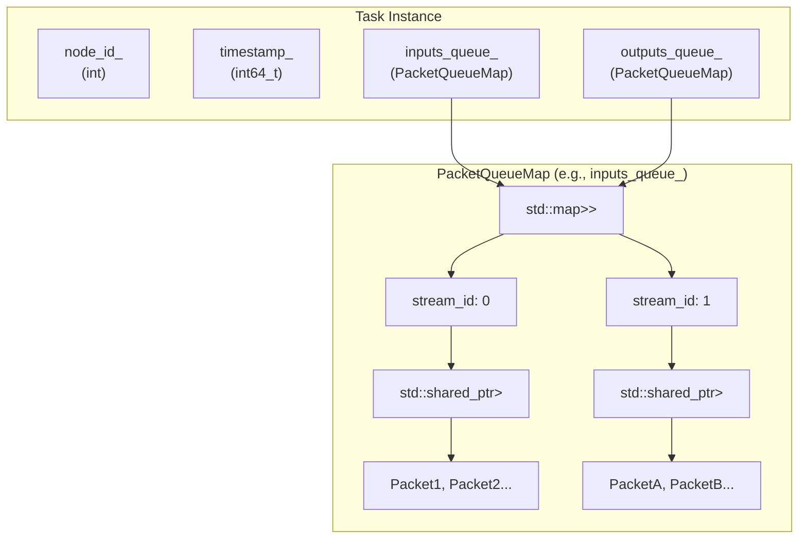
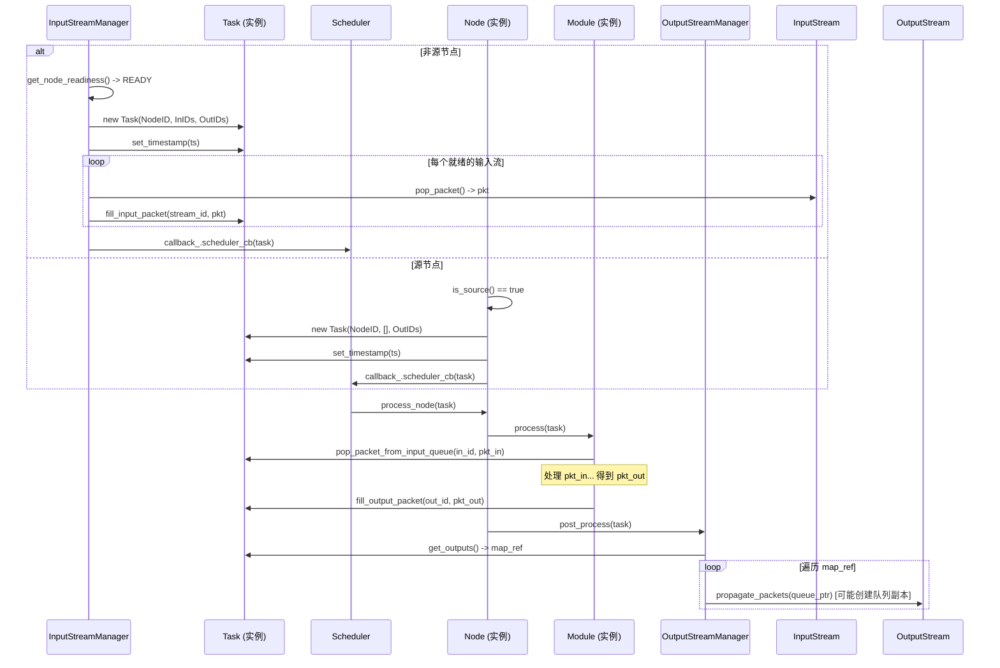

## **BMF 学习笔记: Task 组件详解 (`task.h` & `task.cpp`)**

### **1. 设计理念与核心职责**

`Task` 类是 BMF 引擎中**数据流转和调度执行的基本载体**。它封装了 `Node`（节点）**一次**处理所需的所有信息和数据。其设计理念围绕以下核心职责：

1. **数据聚合器 (Data Aggregator):**
   - `Task` 负责**收集**来自一个或多个输入流 (`InputStream`) 的数据包 (`Packet`)，并将它们组织起来，准备交给 `Module` 处理。
   - **为何这样设计?** 将一次处理所需的所有输入数据打包在一起，简化了 `Module` 的处理接口。`Module` 无需关心数据来自哪个流、何时到达，只需从 `Task` 中按需获取即可。
2. **执行上下文 (Execution Context):**
   - `Task` 包含了执行本次处理所需的环境信息，最重要的是**目标节点ID (`node_id_`)** 和**时间戳 (`timestamp_`)**。
   - **为何这样设计?** `node_id_` 告诉 `Scheduler` 和 `Node` 这个 `Task` 应该由谁来执行。`timestamp_` 则用于多流同步和处理过程中的时间信息传递。
3. **结果暂存器 (Result Buffer):**
   - `Module` 处理完成后，将产生的输出 `Packet` 放入 `Task` 内部的输出队列中。`Task` 负责**暂存**这些结果，直到 `Node` 处理完毕后交由 `OutputStreamManager` 进行分发。
   - **为何这样设计?** 提供了一个临时的存储空间，使得 `Module` 的输出可以先收集起来，再一次性交给下游处理机制，简化了数据传递逻辑。
4. **调度单元 (Scheduling Unit):**
   - `InputStreamManager` 在判断数据满足处理条件后创建 `Task`，并将其提交给 `Scheduler`。`Scheduler` 以 `Task` 为单位进行排队和分发。
   - **为何这样设计?** 将具体的处理请求（包括数据和上下文）封装成一个独立的单元，便于调度器进行统一管理、排序和执行。

### **2. 核心结构详解 (`task.h`)**

```c++
// task.h (关键结构中文注释)
BEGIN_BMF_SDK_NS // BMF SDK 命名空间

// 定义 Packet 队列映射类型: map<stream_id, shared_ptr<queue<Packet>>>
typedef std::map<int, std::shared_ptr<std::queue<Packet>>> PacketQueueMap;

class BMF_SDK_API Task {
  public:
    /** @brief 构造函数
     * @param node_id 目标节点的ID，默认为-1。
     * @param input_stream_id_list 该节点所有输入流的ID列表。
     * @param output_stream_id_list 该节点所有输出流的ID列表。
     */
    Task(int node_id = -1, std::vector<int> input_stream_id_list = {},
         std::vector<int> output_stream_id_list = {});

    // --- 拷贝与移动语义 ---
    Task(const Task &rhs);              // 拷贝构造函数
    Task(Task &&rhs);                   // 移动构造函数
    Task &operator=(Task rhs);          // 拷贝/移动赋值操作符 (copy-and-swap)
    friend BMF_SDK_API void swap(Task &target, Task &source); // Swap 函数

    /** @brief 向指定的输入流队列填充一个 Packet
     * 由 InputStreamManager 在创建 Task 时调用。
     * @param stream_id 目标输入流的 ID。
     * @param packet 要填充的 Packet 对象。
     * @return bool 成功返回 true，如果 stream_id 无效则返回 false。
     */
    bool fill_input_packet(int stream_id, Packet packet);

    /** @brief 向指定的输出流队列填充一个 Packet
     * 由 Module::process() 调用，用于存放处理结果。
     * @param stream_id 目标输出流的 ID。
     * @param packet 要填充的 Packet 对象。
     * @return bool 成功返回 true，如果 stream_id 无效则返回 false。
     */
    bool fill_output_packet(int stream_id, Packet packet);

    /** @brief 从指定的输出流队列弹出一个 Packet
     * 通常由 OutputStreamManager::post_process() 调用，用于向下游传播。
     * @param stream_id 目标输出流的 ID。
     * @param packet (输出参数) 弹出的 Packet 对象。
     * @return bool 成功弹出返回 true，如果队列为空或 stream_id 无效则返回 false。
     */
    bool pop_packet_from_out_queue(int stream_id, Packet &packet);

    /** @brief 从指定的输入流队列弹出一个 Packet
     * 由 Module::process() 调用，用于获取输入数据。
     * @param stream_id 目标输入流的 ID。
     * @param packet (输出参数) 弹出的 Packet 对象。
     * @return bool 成功弹出返回 true，如果队列为空或 stream_id 无效则返回 false。
     */
    bool pop_packet_from_input_queue(int stream_id, Packet &packet);

    /** @brief 检查指定的输入流队列是否为空
     * @param stream_id 输入流 ID。
     * @return bool 如果队列为空或 stream_id 无效则返回 true。
     */
    bool input_queue_empty(int stream_id);
    /** @brief 检查指定的输出流队列是否为空
     * @param stream_id 输出流 ID。
     * @return bool 如果队列为空或 stream_id 无效则返回 true。
     */
    bool output_queue_empty(int stream_id);

    /** @brief 获取 Task 的时间戳
     * @return int64_t 时间戳 (通常是微秒，或特殊值如 BMF_EOF, EOS, DONE)。
     */
    int64_t timestamp() const;
    /** @brief 设置 Task 的时间戳
     * 由 InputStreamManager 或源 Node 在创建 Task 时设置。
     * @param t 时间戳。
     */
    void set_timestamp(int64_t t);

    /** @brief 获取输入队列映射的引用
     * @return PacketQueueMap& 输入队列 map 的引用。
     */
    PacketQueueMap &get_inputs();
    /** @brief 获取输出队列映射的引用
     * @return PacketQueueMap& 输出队列 map 的引用。
     */
    PacketQueueMap &get_outputs();

    /** @brief 获取所有输入流的 ID 列表
     * @return std::vector<int> 输入流 ID 列表。
     */
    std::vector<int> get_input_stream_ids();
    /** @brief 获取所有输出流的 ID 列表
     * @return std::vector<int> 输出流 ID 列表。
     */
    std::vector<int> get_output_stream_ids();

    /** @brief 获取该 Task 归属的节点 ID
     * @return int 节点 ID。
     */
    int get_node();

    /** @brief (私有或保护) 初始化函数
     * 在构造函数中被调用，创建输入输出队列映射。
     */
    void init(int node_id, std::vector<int> input_stream_id_list,
              std::vector<int> output_stream_id_list);

  public: // (通常应为 private，但 BMF SDK 中设为 public)
    int64_t timestamp_ = UNSET;    // Task 的时间戳，默认为 UNSET (-1)
    int node_id_;                 // Task 归属的目标节点 ID
    PacketQueueMap inputs_queue_; // 输入 Packet 队列映射 (stream_id -> queue<Packet>)
    PacketQueueMap outputs_queue_; // 输出 Packet 队列映射 (stream_id -> queue<Packet>)
};

END_BMF_SDK_NS // BMF SDK 命名空间结束
```

**核心成员变量可视化:**

Code snippet



### **3. 关键实现详解 (`task.cpp`)**

- **构造函数 & `init()`**:
  - `Task(int node_id, ...)` 调用 `init()`。
  - `init()`:
    - 保存 `node_id`。
    - 初始化 `timestamp_` 为 0 (注意 `task.h` 默认是 `UNSET`, cpp 设为 0，实际会被 `set_timestamp` 覆盖)。
    - **关键:** 遍历 `input_stream_id_list` 和 `output_stream_id_list`。
    - 对于每个 `stream_id`，创建一个 `std::make_shared<std::queue<Packet>>()`。
    - 将 `stream_id` 和对应的 `queue` 智能指针插入 `inputs_queue_` 或 `outputs_queue_` map 中。
  - **为何使用 `shared_ptr<queue>`?** 允许多个地方（如 Task 内部操作和 OutputStreamManager 读取）共享同一个队列的引用，虽然 `task.cpp` 的 `pop_packet_from_out_queue` 似乎是直接操作 `outputs_queue_`，但在 `OutputStreamManager::post_process` 中创建了 `SafeQueue` 的**副本**，可能这里的 `shared_ptr` 更多是为了接口统一或历史原因，需要结合 `post_process` 的实现来看。不过，使用 `std::queue` 本身意味着这些队列**不是线程安全的**，对 Task 的并发访问需要外部（如 Node 的锁）来保证。
- **拷贝与移动语义**:
  - 提供了拷贝构造、移动构造、拷贝/移动赋值操作符，并使用 `swap` 函数实现 (Copy-and-Swap Idiom)。
  - **为何这样设计?** 保证了 Task 对象可以被安全、高效地复制和移动，这在异步框架中传递对象时很重要。移动语义可以避免不必要的深拷贝开销。
- **`fill_input_packet(int stream_id, Packet packet)`**:
  - 通过 `inputs_queue_.find(stream_id)` 查找对应的队列。
  - 如果找到，调用 `it->second->push(packet)` 将 Packet 放入队列。
  - 返回查找是否成功。
- **`fill_output_packet(int stream_id, Packet packet)`**:
  - 逻辑与 `fill_input_packet` 类似，操作 `outputs_queue_`。
- **`pop_packet_from_input_queue(int stream_id, Packet &packet)`**:
  - 查找对应的输入队列 `q = it->second`。
  - 检查队列是否为空 (`q->empty()`)。
  - 如果非空，`packet = q->front()` 获取队首元素，`q->pop()` 移除队首元素。
  - **包含性能追踪**: `BMF_TRACE_THROUGHPUT(stream_id, node_id_, q->size());` 记录弹出操作。
  - 返回是否成功弹出。
- **`pop_packet_from_out_queue(int stream_id, Packet &packet)`**:
  - 逻辑与 `pop_packet_from_input_queue` 类似，操作 `outputs_queue_`，但不包含性能追踪。
- **`input_queue_empty()` / `output_queue_empty()`**:
  - 查找对应队列并调用其 `empty()` 方法。
- **`timestamp()` / `set_timestamp()`**:
  - 简单的 getter 和 setter。
- **`get_input_stream_ids()` / `get_output_stream_ids()`**:
  - 遍历对应的 `queue` map，收集所有的 `key` (stream_id) 并返回。
- **`get_inputs()` / `get_outputs()`**:
  - 返回 `inputs_queue_` 或 `outputs_queue_` map 的**引用**。这允许 `Module` 或 `OutputStreamManager` 直接访问和操作这些队列。
- **`get_node()`**:
  - 返回 `node_id_`。

### **4. 与其他组件的交互流程图**

Code snippet



### **5. 总结**

- `Task` 是 BMF 中流转于 `InputStreamManager`、`Scheduler`、`Node`、`Module` 和 `OutputStreamManager` 之间的**核心数据结构**。
- 它**封装**了节点一次执行所需的所有**上下文**（节点ID、时间戳）和**数据**（输入Packet队列、输出Packet队列）。
- 其设计使得**模块处理逻辑** (`Module::process`) 与**框架的调度和流转机制**解耦。
- 通过 `node_id_` 确保任务被**正确路由**到目标节点。
- 通过 `timestamp_` 支持各种**流同步**策略。
- 内部使用 `std::map` 和 `std::queue` 来组织 `Packet`，提供了按 `stream_id` 访问数据的接口。注意内部队列**非线程安全**，依赖外部（如 `Node` 的锁）保证。

