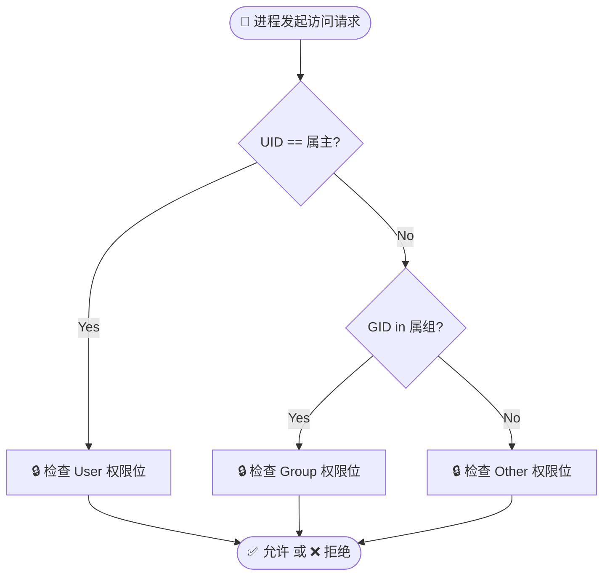

---

# 🛡️ Linux 权限管理与访问控制

> ℹ️ **定义**：Linux 采用 **DAC (Discretionary Access Control)** 自主访问控制模型。一切皆文件，系统通过**UGO（身份）**与**rwx（模式）**的矩阵匹配，决定当前进程是否有权操作目标 inode。

## 🧩 1. 权限位深度解剖 (Anatomy)

通过 `ls -l` 查看的 10 位字符，实质上是文件元数据（Metadata）的直观映射。

### 权限字符串结构

`drwxr-x---`

|**位置**|**字符**|**含义**|**架构师注解**|
|---|---|---|---|
|**第 1 位**|`d` / `-` / `l`|**文件类型**|`d`=目录, `-`=文件, `l`=软链, `s`=套接字|
|**2-4 位**|`rwx`|**User (属主)**|文件的创建者/拥有者，权限优先级最高 (Top Priority)。|
|**5-7 位**|`r-x`|**Group (属组)**|协作组权限。用于团队共享目录配置。|
|**8-10 位**|`---`|**Other (其他人)**|既非属主也非组成员的“路人”。通常设为只读或无权限。|

### 👮 权限判定流程图 (Check Logic)

系统判断权限时是**短路逻辑**（即匹配即停），不会叠加。



---

## ⚙️ 2. 权限矩阵：文件 vs 目录 (Specs)

最容易混淆的知识点。**目录的权限控制的是“索引”，文件的权限控制的是“数据”。**

|**权限位**|**值 (Octal)**|**对文件 (File) 的意义**|**对目录 (Directory) 的意义**|**⚠️ 关键坑点**|
|---|---|---|---|---|
|**r (Read)**|**4**|查看文件内容<br><br>  <br><br>(`cat`, `vim`)|列出目录内的文件名<br><br>  <br><br>(`ls`)|有 `r` 无 `x` 的目录，只能看文件名，看不了文件属性（会显示全问号 `????`）。|
|**w (Write)**|**2**|修改文件内容<br><br>  <br><br>(`echo`, `save`)|**修改目录结构**<br><br>  <br><br>(`touch`, `rm`, `mv`)|**删除文件不需要文件的 w 权限，而是需要父目录的 w 权限！**|
|**x (Exec)**|**1**|作为程序运行<br><br>  <br><br>(`./script.sh`)|**进入/穿越目录**<br><br>  <br><br>(`cd`, 访问内部文件)|**没有 `x` 权限，你甚至进不去目录，有 `r` 也没用。**|

---

## 🛠️ 3. 实战命令速查 (Cheatsheet)

### 身份修改：`chown` (Change Owner)

用于交接“资产”。

```shell
# 1. 仅修改属主
chown lyc file.txt

# 2. 仅修改属组 (注意冒号)
chown :dev_team file.txt

# 3. 🚀 [最常用] 同时修改属主和属组
chown lyc:dev_team file.txt

# 4. 递归修改整个目录 (常用于部署 Web 服务)
chown -R www:www /var/www/html
```

### 模式修改：`chmod` (Change Mode)

#### 方案 A：数字法 (Octal Mode) - **推荐，速度快**

记忆口诀：**读4 写2 执行1**。

|**场景**|**推荐配置**|**解释**|
|---|---|---|
|**私密密钥文件**|`600`|`rw-------` (仅自己读写，别人无权)|
|**标准配置文件**|`644`|`rw-r--r--` (自己读写，别人只读)|
|**可执行脚本**|`755`|`rwxr-xr-x` (自己全权，别人可执行但不可改)|
|**Web 根目录**|`755`|属主运维可改，Nginx 进程可读可进。|
|**危险目录**|`777`|`rwxrwxrwx` (所有人可改可删，**生产环境严禁**)|


```shell
chmod 755 script.sh
chmod -R 644 /etc/my-app/conf
```

#### 方案 B：符号法 (Symbolic Mode) - **适合微调**

语法：`[u/g/o/a] [+/-/=] [r/w/x]`

```shell
# 给脚本赋予执行权限 (所有人)
chmod +x init.sh

# 禁止其他人查看配置文件
chmod o-r secret.yaml

# 强制重置权限
chmod u=rw,go=r file.txt
```

---

## ⚠️ 避坑指南 (Best Practices)

### 1. 著名的 "rm" 悖论

- **现象**：我想删除文件 `a.txt`，但我对 `a.txt` 没有写权限，系统提示 "Override rw-r--r--?"，我输入 `y` 居然删掉了。
    
- **原理**：删除文件本质上是**修改了父目录的索引块**。只要你对**目录**有 `w` 权限，你就能删除目录下的任何文件（无论该文件归谁所有）。
    
- **防护**：如果目录需要共享协作，但防止互删，需要设置 **Sticky Bit**（粘滞位，`chmod +t dir`），如 `/tmp` 目录。
    

### 2. 目录的 "rx" 绑定关系

- 对于目录，`r` 和 `x` 通常是共存的。
    
    - 只有 `r` 无 `x`：能 `ls` 看到文件名，但全是乱码报错，进不去。
        
    - 只有 `x` 无 `r`：能 `cd` 进去，但 `ls` 空白。如果你知道具体文件名，可以访问。
        
- **结论**：给目录权限时，一般直接给 `5 (r-x)` 或 `7 (rwx)`，极少给 `4` 或 `2`。
    

### 3. Root 的特权

- `root` 用户无视上述所有 `r` 和 `w` 限制。
    
- 但 `root` 默认也不执行没有 `x` 权限的文件（防止误运行文本文件）。
    

### 4. 默认权限 (Umask)

- 为什么新建文件默认是 `644`，新建目录是 `755`？
    
- 这是由 `umask` 决定的（通常是 `0022`）。
    
- 计算公式：`默认权限 = 最大权限 (666/777) - umask`。