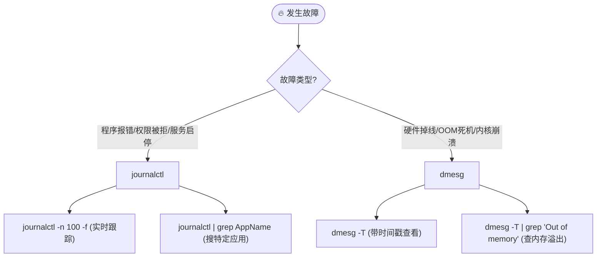

---

# 🐧 Linux 运维与开发

> 💡 **核心用途**：从底层内核日志分析到上层应用服务部署，全链路覆盖。适用于现场调试、服务部署及故障排查。

## 📊 第一章：系统状态与磁盘管理 (System & Disk)

### 1. 系统信息速查

快速确认环境版本，防止因架构不同（x86/ARM）导致的兼容性问题。

```shell
lscpu                   # 🧠 查看CPU架构、核心数、线程数
uname -a                # 🐧 查看内核版本
lsb_release -a          # 📦 查看发行版详细信息 (如 Ubuntu 20.04)
# 或者
cat /etc/os-release     # 通用查看发行版信息
```

### 2. 磁盘与分区

```shell
lsblk -f                # 🌳 树状列出块设备及文件系统类型 (最直观)
df -h                   # 💾 查看磁盘挂载点及剩余空间 (Human readable)
sudo fdisk -l           # ⚙️ 查看物理分区表详细信息
```

---

## 🚀 第二章：进程管理与调试 (Process & Debug)

### 1. 进程监控与查找

```shell
# 🔍 查找特定进程 (如 nginx)
ps aux | grep nginx

# 👁️ 实时监控进程生成 (监控 cmd 中包含 pgrep 的进程)
# -n 0.001 表示极速刷新
watch -n 0.001 "ps -eo pid,ppid,cmd | grep '[p]grep -f'"
```

### 2. 后台运行 (防止终端关闭服务断开)

> ⚠️ **注意**：`nohup` 用于忽略挂起信号，`&` 用于放入后台，`>/dev/null 2>&1` 用于丢弃输出防止日志塞满磁盘。

```shell
# 标准后台启动模板
nohup ./ffmpeg -re -stream_loop -1 -i input.mp4 \
  -c copy -f rtsp rtsp://127.0.0.1/live/test \
  >/dev/null 2>&1 &
```

### 3. core文件生成

```shell
#移除core文件大小的限制，让系统在必要时可以生成core dump。
ulimit -c unlimited 

#设置core文件的输出目录
echo "core.%e.%p" | sudo tee /proc/sys/kernel/core_pattern 
```

### 4. 崩溃定位 (Addr2line)

当程序崩溃只有堆栈地址偏移量时，使用此命令定位代码行号。

```shell
# -e: 可执行文件, -f: 函数名, -C: 反混淆(Demangle), -p: 漂亮打印
# +0x... 后面跟偏移地址
addr2line -e ./mts -f -C -p -i -a +0x1c814ac
```

---

## 🌐 第三章：网络配置与分析 (Network)

### 1. 网络抓包与探测 (Troubleshooting)

```shell
# 📡 端口占用查看 (如查看 22003 端口)
netstat -anp | grep 22003

# 🦈 TCPDump 抓包
# 场景A：抓本地回环 (localhost通信)
sudo tcpdump -i lo -nn tcp port 10084 -w loopback.pcap

# 场景B：抓任意网卡 (对外通信)
sudo tcpdump -i any -nn -w external.pcap
```

### 2. Curl 接口测试 (API Testing)

> 💡 **坑点提示**：Windows CMD/PowerShell 对单引号处理与 Linux 不同，需转义双引号。

**Linux / macOS / Git Bash:**

```shell
curl -X POST -H "Content-Type: application/json" \
     -d '{ "secret": "your-uuid-code" }' \
     http://192.168.20.78:9000/api/task
```

**Windows CMD / PowerShell:**

```shell
curl -X POST -H "Content-Type: application/json" \
     -d "{ \"secret\": \"your-uuid-code\" }" \
     http://192.168.20.78:9000/api/task
```

### 3. 网络配置工具 (NMTUI)

图形化配置静态 IP，比手写 `/etc/netplan` 或 `ifcfg` 更不容易出错。

```shell
# 启动图形界面
sudo nmtui
```

- **操作流**：`Edit a connection` -> 选网卡 -> `IPv4: <Manual>` -> 填 IP/Gateway/DNS -> `OK`。
    
- **生效命令**：
    
    ```shell
    nmcli connection up <网卡名>  # 例如 enp3s0
    ip addr show                 # 验证配置
    ```
    

---

## 📝 第四章：日志分析体系 (Log Analysis)



### 1. `journalctl` (系统服务层)

```shell
# 实时滚屏查看最后 100 行
sudo journalctl -n 100 -f

# 检索特定软件日志 (如 Electron 客户端)
sudo journalctl | grep Electron
```

### 2. `dmesg` (内核硬件层)

```shell
# 查看内核环形缓冲区 (带人类可读时间戳)
dmesg -T

# 查“猝死”原因 (通常是内存爆了被系统杀掉)
dmesg -T | grep -i "Out of memory"
```

---

## 🛡️ 第五章：安全与 SSH (Security)

### 1. Firewalld 动态防火墙

RHEL/CentOS 系的标准防火墙管理。

|**动作**|**命令**|**备注**|
|---|---|---|
|**查看状态**|`firewall-cmd --state`|running 表示开启|
|**查看所有**|`firewall-cmd --list-all`|查看已开端口|
|**开放端口**|`firewall-cmd --add-port=80/tcp --permanent`|**--permanent** 是永久生效的关键|
|**开放范围**|`firewall-cmd --add-port=30000-32000/tcp --permanent`|批量开放|
|**重载配置**|`firewall-cmd --reload`|**修改后必须执行！**|
|**关闭防火墙**|`systemctl stop firewalld`|仅限内网测试使用|

### 2. SSH 服务配置

配置允许 Root 登录（开发环境常用）。

```shell
# 1. 安装服务
apt install openssh-server

# 2. 编辑配置
vim /etc/ssh/sshd_config

# --- 修改以下内容 ---
# Port 222                 <-- 修改默认端口防扫描
# PermitRootLogin yes      <-- 允许 root 登录
# PasswordAuthentication yes

# 3. 重启生效
service ssh restart
```

---

## 📦 第六章：文件与包管理 (File & Package)

### 1. 高频解压缩

```shell
# 📦 压缩 (Pack)
tar -czvf app_backup.tar.gz ./app_dir

# 📂 解压 (Unpack)
tar -xzvf app_backup.tar.gz
```

### 2. 配置本地 Apt 源 (离线部署)

适用于内网服务器无法联网装包的场景。

```shell
# 1. 编辑源列表
vim /etc/apt/sources.list

# 2. 添加本地文件源 或 内网 HTTP 源
# deb file:///var/debs/ /
# deb [trusted=yes] http://192.168.20.87:8081/ ./

# 3. 导入公钥并更新
cd /var/debs
apt-key add username.pub
apt-get update
```

### 3. Base64 图片处理

```shell
# 开发小贴士：
# 在 VSCode 中，如果看到很长的 "data:image/jpg;base64,..."
# 可以安装插件 'base64-image-preview' 直接预览图片，无需转换代码。
```