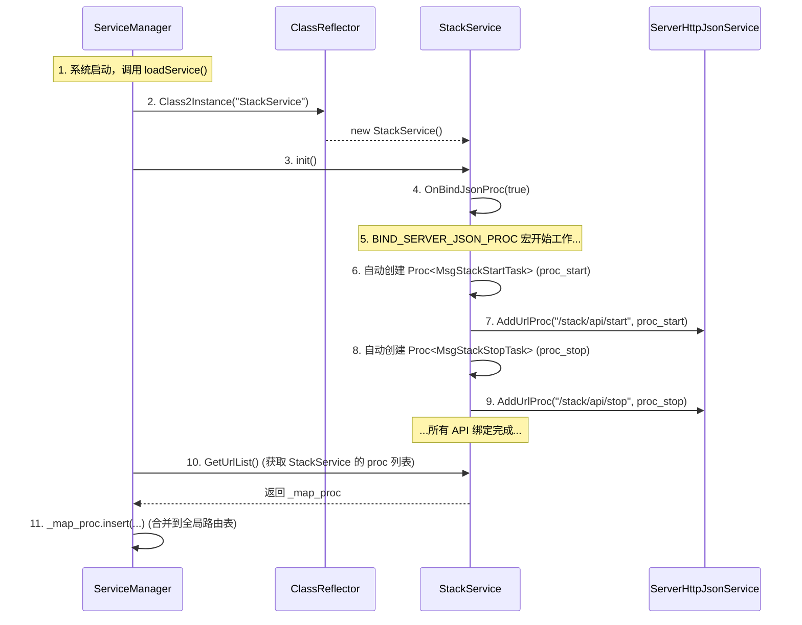
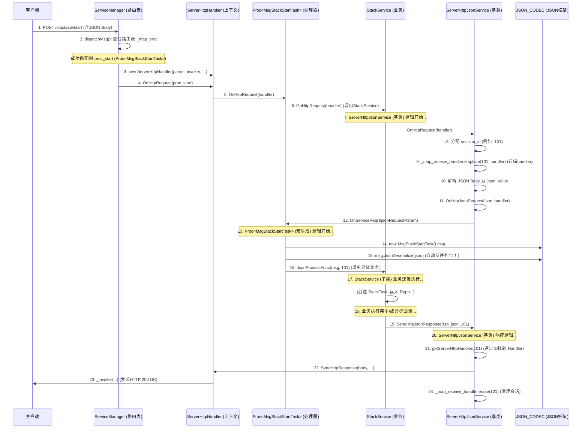

## C++ HTTP JSON 服务框架

### Part 1: 核心设计理念

本套框架的核心设计理念是 **“自动化”** 与 **“约定优于配置”**。

它旨在将开发者从繁琐的、重复性的工作中解放出来，仅需关注两个核心问题：

1. **数据（Model）**：定义C++结构体 (`struct`) 并用 `JSON_BIND_ATTR` 宏绑定字段。
2. **逻辑（Controller）**：在服务类中（如 `StackService`）实现 `JsonProcessFunc` 函数来处理业务。

框架会自动处理所有中间层，包括：HTTP 请求解析、JSON Body 反序列化、URL 路由、会话管理、异步响应、错误处理和 JSON 响应封装。

------
### Part 2: 核心组件一：JSON 序列化/反序列化框架

这是整个系统的基石。它解决了“如何让 C++ `struct` 与 `Json::Value` 自动相互转换”的问题。

#### 1. 核心文件

- `json_codec_bind_macros.h`: 提供用户接口宏 (`JSON_BIND_ATTR`)。
- `json_codec.h`: 模板引擎，负责类型分发。
- `json_codec.cpp`: 基础类型的具体实现。

#### 2. 设计解析 (工作原理)

**A. 用户接口层 (`JSON_BIND_ATTR` 宏)**

当你在一个 `struct` 中使用 `JSON_BIND_ATTR(id, name, items)` 时，这个宏会**在编译期**为你“注入”两个成员函数：`JsonSerialize` 和 `JsonDeserialize`。

以 `JsonSerialize` 为例，宏展开后的代码主要做了三件事：

1. **成员变量名“字符串化”**：

   - `#__VA_ARGS__` 会将 `id, name, items` 转换成一个 C 字符串：`"id, name, items"`。

2. **解析成员变量名**：

   - `toolkit::split` 将字符串按 `,` 分割，得到一个 `std::vector<string>`：`{"id", "name", "items"}`。

3. **遍历所有成员 (C++17 折叠表达式)**：

   - 宏内部使用了一个 C++17 的“折叠表达式”：`((result = result && process(args)), ...);`

   - 这里的 `args` 就是 `id, name, items`（成员变量本身，而不是字符串）。

   - 这行代码会展开成：

     C++

     ```c++
     result = result && process(id);
     result = result && process(name);
     result = result && process(items);
     ```

**B. 引擎层 (模板与重载)**

`process` 函数会调用 `JSON_CODEC::JsonEncodeBindAttr`。C++ 编译器会根据成员变量的**类型**，自动选择 `json_codec.h` 中三个版本的实现之一：

1. **基础类型 (如 `int`, `std::string`)**:
   - 匹配到 `json_codec.cpp` 中的具体实现，如 `JsonEncodeBindAttr(..., int32_t attr)`。
   - **逻辑**：`json_value[var_name] = attr;` (例如 `json_value["id"] = 123;`)
2. **自定义类型 (如 `struct MySubObject`)**:
   - 匹配到模板 `template <typename TYPE> JsonEncodeBindAttr(..., TYPE &t)`。
   - **逻辑**：**递归调用**。它会创建一个临时的 `temp_value`，然后调用 `t.JsonSerialize(temp_value)`，最后 `json_value[var_name] = temp_value;`。这就实现了嵌套 JSON。
3. **`std::vector<TYPE>` 类型**:
   - 匹配到 `std::vector` 的模板特化。
   - **逻辑**：遍历 vector 中的每一项 `item`，并递归调用 `JsonEncodeBindAttr(element_value, "", item)`。

**C. 核心技巧：“空字段名”约定**

这是整个 JSON 框架最巧妙的设计。注意 `std::vector` 模板在递归时传递的第二个参数是 `""` (空字符串)。

在 `json_codec.cpp` 和 `json_codec.h` 的所有实现中，都有这个关键判断：

C++

```c++
// 伪代码
if (var_name == "") {
    // 空字段名：不要创建 key，直接将自己作为值
    json_value = attr;
} else {
    // 非空字段名：创建 key-value 对
    json_value[var_name] = attr;
}
```

- **目的**：当 `std::vector<MyStruct>` 序列化时，它希望得到 `[ {"id": 1}, {"id": 2} ]`。
- **流程**：`vector` 模板调用 `JsonEncodeBindAttr(element_value, "", item)`。
- `item` 是 `MyStruct` 类型，匹配到**自定义类型**模板。
- 该模板发现 `var_name` 是 `""`，于是执行 `if` 分支，直接调用 `item.JsonSerialize(element_value)`。
- `MyStruct` 的 `JsonSerialize` (由宏生成) 则使用**非空**字段名 (`"id"`) 来填充 `element_value`，使其变为 `{"id": 1}`。
- `vector` 模板拿到 `element_value` 并将其 `append` 到数组中。

这个约定是 `std::vector` 模板能正确处理所有类型（基础类型、嵌套类型）的“粘合剂”。

------


### Part 3: 核心组件二：HTTP JSON 服务框架

这是系统的“发动机”。它连接 HTTP 请求、JSON 框架和你的业务逻辑。

#### 1. 四大核心组件

1. **`ServiceManager` (服务管理器)**
   - **职责**：全局**“路由器”**。
   - **持有**：一个全局 `_map_proc`（`std::string` -> `IServerUrlProc::Ptr`），即 **URL 路由表**。
   - **工作**：`dispatchMsg` 方法接收所有 HTTP 请求，根据 URL 查找 `_map_proc`，然后将请求转发给匹配的 `proc`。
2. **`ServerHttpJsonService` (服务基类)**
   - **职责**：所有 JSON 服务的“脚手架”和**“异步会话管理器”**。
   - **持有**：一个临时的 `_map_receive_handler`（`session_id` -> `ServerHttpHandler::Ptr`）。
   - **工作**：
     - `OnHttpRequest`: 负责分配 `session_id` 并将 `handler` 存入 `_map_receive_handler`。这是实现**异步响应**的关键。
     - `SendHttpJsonResponse`: 允许业务逻辑在未来的任意时刻，通过 `session_id` 找到对应的 `handler` 并发送响应。
3. **`IServerUrlProc` (即 "proc"，处理器)**
   - **中文翻译**：**处理器** 或 **处理程序**。
   - **职责**：**“命令模式”** 的实现。它是一个“胶水”对象，**将一个 URL、一个服务实例、一个消息类型绑定在一起**。
   - **来源**：由 `BIND_SERVER_JSON_PROC` 宏在 `init()` 时自动生成。
4. **`ServerHttpHandler` (HTTP 请求上下文)**
   - **职责**：封装“单次 HTTP 请求”的所有状态。
   - **持有**：请求解析器 (`_parser`)、响应回调 (`_invoker`) 和 `session_id`。
   - **工作**：它像一个“包裹”，在整个处理链中传递，最后通过调用 `_invoker` 将响应发回客户端。

#### 2. 流程一：服务注册 (系统初始化)



#### 3. 流程二：HTTP 请求处理 (运行时)



------


### Part 4: 业务层集成 - `StackService` 重构

#### 1. 消息定义 (`stack_msg.h`)

这是新创建的一层，用于定义 HTTP API 的 JSON Body。

```c++
// stack_msg.h
struct MsgStackStartTask {
    std::string task_id;
    int screen_width;
    int screen_height;
    std::vector<MsgStackPlayer> splice_screens;
    // ... 其他字段 ...

    // 自动绑定 JSON
    JSON_BIND_ATTR(task_id, screen_width, screen_height, splice_screens, ...)
};

struct MsgStackStopTask {
    std::string task_id;
    JSON_BIND_ATTR(task_id)
};
```


#### 2. 服务定义 (`stack_service.h`)

`StackService` 的角色从“纯业务逻辑”转变为“HTTP 控制器”。

```c++
// stack_service.h
#include "services/server_http_json_service.h"
#include "stack_msg.h"

class StackService : public ServerHttpJsonService {
public:
    // 构造函数，用于注入业务依赖
    explicit StackService(std::shared_ptr<StackRepository> repo);
    
    // 框架要求
    int32_t init(void) override;

    // 绑定所有API路由
    BEGIN_BIND_SERVER_JSON_PROC
        BIND_SERVER_JSON_POST("/stack/api/start", MsgStackStartTask)
        BIND_SERVER_JSON_POST("/stack/api/stop", MsgStackStopTask)
        // ... 其他 API ...
    END_BIND_SERVER_JSON_PROC

    // 实现所有业务逻辑
    int32_t JsonProcessFunc(MsgStackStartTask& msg, const uint32_t session_id);
    int32_t JsonProcessFunc(MsgStackStopTask& msg, const uint32_t session_id);
    // ... 其他 API 的实现 ...

private:
    // 业务依赖
    std::shared_ptr<StackRepository> _repo;
    
    // 帮助函数：创建异步回调
    template<typename T = Json::Value>
    std::function<void(const MediaException &, const T &)>
    createJsonResponseCb(const uint32_t session_id, bool data_is_list = false);
    
    // 帮助函数：复用旧代码
    template<typename MsgType>
    Json::Value convertMsgToJson(MsgType& msg);
};
```


#### 3. 核心实现 (`stack_service.cpp`)

这是重构的精髓所在，展示了如何**复用现有的 `StackConfigParser`** 并**处理异步逻辑**。

```c++
// stack_service.cpp

// 辅助宏，用于统一捕获异常并返回0（表示异步处理）
#define HANDLE_STACK_REQUEST(session_id, data_is_list, ...) \
    auto cb = createJsonResponseCb(session_id, data_is_list); \
    try { \
        __VA_ARGS__; \
    } catch (const std::exception &ex) { \
        cb(MediaException(Err_Task_Error, ex.what(), EC_Stack_Task_Failed), Json::nullValue); \
    } \
    return 0; // 0 表示本函数立即返回，响应将在未来的回调中进行

// 1. 处理 /stack/api/start
int32_t StackService::JsonProcessFunc(MsgStackStartTask& msg, const uint32_t session_id) {
    HANDLE_STACK_REQUEST(session_id, false,
        
        // **技巧 1：复用 `StackConfigParser`**
        // 框架已自动将 JSON Body -> msg (MsgStackStartTask)
        // 我们现在将其转回 Json::Value，以便使用旧的、包含复杂验证逻辑的解析器
        Json::Value json_req = convertMsgToJson(msg);
        
        // 调用你现有的、久经考验的解析器
        std::vector<StackInputConfig::Ptr> input_configs;
        TaskConfig::Ptr task_config = StackConfigParser::parseTaskConfig(json_req, input_configs);
        
        // --- 以下是你的旧 `StackService::start` 业务逻辑 ---
        
        const auto &task_id = task_config->task_id;
        
        auto task_alloc = [task_config, input_configs]() {
            const auto task = std::make_shared<StackTask>(task_config);
            task->init(input_configs);
            return task;
        };

        if (!_repo->addTask(task_id, task_alloc)) {
            throw MediaException(Err_Task_Error, "Task already exists", EC_Stack_Task_Exist);
        }
        
        // 业务执行成功，调用回调
        cb(MediaException(0, "Success", 0), Json::Value());
    )
}

// 2. 处理 /stack/api/stop (演示异步)
int32_t StackService::JsonProcessFunc(MsgStackStopTask& msg, const uint32_t session_id) {
    HANDLE_STACK_REQUEST(session_id, false,
    
        const std::string& task_id = msg.task_id;
        const auto task_opt = _repo->find(task_id);
        if (!task_opt.has_value()) {
            throw MediaException(Err_Task_Error, "Task not found", EC_Stack_Task_NoExist);
        }
        const auto &task = task_opt.value();
        _repo->erase(task_id);

        // **技巧 2：处理异步回调**
        // `task->stop()` 是异步的，它在自己的线程池 (Poller) 中执行。
        // 我们把 `cb` (即 createJsonResponseCb 返回的 lambda)
        // 传递给这个异步操作。
        task->getOwnerPoller()->async([task, cb] {
            try {
                task->stop(); // 真正的停止操作
            } catch (const std::exception &ex) {
                // 即使在异步线程中出错，也要调用 cb
                ErrorL << "Task stop failed: " << ex.what();
                // 注意：这里我们忽略异步停止的错误，只返回成功
            }
            // 异步操作完成，调用 cb
            // cb 会捕获 session_id 并发送 HTTP 响应
            cb(MediaException(Err_Stack_Success, "success", 0), Json::Value());
        });
        
        // 注意：HANDLE_STACK_REQUEST 宏会 `return 0`，
        // 导致 HttpHandler 知道这个请求被异步处理了，不会立即关闭。
    )
}

// 3. 异步回调的实现 (在 stack_service.h 中声明)
template<typename T>
std::function<void(const MediaException &, const T &)>
StackService::createJsonResponseCb(const uint32_t session_id, bool data_is_list) {
    
    // 返回一个捕获了 [this] 和 [session_id] 的 lambda
    return [this, session_id, data_is_list](const MediaException &ex, const T &data) {
        Json::Value rsp_json;
        int32_t status_code = 200;

        if (ex.getErrCode() != 0) {
            status_code = 400; // 业务错误
            rsp_json["code"] = ex.getCustomCode();
            rsp_json["msg"] = ex.what();
        } else {
            rsp_json["code"] = 0;
            rsp_json["msg"] = "success";
            if constexpr (std::is_same_v<T, Json::Value>) {
                if (!data.isNull()) {
                    rsp_json[data_is_list ? "list" : "data"] = data;
                }
            }
        }
        
        // 关键：调用基类的方法，通过 session_id 发送最终的 HTTP 响应
        this->SendHttpJsonResponse(rsp_json, session_id, status_code);
    };
}
```

### Part 5: 总结

通过 **C++ 模板、宏和面向对象**，提供了一个从 HTTP 接入、JSON 解析到业务逻辑执行的**全自动化管道**。

- **JSON 框架**：通过宏实现了**编译期**的、类型安全的、可递归的序列化/反序列化。
- **HTTP 框架**：通过`ServiceManager`（路由）、`ServerHttpJsonService`（会话）和`IServerUrlProc`（命令）三个组件，实现了 **URL -> C++ 业务函数** 的自动分发和调用。
- **业务集成**：通过 `createJsonResponseCb` 帮助函数，巧妙地将框架的**同步会话模型 (session_id)** 与业务的**异步执行模型 (poller->async)** “粘合”在了一起，实现了完美的解耦和高效的性能。