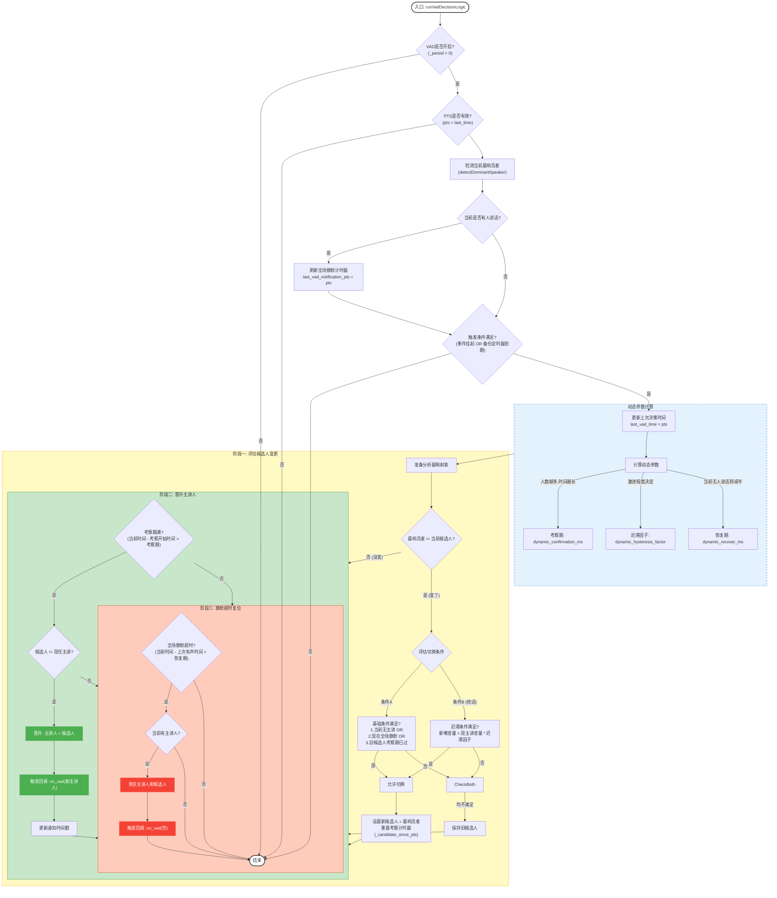

```C++
#ifndef AUDIO_MIXING_ENGINE_H
#define AUDIO_MIXING_ENGINE_H
#include "mix_audio_source.h"
#include "audio_mix_processor.h"
#include "filter/ffmpegfilter/ff_audio_limiter.h"
#include "stack/config/stack_def.h"

namespace mediacore {

class AudioMixingEngine {
public:
    using Ptr = std::shared_ptr<AudioMixingEngine>;
    using OnMixAudio = std::function<void(const MediaFrame::Ptr &general_frame, const std::vector<MediaFrame::Ptr> &unique_frames)>;

    explicit AudioMixingEngine(const std::string &id, const AudioEncodeConfig &config);
    ~AudioMixingEngine();
    void process(int64_t pts);
    /**
     * 语音激励触发的频率
     * @param period
     * @param recover_ms
     * @param aggressiveness
     */
    void enableVad(uint32_t period, uint32_t recover_ms, float aggressiveness);
    void disableVAD();
    void onStreamEvent() { _vad_event_pending = true; };
    void addProducer(const MixAudioSource::Ptr &producer);
    void removeProducer(const MixAudioSource::Ptr &producer);
    void addMixProcessor(const std::string &group_id, const std::set<std::string> &dis_streams);
    void removeMixProcessor(const std::string &group_id);
    void registerMixedStreamCallback(const OnMixAudio &call) { _on_Audio = call; };
    void registerMixerVadCallback(const OnVad &call) { _on_vad = call; };

    [[nodiscard]] float aggressiveness() const { return _aggressiveness; }
    [[nodiscard]] uint32_t backupPeriodMs() const { return _backup_period_ms; }

private:
    struct ProcessorEntry {
        AudioMixProcessor::Ptr processor;
        std::set<std::string> disabled_streams; // 绑定的禁用列表
        std::vector<AudioStreamAnalyzer::Ptr> cached_inputs; // 预计算的可用输入流
    };

    void update_caches();
    /**
     * 获取待分析的流
     * @param pts
     */
    void updateStreamAnalyzers(int64_t pts);
    /**
     * 语音激励判断
     * @param pts
     */
    void runVadDecisionLogic(int64_t pts);
    /**
     * 混音实现
     * @param pts
     */
    void performAudioMixing(int64_t pts) const;

    // 通用混音器
    std::unique_ptr<AudioMixProcessor> _general_processor;
    OnMixAudio _on_Audio;
    OnVad _on_vad;

    std::vector<MixAudioSource::Ptr> _source_vec; // 音频生产者
    std::unordered_map<std::string, size_t> _source_idx_map;

    std::vector<ProcessorEntry> _processor_vec; // 每种不同策略的音频混合器
    std::unordered_map<std::string, size_t> _processor_idx_map;

    std::vector<AudioStreamAnalyzer::Ptr> _stream_analyzers_cache; // 所有生产者对饮的流分析器
    AudioEncodeConfig _config;
    std::string _id;

    // vad状态机
    uint32_t _period = 0;
    int64_t _last_vad_time = 0;
    bool _vad_event_pending = false;
    float _aggressiveness = 1.0f;
    uint32_t _backup_period_ms = 2000;
    std::string _current_dominant_speaker; // 当前已进入事件驱动的主讲人
    std::string _candidate_speaker; // 候选主讲人
    int64_t _candidate_since_pts = 0; // 候选人出现的时间戳
    int64_t _last_vad_notification_pts = 0;
    static constexpr int64_t CONFIRMATION_DURATION_MS = 400;
    uint32_t _recover_ms = 20000;
};
} // namespace mediacore

#endif // AUDIO_MIXING_ENGINE_H
#include "audio_mixing_engine.h"
#include "multi_audio_mixer.h"
namespace mediacore {
namespace {
constexpr int64_t CONFIRMATION_DURATION_MS = 500;
constexpr int64_t CANDIDATE_GRACE_PERIOD_MS = 150;
constexpr int64_t EVENT_DEBOUNCE_MS = 200;
constexpr float HYSTERESIS_FACTOR = 1.15f;
} // namespace

AudioMixingEngine::AudioMixingEngine(const std::string &id, const AudioEncodeConfig &config)
    : _config(config)
    , _id(id) {
    _stream_analyzers_cache.reserve(16);
    _source_vec.reserve(16);
    _general_processor = std::make_unique<AudioMixProcessor>(id, _config);
}

AudioMixingEngine::~AudioMixingEngine() = default;
void AudioMixingEngine::process(const int64_t pts) {
    updateStreamAnalyzers(pts);
    runVadDecisionLogic(pts);
    performAudioMixing(pts);
}
void AudioMixingEngine::enableVad(const uint32_t period, const uint32_t recover_ms, const float aggressiveness) {
    _backup_period_ms = std::max(1000u, period);
    _period = _backup_period_ms;
    _aggressiveness = aggressiveness;
    _recover_ms = recover_ms;
    for (const auto &sp : _source_vec) {
        if (const auto asp = sp->getAudioStreamAnalyzer()) {
            asp->setAggressiveness(_aggressiveness);
        }
    }
    _vad_event_pending = true;
}
void AudioMixingEngine::disableVAD() {
    _period = 0;
    _current_dominant_speaker.clear();
    _candidate_speaker.clear();
    _vad_event_pending = false;
    _last_vad_time = 0;
    _last_vad_notification_pts = 0;
}

void AudioMixingEngine::addProducer(const MixAudioSource::Ptr &producer) {
    if (!producer) {
        return;
    }

    const auto &id = producer->id();
    if (_source_idx_map.find(id) != _source_idx_map.end()) {
        return;
    }

    _source_vec.push_back(producer);
    _source_idx_map[id] = _source_vec.size() - 1;

    if (const auto asp = producer->getAudioStreamAnalyzer()) {
        asp->setAggressiveness(_aggressiveness);
        asp->setEventNotifier([this] { this->onStreamEvent(); });
    }

    update_caches();
}
void AudioMixingEngine::removeProducer(const MixAudioSource::Ptr &producer) {
    if (!producer)
        return;

    const auto producer_id = producer->id();
    if (producer_id == _current_dominant_speaker || producer_id == _candidate_speaker) {
        _current_dominant_speaker.clear();
        _candidate_speaker.clear();
        if (_on_vad) {
            _on_vad("");
        }
    }

    const auto it = _source_idx_map.find(producer_id);
    if (it == _source_idx_map.end()) {
        return;
    }
    const size_t index_to_remove = it->second;

    if (_source_vec.size() <= 1) {
        _source_vec.clear();
        _source_idx_map.clear();
        update_caches();
        return;
    }

    if (index_to_remove == _source_vec.size() - 1) {
        _source_vec.pop_back();
        _source_idx_map.erase(producer_id);
        update_caches();
        return;
    }

    const auto &last_producer = _source_vec.back();

    _source_vec[index_to_remove] = last_producer;

    _source_vec.pop_back();

    _source_idx_map[last_producer->id()] = index_to_remove;

    _source_idx_map.erase(producer_id);

    update_caches();

    for (const auto &p : _processor_vec) {
        p.processor->removeStreamMixState(producer_id);
    }
}

void AudioMixingEngine::addMixProcessor(const std::string &group_id, const std::set<std::string> &dis_streams) {
    if (group_id.empty()) {
        return;
    }

    if (_processor_idx_map.find(group_id) != _processor_idx_map.end()) {
        return;
    }

    ProcessorEntry entry;
    entry.processor = std::make_shared<AudioMixProcessor>(group_id, _config);
    entry.disabled_streams = dis_streams; // 存储与该 processor 关联的禁用列表

    // 将新的 entry 添加到 vector 末尾
    _processor_vec.push_back(std::move(entry));
    // 在 map 中记录新 processor 的 ID 和索引
    _processor_idx_map[group_id] = _processor_vec.size() - 1;

    // 更新缓存
    update_caches();
}
void AudioMixingEngine::removeMixProcessor(const std::string &group_id) {
    const auto it = _processor_idx_map.find(group_id);
    if (it == _processor_idx_map.end()) {
        return;
    }
    const size_t index_to_remove = it->second;

    // 处理边界情况
    if (_processor_vec.size() <= 1) {
        _processor_vec.clear();
        _processor_idx_map.clear();
        update_caches();
        return;
    }

    if (index_to_remove == _processor_vec.size() - 1) {
        _processor_vec.pop_back();
        _processor_idx_map.erase(group_id);
        update_caches();
        return;
    }

    const auto &last_entry = _processor_vec.back();

    _processor_vec[index_to_remove] = last_entry;

    _processor_vec.pop_back();

    _processor_idx_map[last_entry.processor->id()] = index_to_remove;

    _processor_idx_map.erase(group_id);

    update_caches();
}
void AudioMixingEngine::update_caches() {
    // 准备一份所有可用 stream processor 的列表
    std::vector<AudioStreamAnalyzer::Ptr> all_streams;
    all_streams.reserve(_source_vec.size());
    for (const auto &producer : _source_vec) {
        if (producer && producer->isActive()) {
            if (auto sp = producer->getAudioStreamAnalyzer()) {
                all_streams.push_back(sp);
            }
        }
    }

    // 遍历每一个 ProcessorEntry，为其填充缓存
    for (auto &entry : _processor_vec) {
        entry.cached_inputs.clear();
        for (const auto &stream : all_streams) {
            // 如果流不在禁用列表中，则加入缓存
            if (entry.disabled_streams.find(stream->id()) == entry.disabled_streams.end()) {
                entry.cached_inputs.push_back(stream);
            }
        }
    }
}
void AudioMixingEngine::updateStreamAnalyzers(const int64_t pts) {
    _stream_analyzers_cache.clear();

    for (const auto &source : _source_vec) {
        if (!source || !source->isActive()) {
            continue;
        }

        if (const auto asp = source->getAudioStreamAnalyzer(); asp)
            _stream_analyzers_cache.push_back(asp);
    }

    for (const auto &sp : _stream_analyzers_cache) {
        sp->process(pts);
    }
}
/**
 * @brief 执行VAD（语音活动检测）与主讲人决策的核心逻辑
 * @param pts 当前处理帧的媒体时间戳 (ms)
 */
void AudioMixingEngine::runVadDecisionLogic(const int64_t pts) {
    // [卫语句] 如果VAD功能未启用（period <= 0），则直接退出。
    if (_period <= 0)
        return;
    // [卫语句] [健壮性] 防止因时间戳回退或重复调用导致逻辑错误。
    if (_last_vad_time > 0 && pts <= _last_vad_time)
        return;

    // --- 1. “喂狗”逻辑 (Watchdog) ---
    // [目的] 无论后续是否需要进行复杂决策，都必须在每一轮执行此检查。
    // [作用] 只要房间内有任何有效声音，就刷新“静默超时”计时器，确保正在发言的人永远不会被错误地判定为超时。
    const int dominant_idx = AudioMixUtils::detectDominantSpeaker(_stream_analyzers_cache);
    if (dominant_idx != SIZE_MAX) {
        _last_vad_notification_pts = pts;
    }

    // --- 2. 决策点检查 (低频门控) ---
    // [目的] 避免在每一帧都执行昂贵的状态机，仅在“事件触发”或“备份周期到达”时才执行。
    // [核心修复] 采用正确的逻辑，确保事件不会被错误地“吞掉”。
    // [条件] 如果没有待处理的事件，并且也未到备份检查时间，则无需进行决策。
    if (const bool backup_due = (_last_vad_time == 0 || pts - _last_vad_time >= _backup_period_ms); !_vad_event_pending && !backup_due) {
        return; // [动作] 安全退出，此时“喂狗”逻辑已完成。
    }
    // --- 决策逻辑正式开始 ---
    // [日志] 记录本次决策的触发原因，便于调试。
    TraceL << "VAD: Running decision logic. Triggered by " << (_vad_event_pending ? "event" : "backup timer") << " at pts=" << pts;
    _vad_event_pending = false; // [状态更新] 消耗掉已处理的事件标记。
    _last_vad_time = pts; // [状态更新] 更新本次决策的执行时间。
    // --- 3. 动态参数计算 ---
    // [目的] 使算法能根据实时会议情况自适应调整，提升智能性。
    const int64_t participant_count = _stream_analyzers_cache.size();
    int64_t dynamic_confirmation_ms = CONFIRMATION_DURATION_MS; // 使用常量
    if (participant_count > 5) {
        dynamic_confirmation_ms += 50 * (participant_count - 5);
        dynamic_confirmation_ms = std::min(dynamic_confirmation_ms, CONFIRMATION_DURATION_MS * 2); // 使用常量
    }
    const float dynamic_hysteresis_factor = 1.0f + ((HYSTERESIS_FACTOR - 1.0f) / _aggressiveness); // 使用常量
    int64_t dynamic_recover_ms = _recover_ms;
    if (dominant_idx == SIZE_MAX) {
        dynamic_recover_ms = _recover_ms / 2;
    }

    // [性能优化] 预构建查找表，用于O(1)的音量查询。
    std::unordered_map<std::string, AudioStreamAnalyzer::Ptr> analyzer_map;
    for (const auto &analyzer : _stream_analyzers_cache) {
        analyzer_map[analyzer->id()] = analyzer;
    }

    // VAD触发核心状态机 ---
    // [目的] 评估是否需要更换候选人，并仅在必要时重置计时器。
    // [核心原则] 只要最响者和候选人不同，就启动“变更评估”。
    if (const std::string loudest_speaker_id = (dominant_idx != SIZE_MAX) ? _stream_analyzers_cache[dominant_idx]->id() : "";
        loudest_speaker_id != _candidate_speaker) {
        bool allow_switch = false;
        // 评估条件1：如果当前无主讲人、或场上变静默、或旧候选人的“宽限期”已过，则满足基础切换条件。
        if (_current_dominant_speaker.empty() || loudest_speaker_id.empty() || (pts - _candidate_since_pts > CANDIDATE_GRACE_PERIOD_MS)) { // 使用常量
            // 评估条件2（抢话场景）：如果需要“抢话”，则必须通过“迟滞判断”。
            if (!_current_dominant_speaker.empty() && !loudest_speaker_id.empty()) {
                const float loudest_volume = analyzer_map.at(loudest_speaker_id)->getAvgVolume();
                float current_dominant_volume = 0.0f;
                if (const auto it = analyzer_map.find(_current_dominant_speaker); it != analyzer_map.end()) {
                    current_dominant_volume = it->second->getAvgVolume();
                }
                // [迟滞判断] 挑战者的音量必须“显著”高于现任，才允许切换。
                if (loudest_volume > current_dominant_volume * dynamic_hysteresis_factor) {
                    allow_switch = true;
                    TraceL << "VAD: Hysteresis check PASSED for new candidate '" << loudest_speaker_id << "'.";
                }
            } else {
                // [非抢话场景] 无需迟滞判断，直接允许切换。
                allow_switch = true;
            }
        }
        // [最终决策] 如果评估后允许切换，则更新候选人并【在这里，且仅在这里】重置计时器。
        if (allow_switch) {
            TraceL << "VAD: Candidate changed from '" << _candidate_speaker << "' to '" << loudest_speaker_id << "'. Resetting timer.";
            _candidate_speaker = loudest_speaker_id;
            _candidate_since_pts = pts;
        }
    }
    // --- 5. 晋升逻辑 ---
    // [目的] 当候选人的“考察期”满，且他不是现任主讲人时，进行晋升。
    if ((pts - _candidate_since_pts > dynamic_confirmation_ms) && _candidate_speaker != _current_dominant_speaker) {
        TraceL << "VAD: Promoting '" << _candidate_speaker << "' to dominant speaker after " << (pts - _candidate_since_pts) << "ms.";
        _current_dominant_speaker = _candidate_speaker;
        if (_on_vad) {
            _on_vad(_current_dominant_speaker); // 可传递空字符串""以通知进入静默状态
        }
        _last_vad_notification_pts = pts;
    }

    // --- 6. 恢复逻辑 ---
    // [目的] 作为最终保障，在长时间无任何有效声音后，清空主讲人状态。
    if (!_current_dominant_speaker.empty() && (pts - _last_vad_notification_pts > dynamic_recover_ms)) {
        DebugL << "VAD: Dominant speaker '" << _current_dominant_speaker << "' removed due to inactivity for over " << dynamic_recover_ms << "ms.";
        _current_dominant_speaker.clear();
        _candidate_speaker.clear();
        _last_vad_notification_pts = pts;
        if (_on_vad)
            _on_vad("");
    }
}
void AudioMixingEngine::performAudioMixing(const int64_t pts) const {
    //  执行“通用混音”，这个混音器处理所有可用的流
    const MediaFrame::Ptr general_frame = _general_processor->mixAudioFrame(_stream_analyzers_cache, pts);
    if (!general_frame)
        return;

    general_frame->pts = pts;
    general_frame->dts = pts;
    general_frame->id = _general_processor->id();
    // 执行所有“定制混音”
    std::vector<MediaFrame::Ptr> unique_frames;
    unique_frames.reserve(_processor_vec.size());

    for (const auto &entry : _processor_vec) {
        std::string index1;
        auto frame = entry.processor->mixAudioFrame(entry.cached_inputs, pts);
        frame->pts = pts;
        frame->dts = pts;
        frame->id = entry.processor->id();
        unique_frames.emplace_back(std::move(frame));
    }

    //  通过回调函数，将所有混音完成的音频帧（一个通用帧和多个定制帧）派发出去
    if (_on_Audio) {
        _on_Audio(general_frame, unique_frames);
    }
}
} // namespace mediacore

```

```C++
#ifndef AUDIO_STREAM_ANALYZER_H
#define AUDIO_STREAM_ANALYZER_H

#include <deque>
#include <memory>
#include <utility>
#include "../../codec/ffmpegcodec/ff_codec_util.h"

namespace mediacore {

class AudioStreamAnalyzer {
public:
    using Ptr = std::shared_ptr<AudioStreamAnalyzer>;

    explicit AudioStreamAnalyzer(std::string id, int64_t history_window_ms);
    void process(float current_time_ms);

    [[nodiscard]] float getAvgVolume() const { return _avg_volume; }
    [[nodiscard]] bool isActive() const { return _is_active; }
    [[nodiscard]] int64_t getActiveSince() const { return _active_since; }
    [[nodiscard]] int64_t getInactiveSince() const { return _inactive_since; }
    [[nodiscard]] std::string id() const { return _id; }
    [[nodiscard]] AVFrame *frame() const { return _frame; }
    void setFrame(AVFrame *frame) { _frame = frame; }

private:
    static float applyDynamicCompression(float volume);
    bool detectVoiceActivity(float volume);

    std::deque<std::pair<float, float>> _volume_history;
    float _speech_probability = 0.0f; // 语音概率
    float _noise_floor = -65.0f;
    float _default_avg_volume = -60.0f; // 平均音量
    bool _prev_state = false;
    bool _is_active = false;
    const int64_t _history_window_ms; // --- 状态变量 ---
    float _avg_volume = 0.0f; // 平均音量
    bool _was_active = false; // 上一帧是否活跃
    int64_t _active_since = 0; // 活跃开始时间
    int64_t _inactive_since = 0; // 非活跃开始时间
    static constexpr float NOISE_GATE_THRESHOLD = 0.005f;
    static constexpr float SPEECH_PROBABILITY_RISE = 0.3f;
    static constexpr float SPEECH_PROBABILITY_FALL = 0.05f;
    std::string _id;
    AVFrame *_frame = nullptr;
};

} // namespace mediacore
#endif // AUDIO_STREAM_ANALYZER_H
#include "audio_stream_analyzer.h"

#include "filter/ffmpegfilter/ff_audio_utils.h"

#include <cmath>
#include <utility>

namespace mediacore {

AudioStreamAnalyzer::AudioStreamAnalyzer(std::string id, const int64_t history_window_ms)
    : _history_window_ms(history_window_ms)
    , _id(std::move(id)) {}

void AudioStreamAnalyzer::process(float current_time_ms) {
    // if (!_frame)
    //     return;

    // 1. 计算原始音量
    float raw_volume = AudioUtils::calculateFrameVolume(_frame);

    _volume_history.emplace_back(current_time_ms, raw_volume);

    while (!_volume_history.empty() && current_time_ms - _volume_history.front().first > _history_window_ms) {
        _volume_history.pop_front();
    }

    float weighted_sum = 0.0f;
    float weight_sum = 0.0f;
    for (const auto &[fst, snd] : _volume_history) {
        const float time_weight = 1.0f - (current_time_ms - fst) / static_cast<float>(_history_window_ms);
        weighted_sum += snd * time_weight;
        weight_sum += time_weight;
    }
    _avg_volume = (weight_sum > 0.0f) ? (weighted_sum / weight_sum) : 0.0f;

    if (_avg_volume < NOISE_GATE_THRESHOLD) {
        _avg_volume = 0.0f;
    } else {
        _avg_volume = applyDynamicCompression(_avg_volume);
    }

    // 检测语音活动
    const bool is_active = detectVoiceActivity(_avg_volume);

    // 更新活跃状态
    if (is_active && !_was_active) {
        _active_since = static_cast<int64_t>(current_time_ms);
    } else if (!is_active && _was_active) {
        _inactive_since = static_cast<int64_t>(current_time_ms);
    }
    _was_active = is_active;
    _is_active = is_active;
}

float AudioStreamAnalyzer::applyDynamicCompression(const float volume) {
    if (volume <= 0.0f)
        return 0.0f;
    constexpr float ratio = 0.4f;
    constexpr float makeup_gain = 1.2f;
    constexpr float knee_width = 0.1f;

    if (constexpr float threshold = 0.15f; volume < threshold - knee_width / 2) {
        return makeup_gain * threshold * std::pow(volume / threshold, ratio);
    } else {
        if (volume < threshold + knee_width / 2) {
            const float knee_factor = (volume - (threshold - knee_width / 2)) / knee_width;
            const float c1 = makeup_gain * threshold * std::pow(volume / threshold, ratio);
            const float c2 = makeup_gain * (threshold + (volume - threshold) * (1.0f - (1.0f - ratio) * 0.7f));
            return c1 * (1.0f - knee_factor) + c2 * knee_factor;
        }
        constexpr float compression_factor = 1.0f - (1.0f - ratio) * 0.7f;
        return makeup_gain * (threshold + (volume - threshold) * compression_factor);
    }
}

bool AudioStreamAnalyzer::detectVoiceActivity(const float volume) {
    const float volume_db = 20.0f * std::log10(std::max(volume, 0.0001f));

    static constexpr float noise_adapt_rate = 0.01f;

    if (volume_db < -30.0f) { // 假设低于-30dB的可能是背景噪声
        _noise_floor = _noise_floor * (1.0f - noise_adapt_rate) + volume_db * noise_adapt_rate;
    }
    _default_avg_volume = _default_avg_volume * 0.95f + volume_db * 0.05f;

    const float dynamic_threshold = _noise_floor + 15.0f;

    float rise_rate = SPEECH_PROBABILITY_RISE;
    float fall_rate = SPEECH_PROBABILITY_FALL;

    if (volume_db > dynamic_threshold + 10.0f) {
        rise_rate *= 1.5f;
    } else if (volume_db < dynamic_threshold - 10.0f) {
        fall_rate *= 1.5f;
    }

    // 基于动态阈值更新语音概率
    if (volume_db > dynamic_threshold) {
        _speech_probability = std::min(_speech_probability + rise_rate, 1.0f);
    } else {
        _speech_probability = std::max(_speech_probability - fall_rate, 0.0f);
    }

    const bool current_state = _speech_probability > (_prev_state ? 0.45f : 0.55f);
    _prev_state = current_state;

    return current_state;
}

} // namespace mediacore

```

```C++
//
// Created by liyuc on 2025/7/22.
// Describe:
//

#ifndef AUDIO_MIX_PROCESSER_H
#define AUDIO_MIX_PROCESSER_H
#include "audio_stream_analyzer.h"
#include "filter/ffmpegfilter/ff_audio_limiter.h"
#include "stack/config/stack_def.h"
namespace mediacore {
static void mixAudioSources(
    const AVFrame *dst_frame, const std::vector<AudioStreamAnalyzer::Ptr> &stream_processors,
    const std::vector<float> &weights);
static int detectDominantSpeaker(const std::vector<AudioStreamAnalyzer::Ptr> &processors);
static int calculateDynamicMaxSpeakers(int total_participants);

class AudioMixProcessor {
public:
    using Ptr = std::shared_ptr<AudioMixProcessor>;
    AudioMixProcessor(std::string group_id, const AudioEncodeConfig &config);
    MediaFrame::Ptr
    mixAudioFrame(const std::vector<AudioStreamAnalyzer::Ptr> &stream_processors, float current_time_ms);
    [[nodiscard]] std::string id() const { return _id; }
    std::string getDominantSpeakerId() const { return _dominant_speaker_id; };
    void removeStreamMixState(const std::string &id);

private:
    struct StreamMixState {
        float current_weight = 0.0f;
        float target_weight = 0.0f;
    };

    void calculateMixingWeights(
        const std::vector<AudioStreamAnalyzer::Ptr> &stream_processors, std::vector<float> &weights,
        float current_time_ms);
    void processAudioPipeline(
        AVFrame *dst_frame, const std::vector<AudioStreamAnalyzer::Ptr> &stream_processors,
        const std::vector<float> &weights) const;
    void statistics(const std::vector<float> &weights, const std::vector<AudioStreamAnalyzer::Ptr> &stream_processors);

    std::unique_ptr<AudioLimiter> _limiter;
    std::string _dominant_speaker_id;
    std::string _id;
    bool _frame_trace { false };
    ResourcePool<MediaFrame> _frame_pool;
    AudioEncodeConfig _config;
    std::unordered_map<std::string, StreamMixState> _stream_states;
};
} // namespace mediacore

#endif // AUDIO_MIX_PROCESSER_H
//
// Created by liyuc on 2025/7/22.
// Describe:
//

#include "audio_mix_processor.h"
#include <utility>
#include "device/device_factory.h"
#include "filter/ffmpegfilter/ff_audio_utils.h"
namespace mediacore { // --- 常量定义 ---
static constexpr float WEIGHT_THRESHOLD = 0.005f;
static constexpr float VOICE_ACTIVITY_THRESHOLD = 0.01f; // 主导发言者认定的最低音量门槛
static constexpr int64_t AUDIO_TRANSITION_DURATION_MS = 300;
static constexpr float DOMINANT_SPEAKER_BOOST = 1.2f;

MediaFrame::Ptr AudioMixProcessor::mixAudioFrame(
    const std::vector<AudioStreamAnalyzer::Ptr> &stream_processors, const float current_time_ms) {
    auto buffer = _frame_pool.obtain2();
    if (!buffer)
        return nullptr;
    if (buffer->empty()) {
        const auto frame
            = initAudioFrame(_config.channels, _config.frame_format, _config.sample_rate, _config.frame_size);
        resetAVFrame(frame);
        convertMediaFrame(buffer, frame);
    }
    const auto av_mix_frame = &(buffer->get<AVFrame>());
    std::vector<float> weights;
    calculateMixingWeights(stream_processors, weights, current_time_ms);
    processAudioPipeline(av_mix_frame, stream_processors, weights);
    statistics(weights, stream_processors);
    return buffer;
}
void AudioMixProcessor::removeStreamMixState(const std::string &id) {
    if (_stream_states.count(id))
        _stream_states.erase(id);
}

void AudioMixProcessor::calculateMixingWeights(
    const std::vector<AudioStreamAnalyzer::Ptr> &stream_processors, std::vector<float> &weights,
    const float current_time_ms) {
    if (stream_processors.empty())
        return;

    weights.assign(stream_processors.size(), 0.0f); // 预分配+赋0

    // 单路流分析
    int active_count = 0;
    for (const auto &sp : stream_processors) {
        if (sp->isActive()) {
            active_count++;
        }
    }

    // 2. 检测主导发言者
    _dominant_speaker_id.clear(); // 每次计算前清空
    if (const size_t dominant_idx = detectDominantSpeaker(stream_processors); dominant_idx != SIZE_MAX) {
        _dominant_speaker_id = stream_processors[dominant_idx]->id();
    } else {
        _dominant_speaker_id.clear();
    }

    if (active_count > 0) {
        // 计算活跃发言者的总音量
        const int max_speakers = calculateDynamicMaxSpeakers(stream_processors.size());

        std::vector<std::pair<float, size_t>> volume_indices;
        volume_indices.reserve(stream_processors.size());

        for (size_t i = 0; i < stream_processors.size(); ++i) {
            auto &sp = stream_processors[i];
            auto &[current_weight, target_weight] = _stream_states[sp->id()];

            if (const float vol = sp->getAvgVolume(); vol > 0) {
                float duration_factor = 1.0f;
                if (sp->isActive()) {
                    if (const int64_t dur = current_time_ms - sp->getActiveSince(); dur > 1000)
                        duration_factor = std::min(1.0f + (dur - 1000) / 5000.0f * 0.3f, 1.3f);
                }
                const float continuity_factor = (target_weight > 0.2f) ? 1.2f : 1.0f;
                float adj_vol = vol * duration_factor * continuity_factor;
                volume_indices.emplace_back(adj_vol, i);
            }
            target_weight = 0.0f; // 重置target
        }

        if (!volume_indices.empty()) {
            std::partial_sort(
                volume_indices.begin(),
                volume_indices.begin() + std::min(max_speakers, static_cast<int>(volume_indices.size())),
                volume_indices.end(), [](const auto &a, const auto &b) { return a.first > b.first; });

            constexpr float primary_ratio = 0.6f;
            constexpr float secondary_ratio = 1.0f - primary_ratio;

            const size_t primary_idx = volume_indices[0].second;
            auto &[current_weight, target_weight] = _stream_states[stream_processors[primary_idx]->id()];
            target_weight = primary_ratio;

            float remaining_total = 0.0f;
            for (int i = 1; i < std::min(max_speakers, static_cast<int>(volume_indices.size())); ++i) {
                remaining_total += volume_indices[i].first;
            }

            if (remaining_total > 0.0f) {
                for (int i = 1; i < std::min(max_speakers, static_cast<int>(volume_indices.size())); ++i) {
                    const size_t idx = volume_indices[i].second;
                    auto &[current_weight, target_weight] = _stream_states[stream_processors[idx]->id()];
                    const float share = (volume_indices[i].first / remaining_total) * secondary_ratio;
                    target_weight = share;
                }
            }

            for (int i = 0; i < std::min(max_speakers, static_cast<int>(volume_indices.size())); ++i) {
                const size_t idx = volume_indices[i].second;
                auto &[current_weight, target_weight] = _stream_states[stream_processors[idx]->id()];

                if (!_dominant_speaker_id.empty() && stream_processors[idx]->id() == _dominant_speaker_id) {
                    target_weight *= DOMINANT_SPEAKER_BOOST;
                }

                if (const int64_t inactive_time = current_time_ms - stream_processors[idx]->getInactiveSince();
                    inactive_time < AUDIO_TRANSITION_DURATION_MS) {
                    const float decay = 1.0f - static_cast<float>(inactive_time) / AUDIO_TRANSITION_DURATION_MS;
                    target_weight *= (1.0f + decay * 0.5f);
                }

                // 防止权重过低导致的声音断断续续
                if (target_weight > 0 && target_weight < 0.05f) {
                    target_weight = 0.05f;
                }
            }
        }
    } else {
        const float base_equal_weight = 1.0f / stream_processors.size();

        for (const auto &sp : stream_processors) {
            constexpr float history_weight = 0.3f;
            auto &[current_weight, target_weight] = _stream_states[sp->id()];
            target_weight = base_equal_weight * (1.0f - history_weight) + current_weight * history_weight;
        }
    }

    float alpha = 10.0f / AUDIO_TRANSITION_DURATION_MS;
    alpha = std::min(alpha, 1.0f);
    for (size_t i = 0; i < stream_processors.size(); ++i) {
        auto &sp = stream_processors[i];
        auto &[current_weight, target_weight] = _stream_states[sp->id()];
        current_weight = current_weight * (1.0f - alpha) + target_weight * alpha;
        weights[i] = current_weight;
    }
    AudioUtils::normalizeWeights(weights);
}

void AudioMixProcessor::processAudioPipeline(
    AVFrame *dst_frame, const std::vector<AudioStreamAnalyzer::Ptr> &stream_processors,
    const std::vector<float> &weights) const {
    mixAudioSources(dst_frame, stream_processors, weights);
    _limiter->process(dst_frame);
}

void AudioMixProcessor::statistics(
    const std::vector<float> &weights, const std::vector<AudioStreamAnalyzer::Ptr> &stream_processors) {
    if (_frame_trace) {
        std::string str;
        for (size_t i = 0; i < weights.size(); ++i) {
            str.append("weights:")
                .append(std::to_string(weights[i]))
                .append(",id:")
                .append(stream_processors[i]->id())
                .append(";");
        }
        InfoL << _id << " " << str;
    }
}

void mixAudioSources(
    const AVFrame *dst_frame, const std::vector<AudioStreamAnalyzer::Ptr> &stream_processors,
    const std::vector<float> &weights) {
    if (!dst_frame)
        return;
    AudioUtils::resetAudioFrame(dst_frame);

    for (size_t i = 0; i < stream_processors.size(); ++i) {
        const auto frame = stream_processors[i]->frame();
        if (!frame || weights[i] < WEIGHT_THRESHOLD)
            continue;
        const int channels = std::min(dst_frame->ch_layout.nb_channels, frame->ch_layout.nb_channels);
        for (int ch = 0; ch < channels; ++ch) {
            if (dst_frame->data[ch] && frame->data[ch]) {
                AudioUtils::mixAudioFrames(
                    dst_frame->data[ch], frame->data[ch], weights[i], dst_frame->nb_samples, dst_frame->format);
            }
        }
    }
}
int detectDominantSpeaker(const std::vector<AudioStreamAnalyzer::Ptr> &processors) {
    size_t dominant_idx = SIZE_MAX;
    float max_volume = 0.0f;
    for (size_t i = 0; i < processors.size(); ++i) {
        if (!processors[i])
            continue;
        if (const float vol = processors[i]->getAvgVolume(); vol > max_volume) {
            max_volume = vol;
            dominant_idx = i;
        }
    }

    // 只有当最大音量超过一个明确的阈值时，才确认其为“主导发言者”
    // 这可以防止在完全静默时，将微弱的背景噪音误判为主导者
    if (max_volume > VOICE_ACTIVITY_THRESHOLD) {
        return dominant_idx;
    }

    return SIZE_MAX; // 无主导发言者
}

int calculateDynamicMaxSpeakers(const int total_participants) {
    if (total_participants <= 4)
        return total_participants;
    if (total_participants <= 8)
        return 4;
    return 5;
}
AudioMixProcessor::AudioMixProcessor(std::string group_id, const AudioEncodeConfig &config)
    : _limiter(std::make_unique<AudioLimiter>())
    , _id(std::move(group_id))
    , _config(config) {
    _frame_pool.setSize(1);
    GET_CONFIG(int, mix_frame_trace, Stack::kMixFrameTrace)
    _frame_trace = mix_frame_trace;
}
} // namespace mediacore
```

```C++
#ifndef VAD_LAYOUT_MANAGER_H
#define VAD_LAYOUT_MANAGER_H

#include <string>
#include <vector>
#include <memory>
#include "common/ordered_map.h"
#include "../config/stack_def.h"

namespace mediacore {

/**
 * @class VADLayoutManager
 * @brief 处理语音激励场景下的视频布局计算和状态管理。
 */
class VADLayoutManager {
public:
    VADLayoutManager() = default;
    ~VADLayoutManager() = default;

    // 禁止拷贝和移动
    VADLayoutManager(const VADLayoutManager &) = delete;
    VADLayoutManager &operator=(const VADLayoutManager &) = delete;

    /**
     * @brief 重置/初始化所有播放器和布局状态。
     * @param initial_players 完整的播放器配置列表。
     */
    void resetPlayers(const std::vector<StackInputConfig::Ptr> &initial_players);

    /**
     * @brief 添加一个新的播放器。
     * @param player_config 待添加播放器的配置。
     */
    void addPlayer(const StackInputConfig::Ptr &player_config);

    /**
     * @brief 移除一个播放器。
     * @param player_id 待移除播放器的ID。
     * @return 如果成功移除返回 true, 否则 false。
     */
    bool removePlayer(const std::string &player_id);

    /**
     * @brief 更新一个已存在的播放器。
     * @param player_config 播放器的新配置。
     * @return 如果成功更新返回 true, 否则 false。
     */
    bool updatePlayer(const StackInputConfig::Ptr &player_config);

    /**
     * @brief 设置当前活跃的发言人。
     * @param speaker_id 发言人的ID。如果为空，表示取消激励状态。
     * @return 如果状态发生变化返回 true, 否则 false。
     */
    bool setActiveSpeaker(const std::string &speaker_id);
    bool clearActiveSpeaker();
    /**
     * @brief 核心计算函数：根据当前内部状态计算最终的布局方案。
     * @return 一个包含最终布局、OSD和边框信息的结构体。
     */
    const CalculatedLayout &calculateLayout();

private:
    /**
     * @brief 选举并设置一个新的主窗口。
     * 策略：
     * 1. 优先选择在 _players 中被标记为 main_layout 的成员。
     * 2. 如果没有，则选择 _players 中的第一个成员。
     * 3. 如果 _players 为空，则清空主窗口ID。
     */
    void electNewMainPlayer();

    /**
     * @brief 标记布局状态已变化，需要重新计算。
     */
    void markLayoutChanged();

    /**
     * @brief 内部计算布局的实现函数（用于缓存）。
     * @return 计算后的布局。
     */
    CalculatedLayout calculateLayoutImpl();

    // 使用 OrderedMap 来存储播放器配置，它保证了元素的插入顺序。
    // 这对于在主窗口被删除后，能稳定地选举出“顺位第一个”作为新主窗口至关重要。
    OrderedMap<std::string, StackInputConfig::Ptr> _players;

    // 逻辑上的主窗口ID。即使因为VAD被临时交换，这个ID也不变。
    std::string _main_player_id;

    // 当前活跃的发言人ID。由外部VAD事件驱动更新。
    std::string _active_speaker_id;

    // 布局计算缓存。
    CalculatedLayout _cached_layout;

    // 布局是否变化标记。
    bool _layout_changed = true;
};

} // namespace mediacore
#endif VAD_LAYOUT_MANAGER_H
//
// Created by liyuc on 2025/9/10.
// Describe:
//

#include "vad_layout_manager.h"
#include "Util/logger.h"

namespace mediacore {

using namespace toolkit;

void VADLayoutManager::resetPlayers(const std::vector<StackInputConfig::Ptr> &initial_players) {
    _players = {};
    _main_player_id.clear();
    _active_speaker_id.clear();
    _layout_changed = true;

    for (const auto &config : initial_players) {
        _players.insert(config->index, config);
    }

    // 初始化后，重新选举主窗口
    electNewMainPlayer();
}

void VADLayoutManager::addPlayer(const StackInputConfig::Ptr &player_config) {
    if (_players.get(player_config->index).has_value()) {
        // 通常不应该发生，上层业务应保证唯一性
        WarnL << "Player with id " << player_config->index << " already exists in LayoutManager.";
        return;
    }
    _players.insert(player_config->index, player_config);

    // 如果新加入的player被指定为主窗口，或者当前没有主窗口，则重新选举
    if (player_config->layout.main_layout || _main_player_id.empty()) {
        electNewMainPlayer();
    }
    markLayoutChanged();
}

bool VADLayoutManager::removePlayer(const std::string &player_id) {
    if (!_players.get(player_id).has_value()) {
        return false;
    }

    _players.erase(player_id);

    // 如果被删除的是当前激励的发言人，则取消激励状态
    if (player_id == _active_speaker_id) {
        _active_speaker_id.clear();
        InfoL << "Active speaker [" << player_id << "] was removed, clearing VAD state.";
    }

    // 如果被删除的是主窗口，则需要重新选举一个新的主窗口
    if (player_id == _main_player_id) {
        InfoL << "Main player [" << player_id << "] was removed. Re-electing new main player.";
        electNewMainPlayer();
    }

    markLayoutChanged();
    return true;
}

bool VADLayoutManager::updatePlayer(const StackInputConfig::Ptr &player_config) {
    if (!_players.get(player_config->index).has_value()) {
        return false;
    }

    const bool was_main = (_main_player_id == player_config->index);
    const bool is_now_main = player_config->layout.main_layout;

    _players.insert(player_config->index, player_config);

    // 检查主窗口状态是否发生变化
    if (was_main != is_now_main) {
        InfoL << "Main layout flag changed for player [" << player_config->index << "]. Re-electing main player.";
        electNewMainPlayer();
    }

    markLayoutChanged();
    return true;
}

bool VADLayoutManager::setActiveSpeaker(const std::string &speaker_id) {
    // 允许设置为空，表示取消激励
    if (!speaker_id.empty() && !_players.get(speaker_id).has_value()) {
        WarnL << "Cannot set active speaker, speaker id [" << speaker_id << "] not found.";
        return false;
    }

    if (speaker_id != _active_speaker_id) {
        _active_speaker_id = speaker_id;
        markLayoutChanged();
        return true;
    }
    return false;
}

bool VADLayoutManager::clearActiveSpeaker() {
    if (!_active_speaker_id.empty()) {
        _active_speaker_id.clear();
        markLayoutChanged();
        InfoL << " Active speaker cleared due to inactivity.";
        return true;
    }
    return false;
}

const CalculatedLayout &VADLayoutManager::calculateLayout() {
    if (!_layout_changed) {
        return _cached_layout;
    }
    _cached_layout = calculateLayoutImpl();
    _layout_changed = false;
    return _cached_layout;
}

void VADLayoutManager::markLayoutChanged() {
    _layout_changed = true;
}

void VADLayoutManager::electNewMainPlayer() {
    _main_player_id.clear();
    // 1. 优先查找被标记为 main_layout 的 player
    for (const auto &[id, config] : _players) {
        if (config->layout.main_layout) {
            _main_player_id = id;
            InfoL << "Elected player [" << _main_player_id << "] as main view (explicitly flagged).";
            return;
        }
    }

    // 2. 如果没有，则选择 OrderedMap 中的第一个 player
    if (const auto first = _players.get_first(); first.has_value()) {
        _main_player_id = first.value().first;
        InfoL << "Elected player [" << _main_player_id << "] as main view (fallback to first).";
    } else {
        // 3. 如果没有任何 player，则清空
        _main_player_id.clear();
        InfoL << "No players available, main view is now empty.";
    }
}

CalculatedLayout VADLayoutManager::calculateLayoutImpl() {
    CalculatedLayout result;
    result.solution.clear();
    result.osd_positon.clear();
    result.borders = BorderGrid(); // 清空

    // 检查是否满足交换条件
    const bool should_swap = !_active_speaker_id.empty() && !_main_player_id.empty()
        && _active_speaker_id != _main_player_id && _players.get(_active_speaker_id).has_value()
        && _players.get(_main_player_id).has_value();

    if (should_swap) {
        // --- 执行交换 ---
        const auto &main_player_config = _players.get(_main_player_id).value().get();
        const auto &speaker_config = _players.get(_active_speaker_id).value().get();

        for (const auto &[player_id, config] : _players) {
            if (player_id == _main_player_id) {
                // 原主窗口的人，放到发言人的原始位置上
                result.solution[player_id] = speaker_config->layout;
            } else if (player_id == _active_speaker_id) {
                // 发言人，放到主窗口的原始位置上
                result.solution[player_id] = main_player_config->layout;
            } else {
                // 其他人位置不变
                result.solution[player_id] = config->layout;
            }
        }
    } else {
        // --- 无需交换，使用原始布局 ---
        for (const auto &[player_id, config] : _players) {
            result.solution[player_id] = config->layout;
        }
    }

    // 根据最终计算出的布局，添加OSD和边框信息
    for (const auto &[index, final_layout] : result.solution) {
        const auto &config = _players.get(index).value().get();
        for (const auto &osd : config->osd_list) {
            result.osd_positon.emplace_back(OsdConfig(
                osd.pos_x, osd.pos_y, osd.size_type, osd.size, osd.font_radio, osd.color, osd.text,
                { index, final_layout.x, final_layout.y, final_layout.width, final_layout.height }));
        }
        result.borders.addBorder(
            { index, final_layout.x, final_layout.y, config->border.color, config->border.thickness, final_layout.width,
              final_layout.height });
    }

    return result;
}

} // namespace mediacore
    
```


