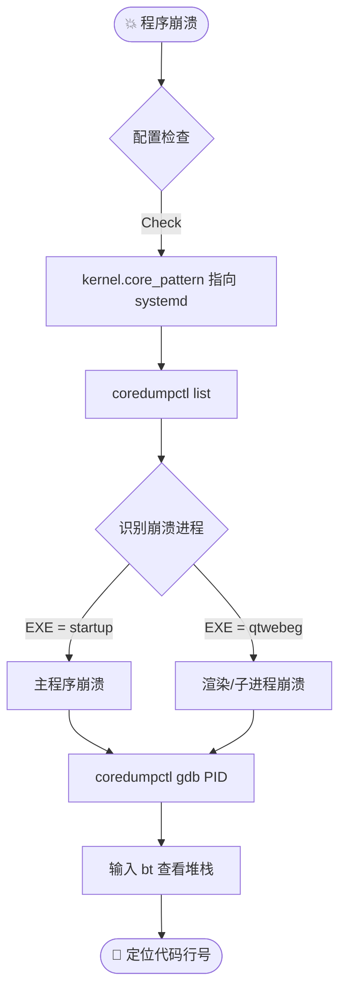

---

# 🐧 Linux 桌面端运维与深度调试手册 (Kylin/UOS)

> ℹ️ **适用场景**：银河麒麟 (Kylin V10)、统信 (UOS) 等国产 Linux 发行版。涵盖客户端部署配置与 C++ (Qt/Electron) 应用的崩溃核心分析。

## 🛠️ 第一部分：部署与环境配置 (Deployment)

### 1. 桌面应用自启动配置

**原理**：XDG 桌面规范。将 `.desktop` 描述文件放入 `~/.config/autostart/` 目录即可实现用户登录后自启。

```shell
# 一键配置脚本 (自动处理目录不存在的情况)
TARGET_DIR="$HOME/.config/autostart"
SOURCE_FILE="$HOME/Desktop/courtintetim.fusioncloudtribsys.desktop" # 注意：中文环境可能是 $HOME/桌面/...

# 1. 确保目录存在
mkdir -p "$TARGET_DIR"

# 2. 复制启动快捷方式
cp "$SOURCE_FILE" "$TARGET_DIR/"

# 3. 赋权 (可选，但推荐)
chmod +x "$TARGET_DIR/$(basename "$SOURCE_FILE")"
```

### 2. Electron 沙盒权限修复

**场景**：Electron 应用启动白屏或报错 `The SUID sandbox helper binary was found, but is not configured correctly`。这是因为 Chrome 沙盒需要 SUID 权限。

```shell
# 必须使用 root 权限操作
# 1. 修改属主为 root
sudo chown root /path/to/install/Electron/chrome-sandbox

# 2. 赋予 4755 权限 (SetUID 位 + rwxr-xr-x)
# 4xxx: SetUID，允许普通用户以文件所有者(root)的身份运行它
sudo chmod 4755 /path/to/install/Electron/chrome-sandbox
```

### 3. 永久关闭 Kysec (麒麟安全机制)

**场景**：麒麟 V10 SP1 的安全机制可能会拦截未签名的第三方驱动或应用行为。

1. **修改 GRUB 配置**：
    
    ```shell
    sudo vim /etc/default/grub
    ```
    
    找到 `GRUB_CMDLINE_LINUX_SECURITY` 行，修改为空：
    
   ```shell
    # 修改前
    GRUB_CMDLINE_LINUX_SECURITY='security=kysec'
    
    # 修改后 (禁用)
    GRUB_CMDLINE_LINUX_SECURITY='security='
    ```
    
1. **更新引导并重启**：

   ```shell
    sudo update-grub  # 重新生成 grub.cfg
    reboot            # 立即重启生效
    ```
    

---

## 🐞 第二部分：崩溃分析 (Crash Analysis)

> 💡 **核心工具**：`coredumpctl` (Systemd 的一部分)。它比传统的 `ulimit -c` + `gdb core` 方式更现代化、管理更方便。

### 1. 分析流程图 (Workflow)



### 2. 环境准备

确保 Core Dump 交给 systemd 接管，而不是直接写文件。

```shell
# 临时生效 (重启失效)
sudo sysctl -w kernel.core_pattern="|/usr/lib/systemd/systemd-coredump %P %u %g %s %t %c %h %e"

# 确认服务状态
systemctl status systemd-coredump
```

### 3. 定位与调试实战 (Step-by-Step)

#### 步骤 A：查凶手 (`list`)

查看崩溃历史，通过 `EXE` 列快速判断是**主进程**还是**WebEngine子进程**挂了。

```shell
coredumpctl list
```

|**关键列**|**含义**|**分析技巧**|
|---|---|---|
|**PID**|进程ID|**记住它**，后续调试的 Key。|
|**SIG**|信号|`11` (SIGSEGV) = 段错误/空指针；`6` (SIGABRT) = 主动崩溃/断言失败。|
|**EXE**|路径|`/opt/app/startup` = 主程序挂了；`/lib/qt/qtwebeg` = 网页渲染进程挂了。|

#### 步骤 B：看摘要 (`info`)

不进 GDB，先看概览。

```shell
coredumpctl info <PID>
# 重点看 "Signal" 和 "Stack trace" 的前几行
```

#### 步骤 C：进现场 (`gdb`)

自动加载 Core 文件和符号表（如果有）。

```shell
# 调试指定 PID
coredumpctl gdb <PID>

# 或者调试最近一次 qtwebeg 的崩溃
coredumpctl gdb qtwebeg
```

#### 步骤 D：找代码 (`bt`)

在 GDB 交互界面 `(gdb)` 中输入：


```Code snippet
bt  # Backtrace (栈回溯)
```

**解读示例**：

```Plaintext
#0  0x00007f... in DoSomething (ptr=0x0) at /project/src/web_engine.cpp:45
                                   ^                     ^
                                空指针嫌疑             代码行号
```

### 4. 导出证据

如果需要将 Core 文件发给研发团队：

```Bash
# 导出未压缩的 core 文件
coredumpctl dump <PID> -o crash_dump.core
```

---

## 📝 第三部分：日志审计 (Log Audit)

当发生静默崩溃（无 Core Dump）或应用异常退出时，需结合内核日志查证。

### 1. 组合查询命令

同时搜索系统消息和内核环形缓冲区，过滤关键字 `instance` (通常是应用名) 或 `QtWebEngine`。


```shell
# 1. 查看系统日志 (包含服务启动、崩溃信号)
# -x: 补充信息, -e: 跳转到末尾
journalctl -xe | grep -E "instance|QtWebEngine"

# 2. 查看内核日志 (查看 OOM Kill、硬件错误、段错误底层记录)
dmesg | grep -E "instance|QtWebEngine"
```

> **架构师提示**：如果 `coredumpctl` 找不到记录，但 `dmesg` 里有 `Out of memory: Kill process`，说明是内存爆了被内核杀掉的，这种情况下通常不会产生 Core Dump。