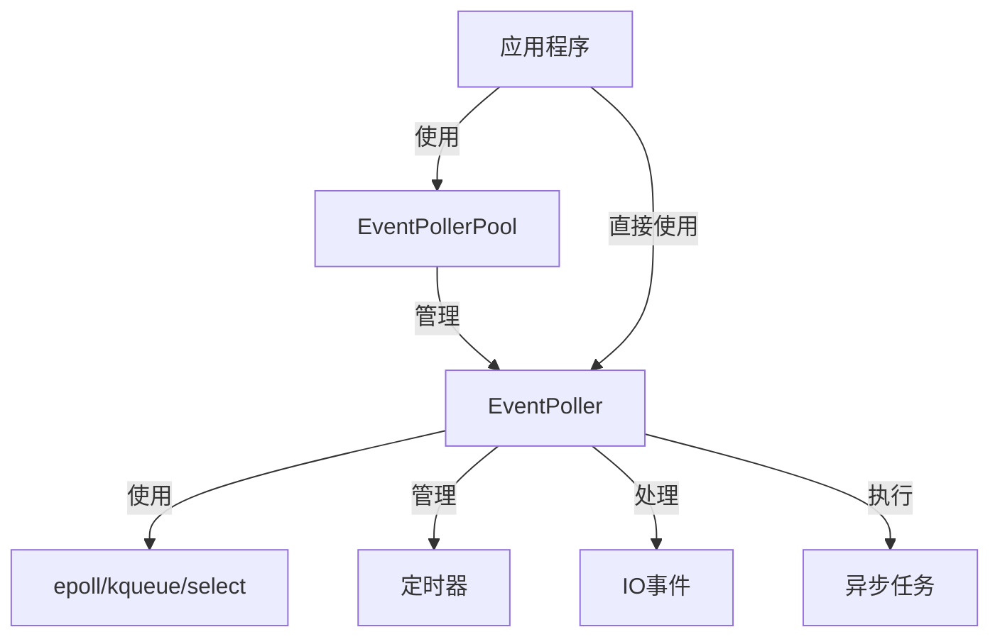
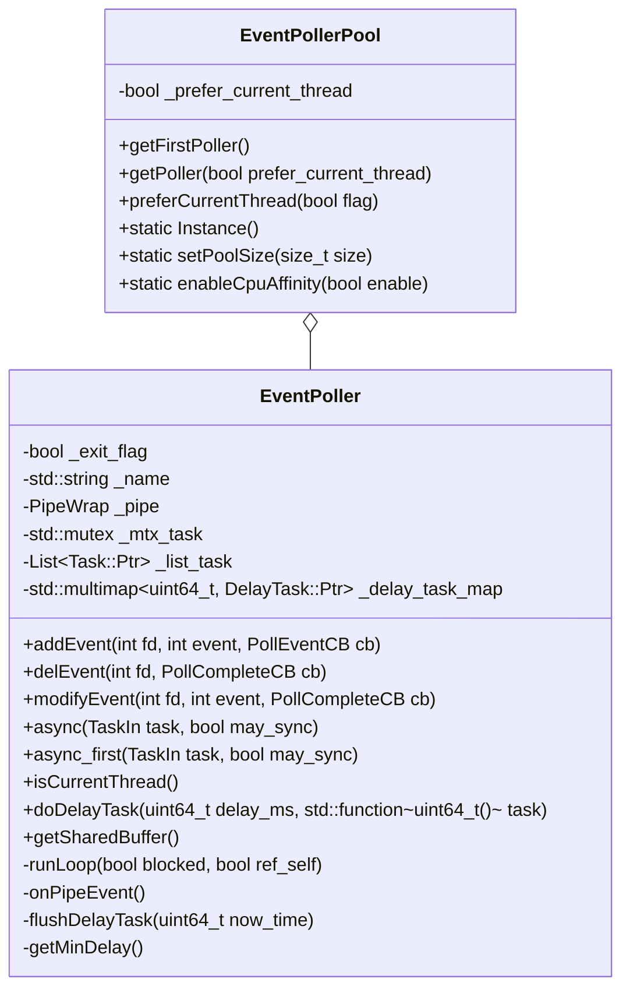
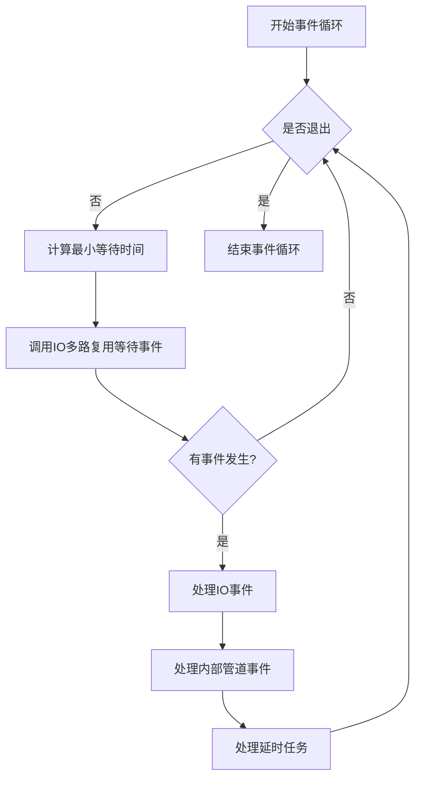
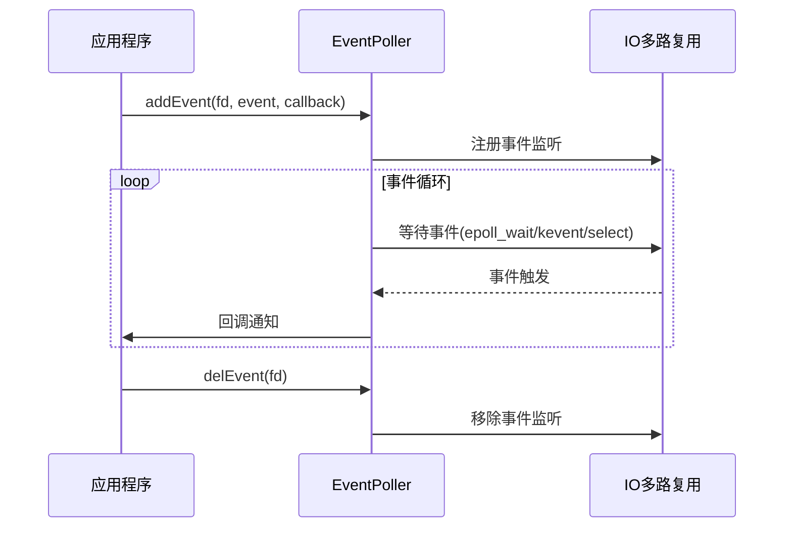
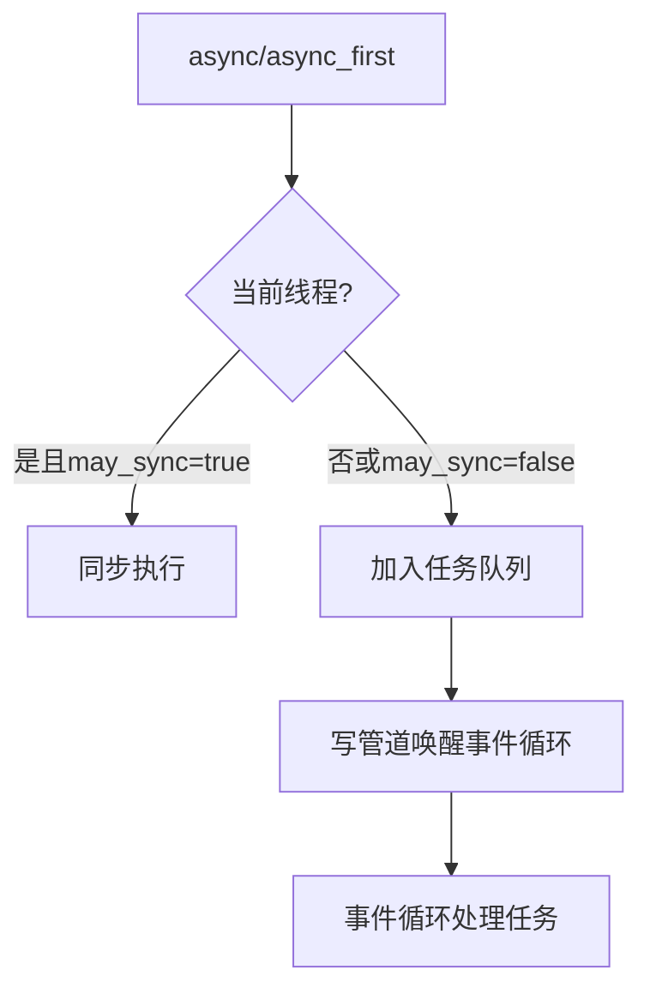
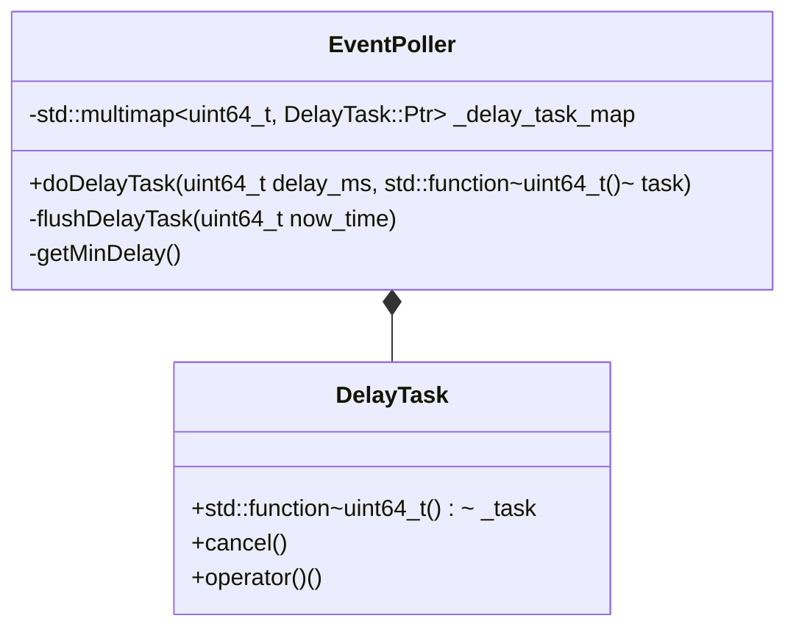
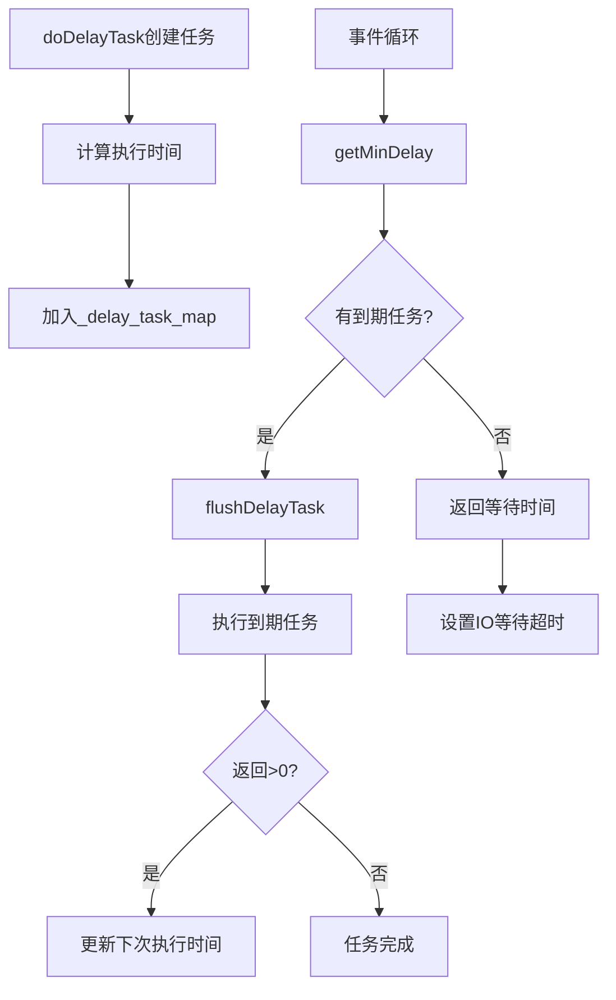
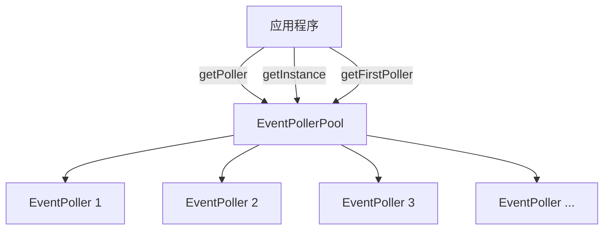
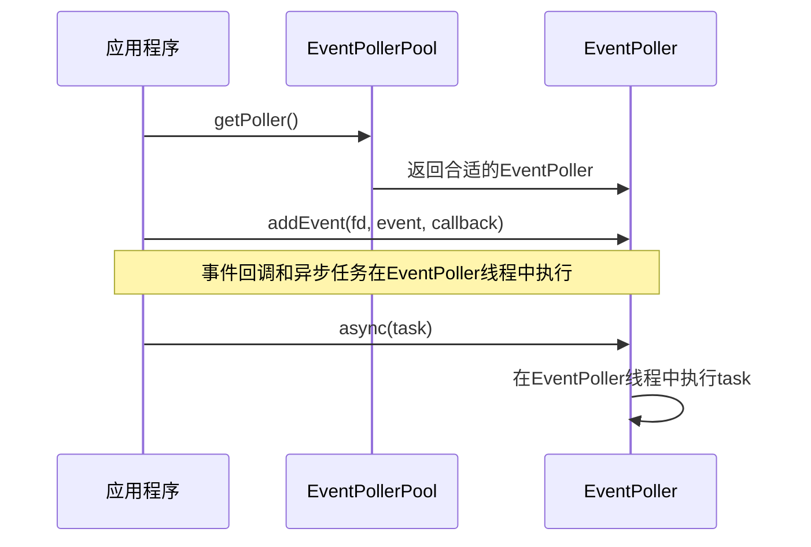

# ZLToolKit EventPoller详解

## 目录

1. [概述](#1-概述)
2. [核心类结构](#2-核心类结构)
3. [事件循环机制](#3-事件循环机制)
4. [任务调度系统](#4-任务调度系统)
5. [定时器实现](#5-定时器实现)
6. [多线程模型](#6-多线程模型)
7. [源码剖析](#7-源码剖析)
8. [使用示例](#8-使用示例)

## 1. 概述

EventPoller是ZLToolKit中的核心组件，提供了高效的事件驱动机制。它基于IO多路复用技术（epoll/kqueue/select），实现了一个通用的事件轮询器，支持跨平台的事件处理、异步任务执行和定时器功能。

### 1.1 主要特性

- 跨平台支持（Linux, macOS, Windows等）
- 基于IO多路复用（epoll/kqueue/select）
- 异步任务执行
- 精确定时器系统
- 线程安全设计
- 线程池支持

### 1.2 核心组件关系



## 2. 核心类结构

### 2.1 EventPoller类



### 2.2 事件类型定义

```cpp
typedef enum {
    Event_Read = 1 << 0,  // 读事件
    Event_Write = 1 << 1, // 写事件
    Event_Error = 1 << 2, // 错误事件
    Event_LT = 1 << 3,    // 水平触发模式
} Poll_Event;
```

### 2.3 回调函数类型

```cpp
using PollEventCB = std::function<void(int event)>;
using PollCompleteCB = std::function<void(bool success)>;
using DelayTask = TaskCancelableImp<uint64_t(void)>;
```

## 3. 事件循环机制

### 3.1 事件循环工作流程



### 3.2 IO多路复用实现

EventPoller根据不同平台选择最优的IO多路复用机制：

```cpp
#if defined(__linux__) || defined(__linux)
#define HAS_EPOLL  // Linux使用epoll
#endif

#if defined(__APPLE__) || defined(__FreeBSD__) || defined(__NetBSD__) || defined(__OpenBSD__)
#define HAS_KQUEUE  // macOS/BSD使用kqueue
#endif

// 其他平台使用select
```

### 3.3 事件处理流程



## 4. 任务调度系统

### 4.1 异步任务执行

EventPoller提供了两种异步任务执行方式：



### 4.2 线程安全设计

```cpp
// 任务队列锁保护
std::mutex _mtx_task;
List<Task::Ptr> _list_task;

// 管道唤醒机制
PipeWrap _pipe;

// 线程安全的任务添加
Task::Ptr EventPoller::async_l(TaskIn task, bool may_sync, bool first) {
    if (may_sync && isCurrentThread()) {
        task();
        return nullptr;
    }

    auto ret = std::make_shared<Task>(std::move(task));
    {
        lock_guard<mutex> lck(_mtx_task);
        if (first) {
            _list_task.emplace_front(ret);
        } else {
            _list_task.emplace_back(ret);
        }
    }
    //写数据到管道,唤醒主线程
    _pipe.write("", 1);
    return ret;
}
```

## 5. 定时器实现

### 5.1 定时任务存储结构



### 5.2 定时器执行流程



### 5.3 定时器精度控制

EventPoller的定时器精度取决于IO多路复用的超时精度，通常为毫秒级：

```cpp
// epoll实现
int ret = epoll_wait(_event_fd, events, EPOLL_SIZE, minDelay ? minDelay : -1);

// kqueue实现
struct timespec timeout = { (long)minDelay / 1000, (long)minDelay % 1000 * 1000000 };
int ret = kevent(_event_fd, nullptr, 0, kevents, KEVENT_SIZE, minDelay ? &timeout : nullptr);

// select实现
tv.tv_sec = (decltype(tv.tv_sec)) (minDelay / 1000);
tv.tv_usec = 1000 * (minDelay % 1000);
ret = zl_select(max_fd + 1, &set_read, &set_write, &set_err, minDelay ? &tv : nullptr);
```

## 6. 多线程模型

### 6.1 EventPollerPool



### 6.2 负载均衡策略

```cpp
// 根据负载返回合适的EventPoller
EventPoller::Ptr EventPollerPool::getPoller(bool prefer_current_thread) {
    auto poller = EventPoller::getCurrentPoller();
    if (prefer_current_thread && _prefer_current_thread && poller) {
        return poller;
    }
    return static_pointer_cast<EventPoller>(getExecutor());
}
```

### 6.3 线程绑定机制



## 7. 源码剖析

### 7.1 事件循环核心代码

```cpp
void EventPoller::runLoop(bool blocked, bool ref_self) {
    if (blocked) {
        if (ref_self) {
            s_current_poller = shared_from_this();
        }
        _sem_run_started.post();
        _exit_flag = false;
        uint64_t minDelay;
#if defined(HAS_EPOLL)
        struct epoll_event events[EPOLL_SIZE];
        while (!_exit_flag) {
            minDelay = getMinDelay();
            startSleep();
            int ret = epoll_wait(_event_fd, events, EPOLL_SIZE, minDelay ? minDelay : -1);
            sleepWakeUp();
            if (ret <= 0) {
                continue;
            }

            _event_cache_expired.clear();

            for (int i = 0; i < ret; ++i) {
                struct epoll_event &ev = events[i];
                int fd = ev.data.fd;
                if (_event_cache_expired.count(fd)) {
                    continue;
                }

                auto it = _event_map.find(fd);
                if (it == _event_map.end()) {
                    epoll_ctl(_event_fd, EPOLL_CTL_DEL, fd, nullptr);
                    continue;
                }
                auto cb = it->second;
                try {
                    (*cb)(toPoller(ev.events));
                } catch (std::exception &ex) {
                    ErrorL << "Exception occurred when do event task: " << ex.what();
                }
            }
        }
#endif //HAS_EPOLL
        // 其他平台实现类似...
    } else {
        _loop_thread = new thread(&EventPoller::runLoop, this, true, ref_self);
        _sem_run_started.wait();
    }
}
```

### 7.2 定时任务处理核心代码

```cpp
uint64_t EventPoller::flushDelayTask(uint64_t now_time) {
    decltype(_delay_task_map) task_copy;
    task_copy.swap(_delay_task_map);

    for (auto it = task_copy.begin(); it != task_copy.end() && it->first <= now_time; it = task_copy.erase(it)) {
        try {
            auto next_delay = (*(it->second))();
            if (next_delay) {
                _delay_task_map.emplace(next_delay + now_time, std::move(it->second));
            }
        } catch (std::exception &ex) {
            ErrorL << "Exception occurred when do delay task: " << ex.what();
        }
    }

    task_copy.insert(_delay_task_map.begin(), _delay_task_map.end());
    task_copy.swap(_delay_task_map);

    auto it = _delay_task_map.begin();
    if (it == _delay_task_map.end()) {
        return 0;
    }
    return it->first - now_time;
}
```

### 7.3 内部管道事件处理

```cpp
void EventPoller::onPipeEvent() {
    char buf[1024];
    int err = 0;
    while (true) {
        if ((err = _pipe.read(buf, sizeof(buf))) > 0) {
            continue;
        }
        if (err == 0 || get_uv_error(true) != UV_EAGAIN) {
            ErrorL << "Invalid pipe fd of event poller, reopen it";
            delEvent(_pipe.readFD());
            _pipe.reOpen();
            addEventPipe();
        }
        break;
    }

    decltype(_list_task) _list_swap;
    {
        lock_guard<mutex> lck(_mtx_task);
        _list_swap.swap(_list_task);
    }

    _list_swap.for_each([&](const Task::Ptr &task) {
        try {
            (*task)();
        } catch (ExitException &) {
            _exit_flag = true;
        } catch (std::exception &ex) {
            ErrorL << "Exception occurred when do async task: " << ex.what();
        }
    });
}
```

## 8. 使用示例

### 8.1 基本使用方式

```cpp
// 获取EventPoller实例
auto poller = EventPollerPool::Instance().getPoller();

// 添加事件监听
int fd = socket(AF_INET, SOCK_STREAM, 0);
poller->addEvent(fd, EventPoller::Event_Read, [](int event) {
    // 处理读事件
    char buffer[1024] = {0};
    read(fd, buffer, sizeof(buffer));
    cout << "收到数据: " << buffer << endl;
});

// 异步执行任务
poller->async([]() {
    cout << "异步任务执行!" << endl;
});

// 添加定时任务
poller->doDelayTask(1000, []() -> uint64_t {
    cout << "1秒定时器触发!" << endl;
    return 1000; // 返回正数表示继续定时执行，再次等待1000ms
});
```

### 8.2 线程安全访问

```cpp
// 创建网络服务器
TcpServer server;
server.start<MySession>(9090);

// 在任意线程异步执行任务（安全跨线程操作）
ThreadPool::Instance().getExecutor()->async([poller]() {
    poller->async([]() {
        cout << "这段代码总是在poller线程中执行" << endl;
    });
});
```

### 8.3 避免CPU优化

EventPoller即使在循环不退出的情况下也不会空转CPU，它使用以下机制避免CPU空转：

- IO多路复用阻塞等待（epoll_wait/kevent/select）
- 定时任务精确控制阻塞时间
- 无任务/事件时无限期阻塞，等待事件发生
- 内部管道通知机制用于唤醒

```cpp
// 无限阻塞等待示例（不会消耗CPU）
int ret = epoll_wait(_event_fd, events, EPOLL_SIZE, -1);

// 定时等待示例（精确控制CPU使用）
int ret = epoll_wait(_event_fd, events, EPOLL_SIZE, minDelay);
```

---

## 总结

EventPoller是ZLToolKit的核心组件，提供了高效的事件驱动机制。它通过IO多路复用技术实现了跨平台的事件处理、异步任务执行和定时器功能。其优雅的设计确保了高性能、低延迟和CPU效率，同时提供了简洁易用的接口。

EventPoller的设计遵循现代C++的最佳实践，包括智能指针内存管理、函数式编程风格和异常安全设计。通过线程池和负载均衡机制，它能够充分利用多核心处理器的能力，适用于高并发网络应用程序。

理解EventPoller的工作原理对于理解整个ZLToolKit框架至关重要，它是Socket、Server、Session等网络组件的基础设施。