```
https://192.168.20.78:10083/webassist/index.html?secret=3QxOcMcEYBmgF0xY3XueFOlFERBbtYbb
```

# ZLToolKit网络模块详解

## 目录

1. [网络模块概述](#1-网络模块概述)
2. [类结构设计](#2-类结构设计)
3. [线程模型详解](#3-线程模型详解)
4. [TCP实现机制](#4-tcp实现机制)
5. [UDP实现机制](#5-udp实现机制)
6. [会话管理机制](#6-会话管理机制)
7. [Buffer管理](#7-buffer管理)
8. [与Muduo对比](#8-与muduo对比)
9. [设计模式应用](#9-设计模式应用)
10. [源码剖析](#10-源码剖析)

## 1. 网络模块概述

ZLToolKit的网络模块(`Network`目录)是一个基于事件驱动的异步网络框架，提供了高性能的TCP/UDP网络通信能力。

### 1.1 核心特点

- 多线程Reactor模式
- Socket克隆机制实现负载均衡
- 支持TCP/UDP协议
- 高效会话管理
- 异步非阻塞IO
- 智能指针管理对象生命周期

### 1.2 目录结构

Network/

├── Buffer.cpp # 缓冲区实现

├── Buffer.h # 缓冲区定义

├── BufferSock.cpp # Socket缓冲区实现

├── BufferSock.h # Socket缓冲区定义

├── Server.cpp # 服务器基类实现

├── Server.h # 服务器基类定义

├── Session.cpp # 会话基类实现

├── Session.h # 会话基类定义

├── Socket.cpp # Socket封装实现

├── Socket.h # Socket封装定义

├── Socket_ios.mm # iOS平台Socket特殊实现

├── TcpClient.cpp # TCP客户端实现

├── TcpClient.h # TCP客户端定义

├── TcpServer.cpp # TCP服务器实现

├── TcpServer.h # TCP服务器定义

├── UdpServer.cpp # UDP服务器实现

├── UdpServer.h # UDP服务器定义

├── sockutil.cpp # Socket工具函数实现

└── sockutil.h # Socket工具函数定义

### 1.3 组件关系图

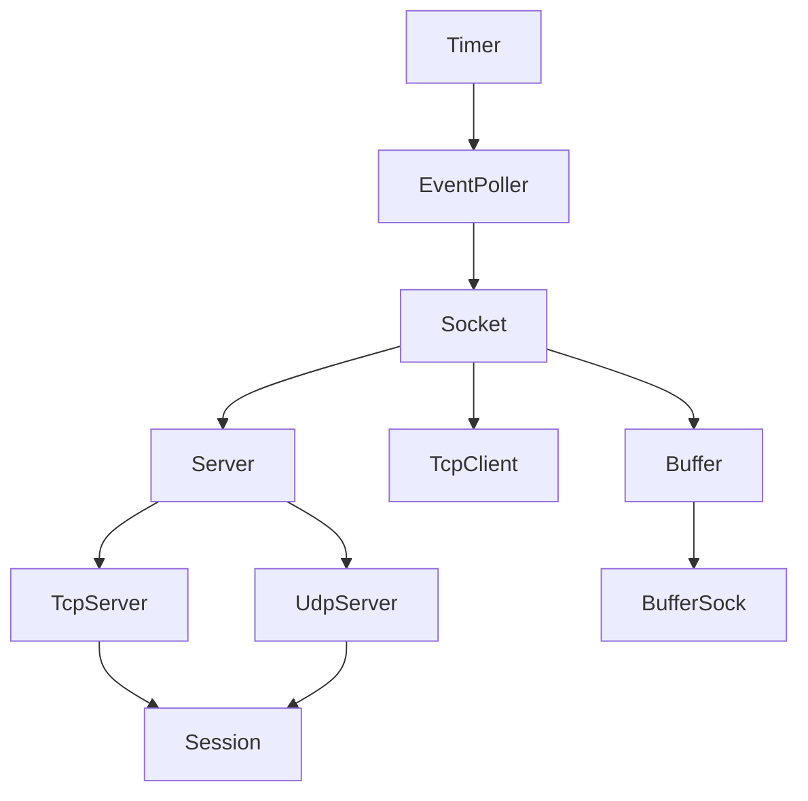
```mermaid
graph TD
    A[EventPoller] --> B[Socket]
    B --> C[Server]
    C --> D[TcpServer]
    C --> E[UdpServer]
    B --> F[TcpClient]
    D --> G[Session]
    E --> G
    B --> H[Buffer]
    H --> I[BufferSock]
    J[Timer] --> A
```

## 2. 类结构设计

### 2.1 核心类图

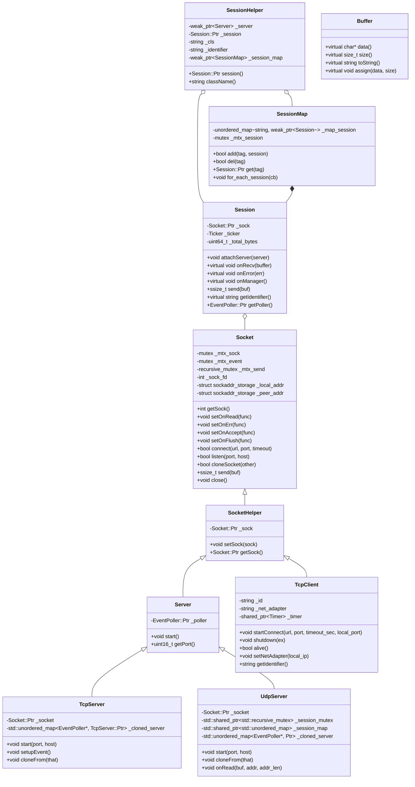
```mermaid
classDiagram
    class Socket {
        -mutex _mtx_sock
        -mutex _mtx_event
        -recursive_mutex _mtx_send
        -int _sock_fd
        -struct sockaddr_storage _local_addr
        -struct sockaddr_storage _peer_addr
        +int getSock()
        +void setOnRead(func)
        +void setOnErr(func)
        +void setOnAccept(func)
        +void setOnFlush(func)
        +bool connect(url, port, timeout)
        +bool listen(port, host)
        +bool cloneSocket(other)
        +ssize_t send(buf)
        +void close()
    }
    
    class SocketHelper {
        -Socket::Ptr _sock
        +void setSock(sock)
        +Socket::Ptr getSock()
    }
    
    class Server {
        -EventPoller::Ptr _poller
        +void start()
        +uint16_t getPort()
    }
    
    class TcpServer {
        -Socket::Ptr _socket
        -std::unordered_map~EventPoller*, TcpServer::Ptr~ _cloned_server
        +void start(port, host)
        +void setupEvent()
        +void cloneFrom(that)
    }
    
    class UdpServer {
        -Socket::Ptr _socket
        -std::shared_ptr~std::recursive_mutex~ _session_mutex
        -std::shared_ptr~std::unordered_map~ _session_map
        -std::unordered_map~EventPoller*, Ptr~ _cloned_server
        +void start(port, host)
        +void cloneFrom(that)
        +void onRead(buf, addr, addr_len)
    }
    
    class Session {
        -Socket::Ptr _sock
        -Ticker _ticker
        -uint64_t _total_bytes
        +void attachServer(server)
        +virtual void onRecv(buffer)
        +virtual void onError(err)
        +virtual void onManager()
        +ssize_t send(buf)
        +virtual string getIdentifier()
        +EventPoller::Ptr getPoller()
    }
    
    class SessionHelper {
        -weak_ptr~Server~ _server
        -Session::Ptr _session
        -string _cls
        -string _identifier
        -weak_ptr~SessionMap~ _session_map
        +Session::Ptr session()
        +string className()
    }
    
    class SessionMap {
        -unordered_map~string, weak_ptr~Session~~ _map_session
        -mutex _mtx_session
        +bool add(tag, session)
        +bool del(tag)
        +Session::Ptr get(tag)
        +void for_each_session(cb)
    }
    
    class TcpClient {
        -string _id
        -string _net_adapter
        -shared_ptr~Timer~ _timer
        +void startConnect(url, port, timeout_sec, local_port)
        +void shutdown(ex)
        +bool alive()
        +void setNetAdapter(local_ip)
        +string getIdentifier()
    }
    
    class Buffer {
        +virtual char* data()
        +virtual size_t size()
        +virtual string toString()
        +virtual void assign(data, size)
    }
    
    Socket <|-- SocketHelper
    SocketHelper <|-- Server
    SocketHelper <|-- TcpClient
    Server <|-- TcpServer
    Server <|-- UdpServer
    Session o-- Socket
    SessionHelper o-- Session
    SessionHelper o-- SessionMap
    SessionMap *-- Session
```

### 2.2 核心接口说明

#### Socket类

底层套接字封装，提供基本网络操作:

```cpp
class Socket : public std::enable_shared_from_this<Socket> {
public:
    using Ptr = std::shared_ptr<Socket>;
    // 创建TCP/UDP Socket
    static Ptr createSocket();
    // 创建指定类型Socket
    static Ptr createSocket(int sock_flags);
    // 监听端口
    bool listen(uint16_t port, const std::string &host = "::", int back_log = 1024);
    // 连接服务器
    bool connect(const std::string &url, uint16_t port, const onErrCB &cb, float timeout_sec = 5, const std::string &local_ip = "::", uint16_t local_port = 0);
    // 绑定UDP端口
    bool bindUdpSock(uint16_t port, const std::string &host = "::");
    // 克隆Socket
    bool cloneSocket(const Socket &other);
    // 发送数据
    ssize_t send(const Buffer::Ptr &buf, int flags = 0, bool flush = true);
};
```

#### Server类

网络服务器基类:

```cpp
class Server : public std::enable_shared_from_this<Server>, public mINI {
public:
    using Ptr = std::shared_ptr<Server>;
    // 构造函数
    Server(EventPoller::Ptr poller = nullptr);
};
```

#### Session类

连接会话基类:

```cpp
class Session : public SocketHelper, public std::enable_shared_from_this<Session> {
public:
    using Ptr = std::shared_ptr<Session>;
    // 构造函数
    Session(const Socket::Ptr &sock);
    // 接收数据回调
    virtual void onRecv(const Buffer::Ptr &buffer) = 0;
    // 错误回调
    virtual void onError(const SockException &err) = 0;
    // 管理会话
    virtual void onManager() = 0;
};
```

## 3. 线程模型详解

### 3.1 Reactor模型

ZLToolKit使用多线程Reactor模式:

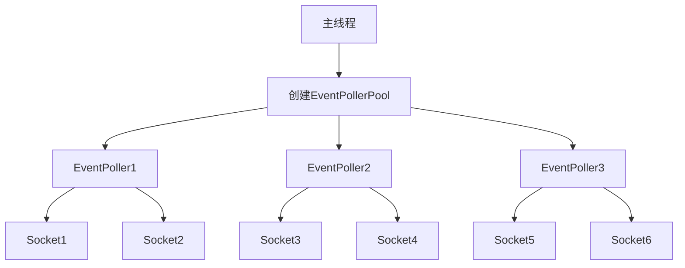
```mermaid
graph TD
    A[主线程] --> B[创建EventPollerPool]
    B --> C1[EventPoller1]
    B --> C2[EventPoller2]
    B --> C3[EventPoller3]
    C1 --> D1[Socket1]
    C1 --> D2[Socket2]
    C2 --> D3[Socket3]
    C2 --> D4[Socket4]
    C3 --> D5[Socket5]
    C3 --> D6[Socket6]
```

### 3.2 Socket克隆机制

ZLToolKit最核心的设计是Socket克隆:

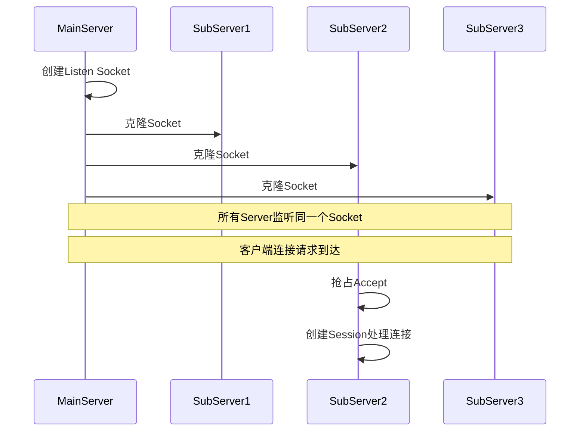
```mermaid
sequenceDiagram
    participant M as MainServer
    participant S1 as SubServer1
    participant S2 as SubServer2
    participant S3 as SubServer3
    
    M->>M: 创建Listen Socket
    M->>S1: 克隆Socket
    M->>S2: 克隆Socket
    M->>S3: 克隆Socket
    
    Note over M,S3: 所有Server监听同一个Socket
    
    Note over M,S3: 客户端连接请求到达
    
    S2->>S2: 抢占Accept
    S2->>S2: 创建Session处理连接
```

### 3.3 线程调度

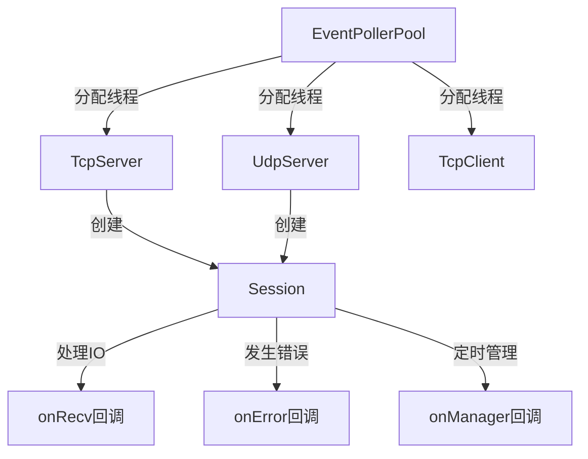
```mermaid
graph TD
    A[EventPollerPool] -->|分配线程| B[TcpServer]
    A -->|分配线程| C[UdpServer]
    A -->|分配线程| D[TcpClient]
    
    B -->|创建| E[Session]
    C -->|创建| E
    
    E -->|处理IO| F[onRecv回调]
    E -->|发生错误| G[onError回调]
    E -->|定时管理| H[onManager回调]
```

## 4. TCP实现机制

### 4.1 TcpServer工作流程

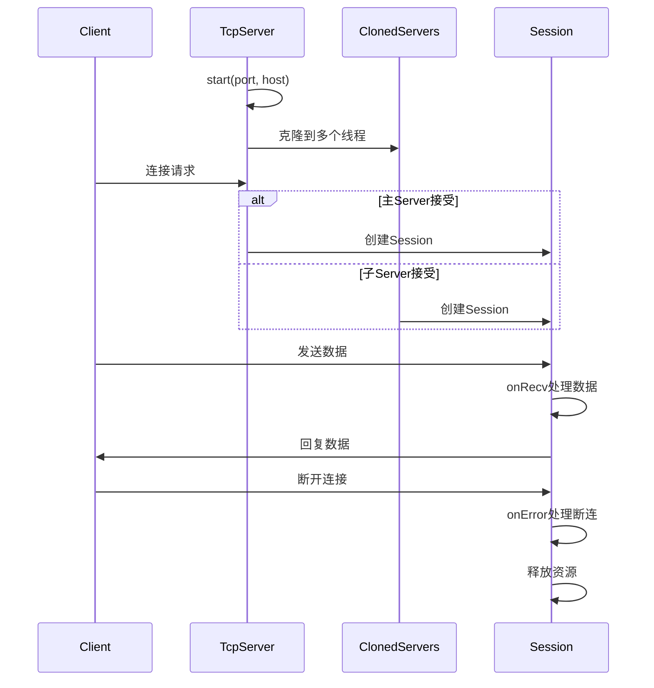
```mermaid
sequenceDiagram
    participant C as Client
    participant S as TcpServer
    participant Sub as ClonedServers
    participant Ses as Session
    
    S->>S: start(port, host)
    S->>Sub: 克隆到多个线程
    
    C->>S: 连接请求
    
    alt 主Server接受
        S->>Ses: 创建Session
    else 子Server接受
        Sub->>Ses: 创建Session
    end
    
    C->>Ses: 发送数据
    Ses->>Ses: onRecv处理数据
    Ses->>C: 回复数据
    
    C->>Ses: 断开连接
    Ses->>Ses: onError处理断连
    Ses->>Ses: 释放资源
```

### 4.2 核心源码分析 - TcpServer

```cpp
void TcpServer::setupEvent() {
    // 创建Socket
    _socket = Socket::createSocket();
    // 绑定错误回调
    weak_ptr<TcpServer> weak_self = dynamic_pointer_cast<TcpServer>(shared_from_this());
    _socket->setOnAccept([weak_self](int sock, const SockException &err) {
        // accept回调，当有新连接到来时触发
        auto strong_self = weak_self.lock();
        if (!strong_self) {
            return;
        }
        if (err) {
            return;
        }
        // 接受连接
        Socket::Ptr client_sock = Socket::createSocket(sock, strong_self->_poller);
        // 创建会话
        strong_self->onAcceptConnection(client_sock);
    });
}
```

### 4.3 连接分配流程

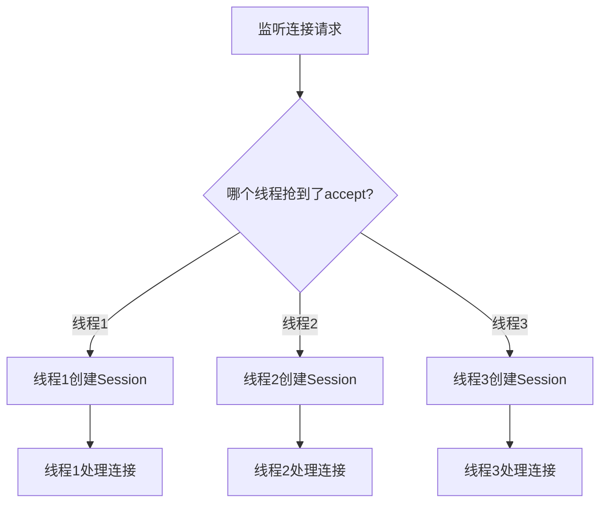
```mermaid
flowchart TD
    A[监听连接请求] --> B{哪个线程抢到了accept?}
    B --> |线程1| C1[线程1创建Session]
    B --> |线程2| C2[线程2创建Session]
    B --> |线程3| C3[线程3创建Session]
    C1 --> D1[线程1处理连接]
    C2 --> D2[线程2处理连接]
    C3 --> D3[线程3处理连接]
```

## 5. UDP实现机制

### 5.1 UDP会话共享

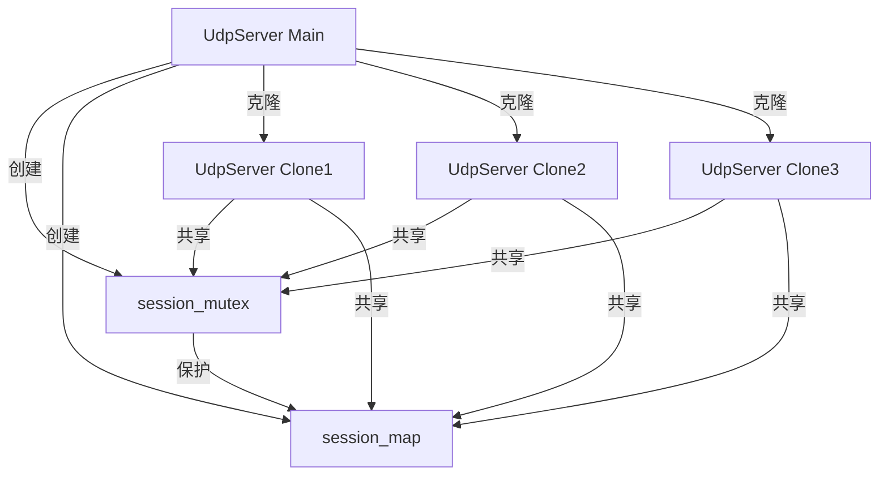
```mermaid
graph TD
    A[UdpServer Main] -->|创建| B[session_mutex]
    A -->|创建| C[session_map]
    A -->|克隆| D[UdpServer Clone1]
    A -->|克隆| E[UdpServer Clone2]
    A -->|克隆| F[UdpServer Clone3]
    
    D -->|共享| B
    D -->|共享| C
    E -->|共享| B
    E -->|共享| C
    F -->|共享| B
    F -->|共享| C
    
    B -->|保护| C
```

### 5.2 UDP数据处理流程

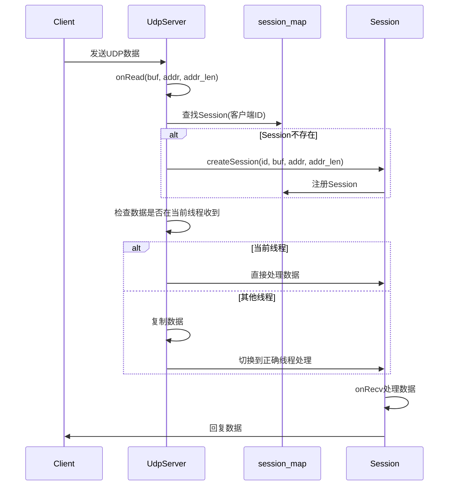
```mermaid
sequenceDiagram
    participant C as Client
    participant S as UdpServer
    participant M as session_map
    participant Ses as Session
    
    C->>S: 发送UDP数据
    S->>S: onRead(buf, addr, addr_len)
    S->>M: 查找Session(客户端ID)
    
    alt Session不存在
        S->>Ses: createSession(id, buf, addr, addr_len)
        Ses->>M: 注册Session
    end
    
    S->>S: 检查数据是否在当前线程收到
    
    alt 当前线程
        S->>Ses: 直接处理数据
    else 其他线程
        S->>S: 复制数据
        S->>Ses: 切换到正确线程处理
    end
    
    Ses->>Ses: onRecv处理数据
    Ses->>C: 回复数据
```

### 5.3 防止数据漂移核心代码

```cpp
void UdpServer::onRead_l(bool is_server_fd, const PeerIdType &id, const Buffer::Ptr &buf, sockaddr *addr, int addr_len) {
    bool is_new = false;
    if (auto helper = getOrCreateSession(id, buf, addr, addr_len, is_new)) {
        if (helper->session()->getPoller()->isCurrentThread()) {
            //当前线程收到数据，直接处理数据
            emitSessionRecv(helper, buf);
        } else {
            //数据漂移到其他线程，需要先切换线程
            WarnL << "UDP packet incoming from other thread";
            std::weak_ptr<SessionHelper> weak_helper = helper;
            //由于socket读buffer是该线程上所有socket共享复用的，所以不能跨线程使用，必须先拷贝一下
            auto cacheable_buf = std::make_shared<BufferString>(buf->toString());
            helper->session()->async([weak_helper, cacheable_buf]() {
                if (auto strong_helper = weak_helper.lock()) {
                    emitSessionRecv(strong_helper, cacheable_buf);
                }
            });
        }
    }
}
```

### 5.4 整体架构图

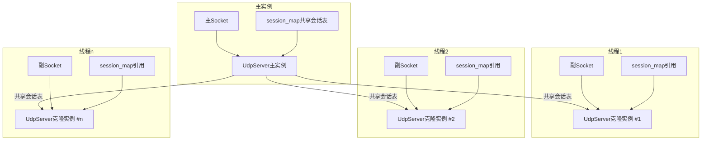
```mermaid
graph TD
    Main[UdpServer主实例] --> |共享会话表| Clone1[UdpServer克隆实例 #1]
    Main --> |共享会话表| Clone2[UdpServer克隆实例 #2]
    Main --> |共享会话表| CloneN[UdpServer克隆实例 #n]
    
    subgraph 主实例
    MainSock[主Socket] --> Main
    SessionMap[session_map共享会话表] --> Main
    end
    
    subgraph 线程1
    Clone1Sock[副Socket] --> Clone1
    Clone1Map[session_map引用] --> Clone1
    end
    
    subgraph 线程2
    Clone2Sock[副Socket] --> Clone2
    Clone2Map[session_map引用] --> Clone2
    end
    
    subgraph 线程n
    CloneNSock[副Socket] --> CloneN
    CloneNMap[session_map引用] --> CloneN
    end
```

### 5.5 数据包接收与分发流程

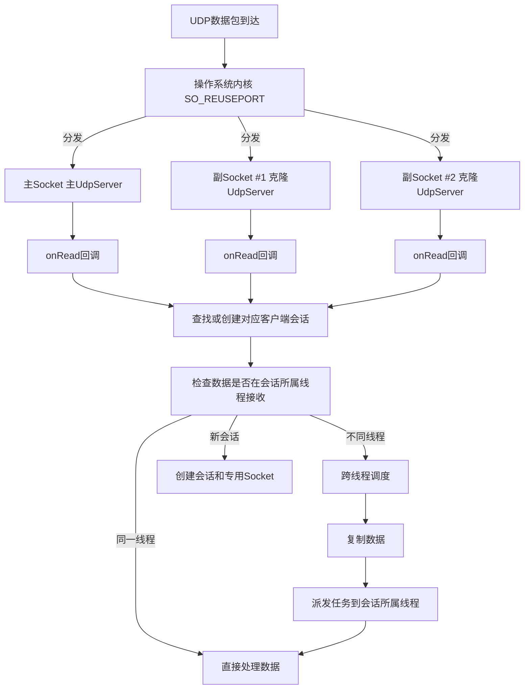
```mermaid
flowchart TD
    A[UDP数据包到达] --> B[操作系统内核 SO_REUSEPORT]
    B -->|分发| C1[主Socket 主UdpServer]
    B -->|分发| C2[副Socket #1 克隆UdpServer]
    B -->|分发| C3[副Socket #2 克隆UdpServer]
    
    C1 --> D1[onRead回调]
    C2 --> D2[onRead回调]
    C3 --> D3[onRead回调]
    
    D1 --> E[查找或创建对应客户端会话]
    D2 --> E
    D3 --> E
    
    E --> F[检查数据是否在会话所属线程接收]
    
    F -->|同一线程| G1[直接处理数据]
    F -->|不同线程| G2[跨线程调度]
    F -->|新会话| G3[创建会话和专用Socket]
    
    G2 --> H[复制数据]
    H --> I[派发任务到会话所属线程]
    I --> G1
```

### 5.6 Peer Socket机制详解

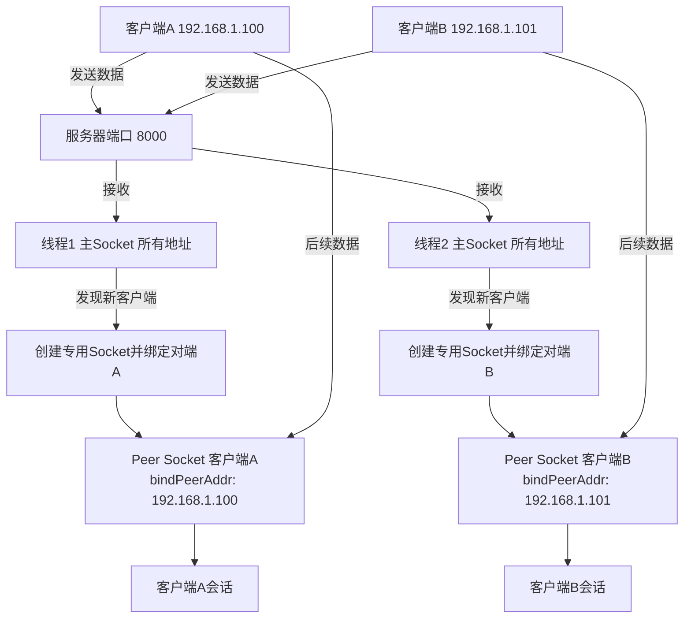
```mermaid
graph TD
    ClientA[客户端A 192.168.1.100] -->|发送数据| Port[服务器端口 8000]
    ClientB[客户端B 192.168.1.101] -->|发送数据| Port
    
    Port -->|接收| MainSock1[线程1 主Socket 所有地址]
    Port -->|接收| MainSock2[线程2 主Socket 所有地址]
    
    MainSock1 -->|发现新客户端| CreateA[创建专用Socket并绑定对端A]
    MainSock2 -->|发现新客户端| CreateB[创建专用Socket并绑定对端B]
    
    CreateA --> PeerSockA[Peer Socket 客户端A\nbindPeerAddr: 192.168.1.100]
    CreateB --> PeerSockB[Peer Socket 客户端B\nbindPeerAddr: 192.168.1.101]
    
    PeerSockA --> SessionA[客户端A会话]
    PeerSockB --> SessionB[客户端B会话]
    
    ClientA -->|后续数据| PeerSockA
    ClientB -->|后续数据| PeerSockB
```

### 5.7 收包判定与处理详解

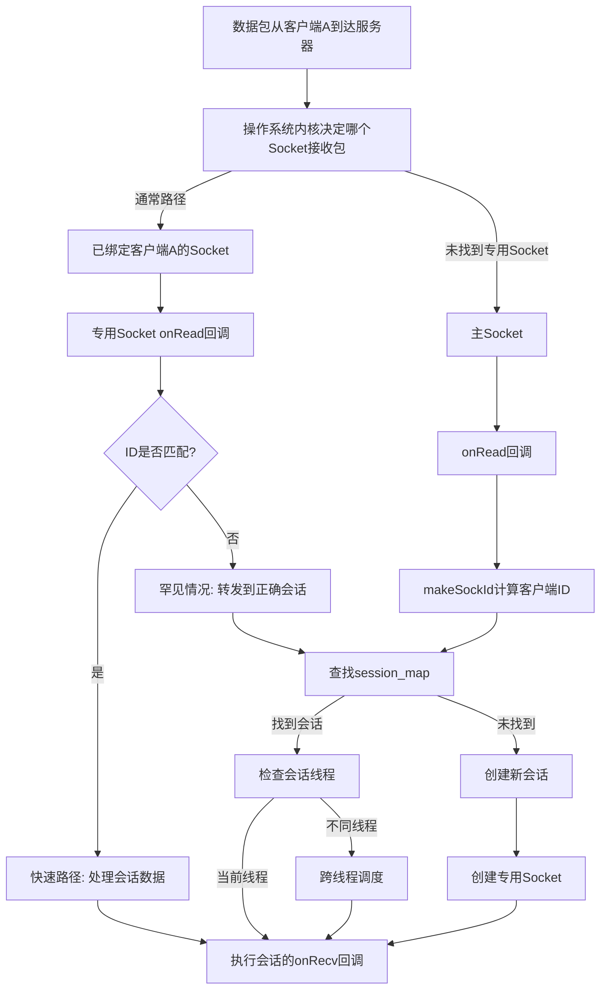
```mermaid
flowchart TD
    A[数据包从客户端A到达服务器] --> B[操作系统内核决定哪个Socket接收包]
    
    B -->|通常路径| C1[已绑定客户端A的Socket]
    B -->|未找到专用Socket| C2[主Socket]
    
    C2 --> D1[onRead回调]
    D1 --> E1[makeSockId计算客户端ID]
    E1 --> F1[查找session_map]
    
    C1 --> D2[专用Socket onRead回调]
    D2 --> E2{ID是否匹配?}
    
    E2 -->|是| F2[快速路径: 处理会话数据]
    E2 -->|否| F3[罕见情况: 转发到正确会话]
    
    F1 -->|找到会话| G[检查会话线程]
    F1 -->|未找到| H[创建新会话]
    
    F2 --> I[执行会话的onRecv回调]
    F3 --> F1
    G -->|当前线程| I
    G -->|不同线程| J[跨线程调度]
    H --> K[创建专用Socket]
    
    J --> I
    K --> I
```

### 5.8 线程切换与数据复制机制

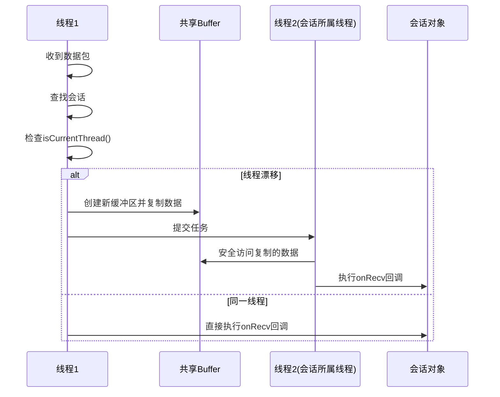
```mermaid
sequenceDiagram
    participant Thread1 as 线程1
    participant Buffer as 共享Buffer
    participant Thread2 as 线程2(会话所属线程)
    participant Session as 会话对象
    
    Thread1->>Thread1: 收到数据包
    Thread1->>Thread1: 查找会话
    Thread1->>Thread1: 检查isCurrentThread()
    
    alt 线程漂移
        Thread1->>Buffer: 创建新缓冲区并复制数据
        Thread1->>Thread2: 提交任务
        Thread2->>Buffer: 安全访问复制的数据
        Thread2->>Session: 执行onRecv回调
    else 同一线程
        Thread1->>Session: 直接执行onRecv回调
    end
```

### 5.9 整体工作实例

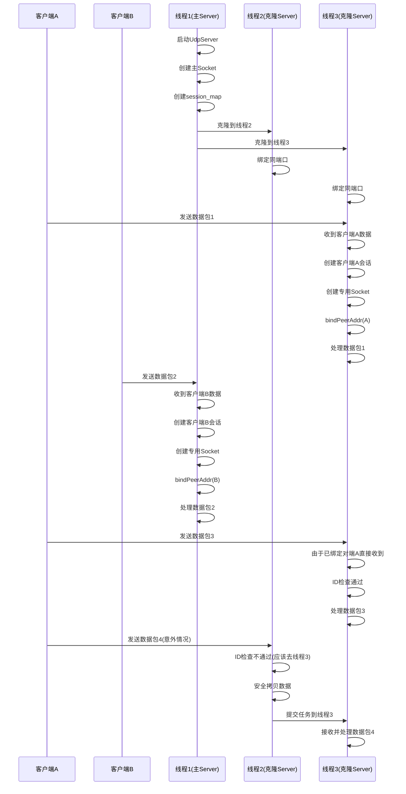
```mermaid
sequenceDiagram
    participant ClientA as 客户端A
    participant ClientB as 客户端B
    participant Thread1 as 线程1(主Server)
    participant Thread2 as 线程2(克隆Server)
    participant Thread3 as 线程3(克隆Server)
    
    Thread1->>Thread1: 启动UdpServer
    Thread1->>Thread1: 创建主Socket
    Thread1->>Thread1: 创建session_map
    Thread1->>Thread2: 克隆到线程2
    Thread1->>Thread3: 克隆到线程3
    Thread2->>Thread2: 绑定同端口
    Thread3->>Thread3: 绑定同端口
    
    ClientA->>Thread3: 发送数据包1
    Thread3->>Thread3: 收到客户端A数据
    Thread3->>Thread3: 创建客户端A会话
    Thread3->>Thread3: 创建专用Socket
    Thread3->>Thread3: bindPeerAddr(A)
    Thread3->>Thread3: 处理数据包1
    
    ClientB->>Thread1: 发送数据包2
    Thread1->>Thread1: 收到客户端B数据
    Thread1->>Thread1: 创建客户端B会话
    Thread1->>Thread1: 创建专用Socket
    Thread1->>Thread1: bindPeerAddr(B)
    Thread1->>Thread1: 处理数据包2
    
    ClientA->>Thread3: 发送数据包3
    Thread3->>Thread3: 由于已绑定对端A直接收到
    Thread3->>Thread3: ID检查通过
    Thread3->>Thread3: 处理数据包3
    
    ClientA->>Thread2: 发送数据包4(意外情况)
    Thread2->>Thread2: ID检查不通过(应该去线程3)
    Thread2->>Thread2: 安全拷贝数据
    Thread2->>Thread3: 提交任务到线程3
    Thread3->>Thread3: 接收并处理数据包4
```

## 关键要点总结

1. **双层Socket架构**：
   - 主Socket接收新客户端连接
   - 专用Socket绑定特定客户端，提高数据包分发效率

2. **内核级数据包分流**：
   - 利用SO_REUSEPORT让多个线程监听同一端口
   - 使用connect/bindPeerAddr让内核自动过滤数据包

3. **安全的跨线程处理**：
   - 共享会话表但单线程处理每个会话
   - 发现线程漂移时深拷贝数据并调度到正确线程

4. **双重校验**：
   - 专用Socket中还会检查数据包ID是否匹配
   - 防止操作系统的错误分发或Socket状态异常

这种设计充分利用了操作系统内核特性，在保持UDP高性能的同时提供了类似TCP的会话管理体验。

## 6. 会话管理机制

### 6.1 SessionMap全局会话表

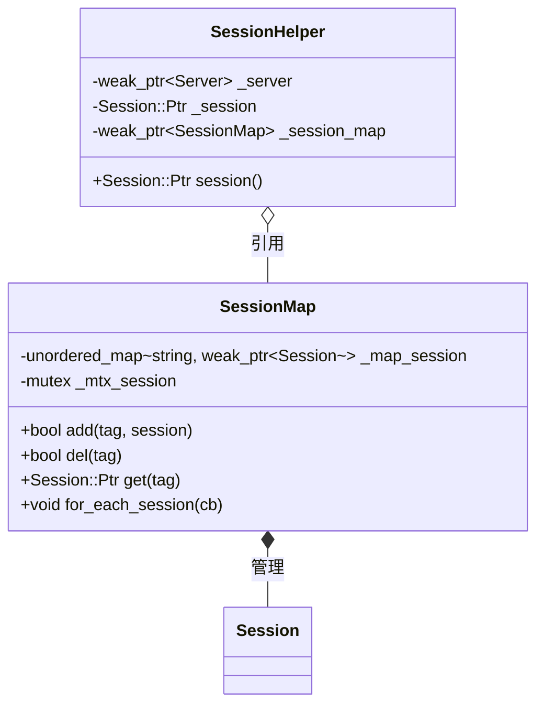
```mermaid
classDiagram
    class SessionMap {
        -unordered_map~string, weak_ptr~Session~~ _map_session
        -mutex _mtx_session
        +bool add(tag, session)
        +bool del(tag)
        +Session::Ptr get(tag)
        +void for_each_session(cb)
    }
    
    class SessionHelper {
        -weak_ptr~Server~ _server
        -Session::Ptr _session
        -weak_ptr~SessionMap~ _session_map
        +Session::Ptr session()
    }
    
    SessionHelper o-- SessionMap : 引用
    SessionMap *-- Session : 管理
```

### 6.2 会话生命周期

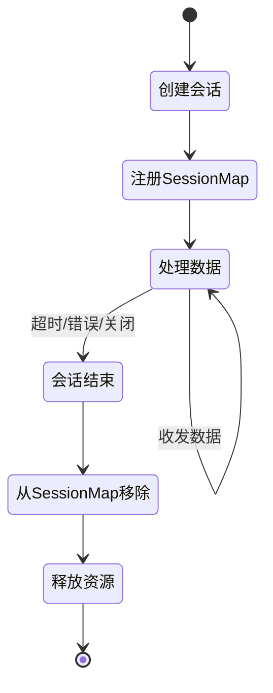
```mermaid
stateDiagram-v2
    [*] --> 创建会话
    创建会话 --> 注册SessionMap
    注册SessionMap --> 处理数据
    处理数据 --> 处理数据: 收发数据
    处理数据 --> 会话结束: 超时/错误/关闭
    会话结束 --> 从SessionMap移除
    从SessionMap移除 --> 释放资源
    释放资源 --> [*]
```

### 6.3 会话管理核心代码

```cpp
SessionHelper::SessionHelper(const std::weak_ptr<Server> &server, Session::Ptr session, std::string cls) {
    _server = server;
    _session = std::move(session);
    _cls = std::move(cls);
    //记录session至全局的map，方便后面管理
    _session_map = SessionMap::Instance().shared_from_this();
    _identifier = _session->getIdentifier();
    _session_map->add(_identifier, _session);
}

SessionHelper::~SessionHelper() {
    if (!_server.lock()) {
        //务必通知Session已从TcpServer脱离
        _session->onError(SockException(Err_other, "Server shutdown"));
    }
    //从全局map移除相关记录
    _session_map->del(_identifier);
}
```

## 7. Buffer管理

### 7.1 Buffer类体系

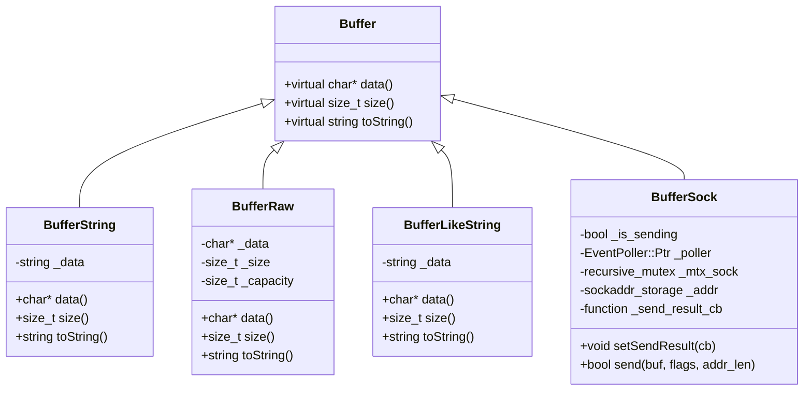
```mermaid
classDiagram
    class Buffer {
        +virtual char* data()
        +virtual size_t size()
        +virtual string toString()
    }
    
    class BufferString {
        -string _data
        +char* data() 
        +size_t size()
        +string toString()
    }
    
    class BufferRaw {
        -char* _data
        -size_t _size
        -size_t _capacity
        +char* data()
        +size_t size()
        +string toString()
    }
    
    class BufferLikeString {
        -string _data
        +char* data()
        +size_t size()
        +string toString()
    }
    
    class BufferSock {
        -bool _is_sending
        -EventPoller::Ptr _poller
        -recursive_mutex _mtx_sock
        -sockaddr_storage _addr
        -function _send_result_cb
        +void setSendResult(cb)
        +bool send(buf, flags, addr_len)
    }
    
    Buffer <|-- BufferString
    Buffer <|-- BufferRaw
    Buffer <|-- BufferLikeString
    Buffer <|-- BufferSock
```

### 7.2 Buffer数据流

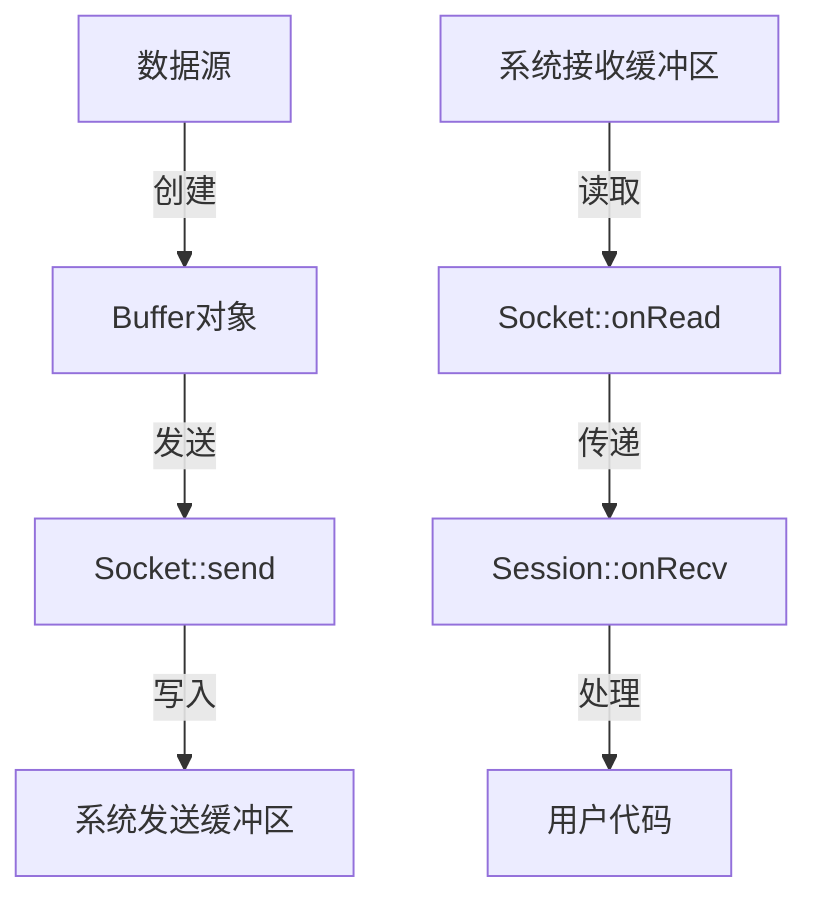
```mermaid
flowchart TD
    A[数据源] -->|创建| B[Buffer对象]
    B -->|发送| C[Socket::send]
    C -->|写入| D[系统发送缓冲区]
    
    E[系统接收缓冲区] -->|读取| F[Socket::onRead]
    F -->|传递| G[Session::onRecv]
    G -->|处理| H[用户代码]
```

## 8. 与Muduo对比

### 8.1 线程模型对比

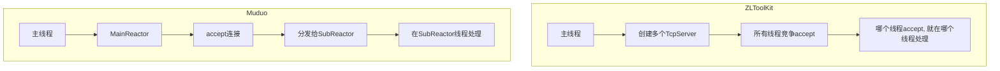
```mermaid
graph TD
    subgraph ZLToolKit
        A1[主线程] --> B1[创建多个TcpServer]
        B1 --> C1[所有线程竞争accept]
        C1 --> D1[哪个线程accept, 就在哪个线程处理]
    end
    
    subgraph Muduo
        A2[主线程] --> B2[MainReactor]
        B2 --> C2[accept连接]
        C2 --> D2[分发给SubReactor]
        D2 --> E2[在SubReactor线程处理]
    end
```

### 8.2 UDP处理对比

|              | ZLToolKit              | Muduo                |
| ------------ | ---------------------- | -------------------- |
| **会话管理** | 内置共享会话表         | 用户自行实现         |
| **线程分配** | 动态竞争，可能跨线程   | 单线程处理，不跨线程 |
| **数据顺序** | 需要特殊处理跨线程问题 | 天然保证顺序         |
| **扩展性**   | 内置多线程支持         | 需用户自行扩展       |
| **API设计**  | 更完整的会话管理API    | 简洁的基础API        |
| **错误处理** | 异常回调机制           | 函数返回值检查       |

### 8.3 时序对比 - TCP处理

```mermaid
sequenceDiagram
    participant C as Client
    
    rect rgb(200, 200, 240)
    note right of C: ZLToolKit
    participant ZS as ZLToolKit Server
    participant ZT as ZLToolKit Thread
    participant ZSe as ZLToolKit Session
    
    C->>ZS: 连接请求
    ZS->>ZT: 竞争accept
    ZT->>ZSe: 创建Session
    C->>ZSe: 发送数据
    ZSe->>ZSe: 在接受连接的线程处理
    ZSe->>C: 响应数据
    end
    
    rect rgb(240, 200, 200)
    note right of C: Muduo
    participant MM as Muduo MainReactor
    participant MS as Muduo SubReactor
    participant MC as Muduo Connection
    
    C->>MM: 连接请求
    MM->>MM: accept连接
    MM->>MS: 分发给SubReactor
    MS->>MC: 创建Connection
    C->>MC: 发送数据
    MC->>MC: 在SubReactor线程处理
    MC->>C: 响应数据
    end
```

## 9. 设计模式应用

### 9.1 工厂模式

```cpp
// Server作为会话工厂
template<typename SessionType>
void TcpServer::start(uint16_t port, const std::string &host, uint32_t backlog) {
    // Session 创建器, 通过它创建不同类型的服务器
    _session_alloc = [](const TcpServer::Ptr &server, const Socket::Ptr &sock) {
        auto session = std::make_shared<SessionType>(sock);
        session->setOnCreateSocket([](const EventPoller::Ptr &poller) {
            return Socket::createSocket(poller);
        });
        return std::make_shared<SessionHelper>(server, session);
    };
    start_l(port, host, backlog);
}
```

### 9.2 观察者模式

```cpp
// Socket使用观察者模式处理事件
void Socket::setOnRead(onReadCB cb) {
    _on_read = std::move(cb);
    enableRead(_on_read.operator bool());
}

void Socket::setOnErr(onErrCB cb) {
    _on_err = std::move(cb);
    _poller->delEvent(_sock_fd);
    if (_sock_fd != -1) {
        _poller->addEvent(_sock_fd, Event_Error, [weak_this = weak_from_this()](int event) {
            auto strong_this = weak_this.lock();
            if (!strong_this) {
                return;
            }
            strong_this->onError(SockException(Err_eof, "end of file"));
        });
    }
}
```

### 9.3 单例模式

```cpp
// SessionMap单例
SessionMap &SessionMap::Instance() {
    static std::shared_ptr<SessionMap> s_instance(new SessionMap);
    static SessionMap &s_ref = *s_instance;
    return s_ref;
}
```

### 9.4 代理模式

```cpp
// SessionHelper作为Session的代理
SessionHelper::SessionHelper(const std::weak_ptr<Server> &server, Session::Ptr session, std::string cls) {
    _server = server;
    _session = std::move(session);
    _cls = std::move(cls);
    //记录session至全局的map，方便后面管理
    _session_map = SessionMap::Instance().shared_from_this();
    _identifier = _session->getIdentifier();
    _session_map->add(_identifier, _session);
}
```

## 10. 源码剖析

### 10.1 Socket克隆核心实现

```cpp
bool Socket::cloneSocket(const Socket &other) {
    SockInfo info;
    // 获取源Socket的信息
    if (!other.getSockInfo(info)) {
        WarnL << "获取源socket信息失败";
        return false;
    }

    // 如果本Socket已经创建，则先关闭
    closeSock();

    // 创建新Socket
    _sock_fd = socket(info.family, info.type, info.protocol);
    if (_sock_fd < 0) {
        WarnL << "创建socket失败:" << get_uv_errmsg();
        return false;
    }

    // 设置关闭时可重用端口
    setReuseable(true);
    
    // 在多个进程中监听同一个端口
    int on = 1;
    if (setsockopt(_sock_fd, SOL_SOCKET, SO_REUSEPORT, &on, sizeof(on)) == -1) {
        closeSock();
        return false;
    }

    // 绑定到相同地址
    if (::bind(_sock_fd, &info.local_addr.storage, info.local_addr_len) == -1) {
        closeSock();
        return false;
    }

    // 如果是TCP监听Socket，则开始监听
    if (info.type == SOCK_STREAM) {
        if (::listen(_sock_fd, SOMAXCONN) == -1) {
            closeSock();
            return false;
        }
    }

    // 设置为非阻塞
    setNonBlock();
    
    // 设置Socket属性
    _local_addr = info.local_addr;
    _sock_type = info.type;
    
    // 注册到poller
    _poller->addEvent(_sock_fd, Event_Read | Event_Error | Event_Write);
    
    return true;
}
```

### 10.2 UDP会话管理核心实现

```cpp
void UdpServer::start_l(uint16_t port, const std::string &host) {
    setupEvent();
    //主server才创建session map，其他cloned server共享之
    _session_mutex = std::make_shared<std::recursive_mutex>();
    _session_map = std::make_shared<std::unordered_map<PeerIdType, SessionHelper::Ptr> >();

    // 新建一个定时器定时管理这些 udp 会话
    std::weak_ptr<UdpServer> weak_self = std::static_pointer_cast<UdpServer>(shared_from_this());
    _timer = std::make_shared<Timer>(2.0f, [weak_self]() -> bool {
        if (auto strong_self = weak_self.lock()) {
            strong_self->onManagerSession();
            return true;
        }
        return false;
    }, _poller);

    //clone server至不同线程，让udp server支持多线程
    EventPollerPool::Instance().for_each([&](const TaskExecutor::Ptr &executor) {
        auto poller = std::static_pointer_cast<EventPoller>(executor);
        if (poller == _poller) {
            return;
        }
        auto &serverRef = _cloned_server[poller.get()];
        if (!serverRef) {
            serverRef = onCreatServer(poller);
        }
        if (serverRef) {
            serverRef->cloneFrom(*this);
        }
    });

    if (!_socket->bindUdpSock(port, host.c_str())) {
        throw std::runtime_error("绑定UDP端口失败");
    }
}

void UdpServer::cloneFrom(const UdpServer &that) {
    setupEvent();
    _cloned = true;
    // clone callbacks
    _on_create_socket = that._on_create_socket;
    _session_alloc = that._session_alloc;
    _session_mutex = that._session_mutex;
    _session_map = that._session_map;
    // clone properties
    this->mINI::operator=(that);
}
```

### 10.3 TCP服务器核心实现

```cpp
void TcpServer::onAcceptConnection(const Socket::Ptr &sock) {
    weak_ptr<TcpServer> weak_self = dynamic_pointer_cast<TcpServer>(shared_from_this());
    //创建一个TcpSession;这里实现创建不同的服务会话实例
    auto helper = _session_alloc(dynamic_pointer_cast<TcpServer>(shared_from_this()), sock);
    auto session = helper->session();

    //把本服务器的配置传递给TcpSession
    session->attachServer(*this);

    //触发onConnect事件
    weak_ptr<Session> weak_session = session;
    sock->setOnFlush([weak_session, weak_self]() {
        auto strong_session = weak_session.lock();
        if (!strong_session) {
            return false;
        }
        auto strong_self = dynamic_pointer_cast<TcpServer>(strong_session->getServer().lock());
        if (!strong_self) {
            return false;
        }

        //在TcpServer派发过来的socketSession中触发onFlush事件
        strong_session->onFlush();
        return true;
    });

    //接收数据
    sock->setOnRead([weak_session](const Buffer::Ptr &buf, struct sockaddr *, int) {
        auto strong_session = weak_session.lock();
        if (!strong_session) {
            return;
        }
        try {
            strong_session->onRecv(buf);
        } catch (SockException &ex) {
            strong_session->shutdown(ex);
        } catch (std::exception &ex) {
            strong_session->shutdown(SockException(Err_shutdown, ex.what()));
        }
    });

    //设置onError事件回调
    sock->setOnErr([weak_session, weak_self](const SockException &err) {
        //在TcpServer派发过来的socketSession中触发onError事件
        auto strong_session = weak_session.lock();
        if (!strong_session) {
            return;
        }
        strong_session->onError(err);
    });
}
```

---

## 总结

ZLToolKit网络模块通过精心设计的多线程模型和Socket克隆机制，实现了高效的网络通信能力。其独特的UDP会话管理和TCP负载均衡能力，使其在高并发场景下表现出色。与Muduo相比，ZLToolKit在某些方面提供了更丰富的功能和更灵活的设计，特别是在UDP处理和会话管理方面。

线程模型创新点在于socket克隆和抢占式accept，显著提高了多核利用率和连接处理效率。Buffer设计和内存管理则保证了高效的数据处理和传输。完善的异常处理机制确保了系统稳定性和可靠性。
