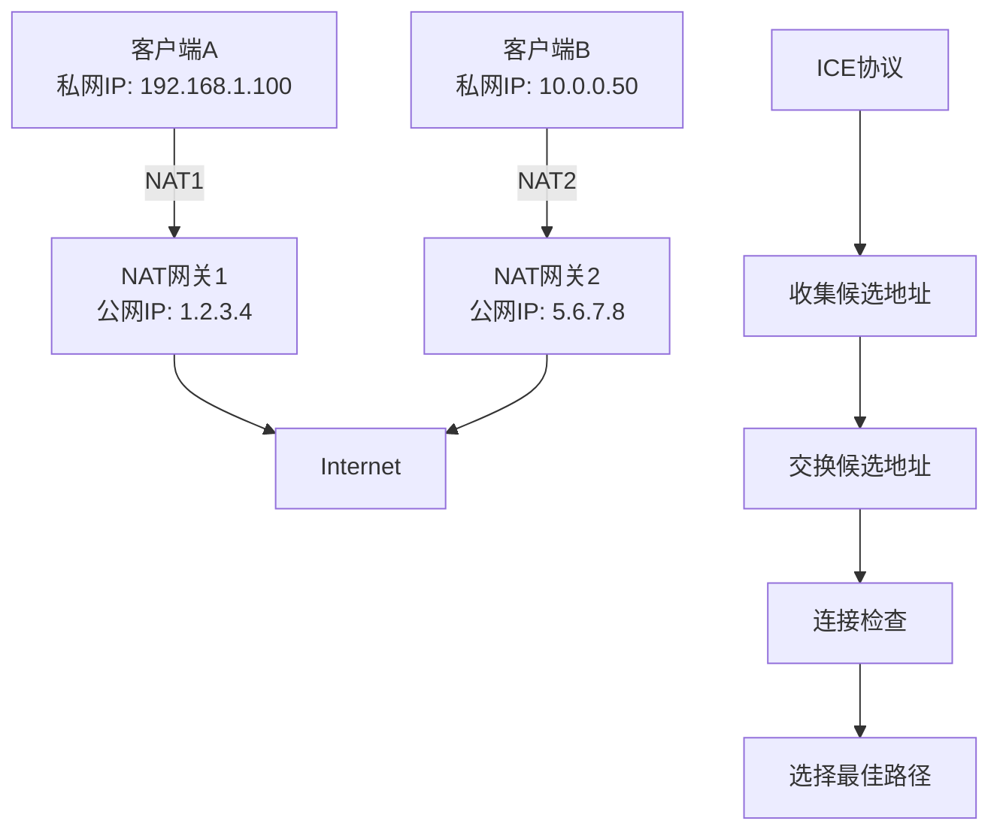
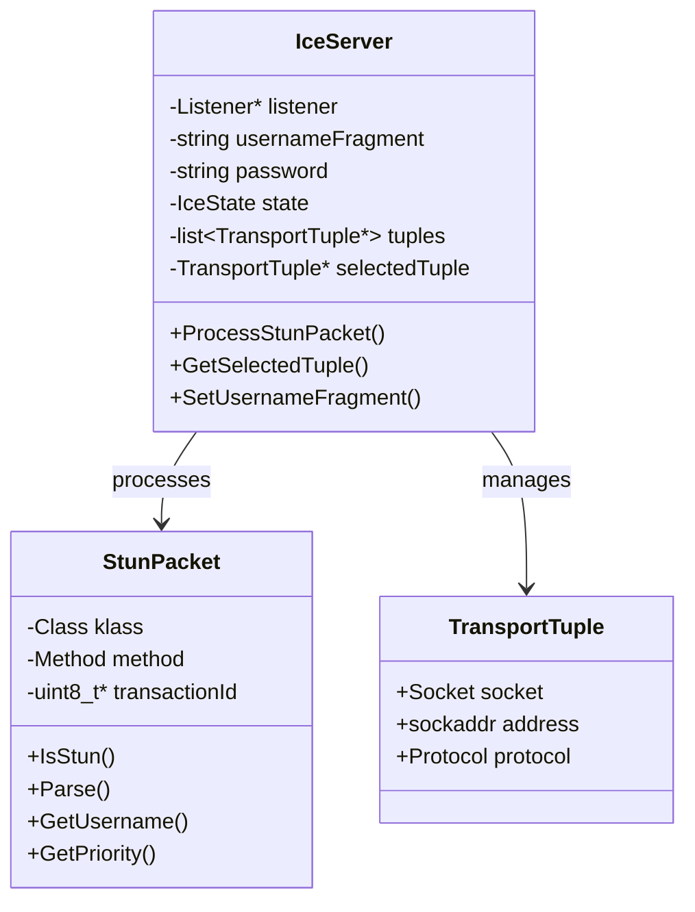
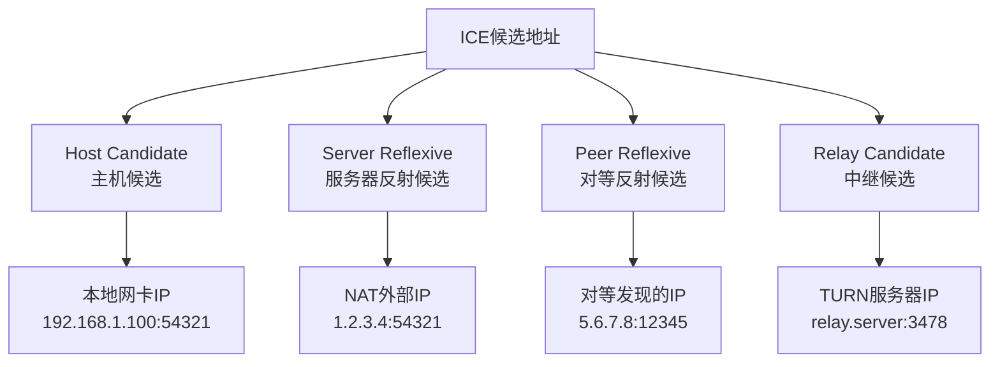
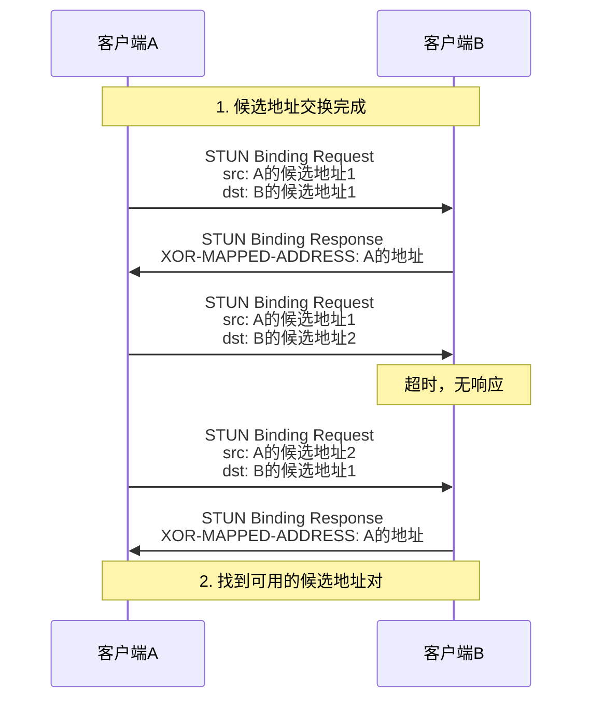
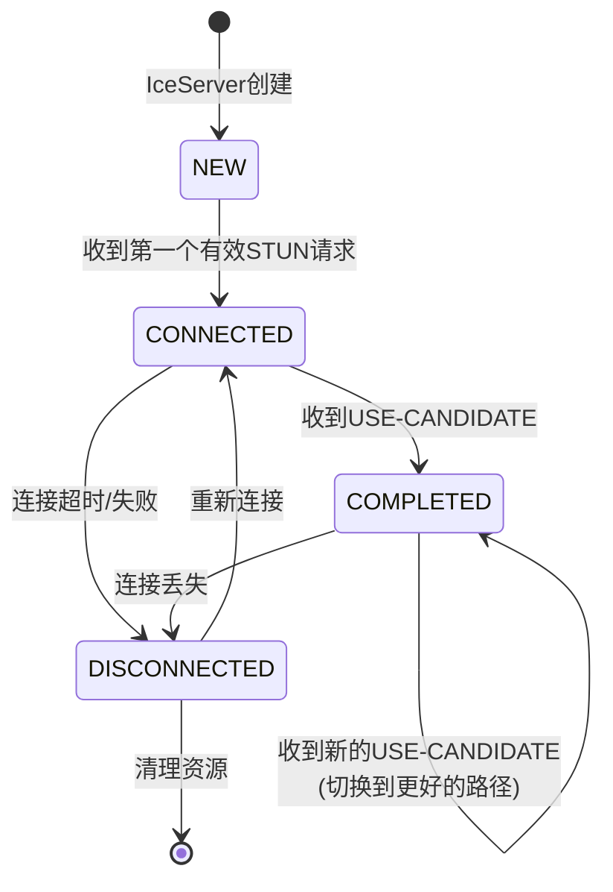
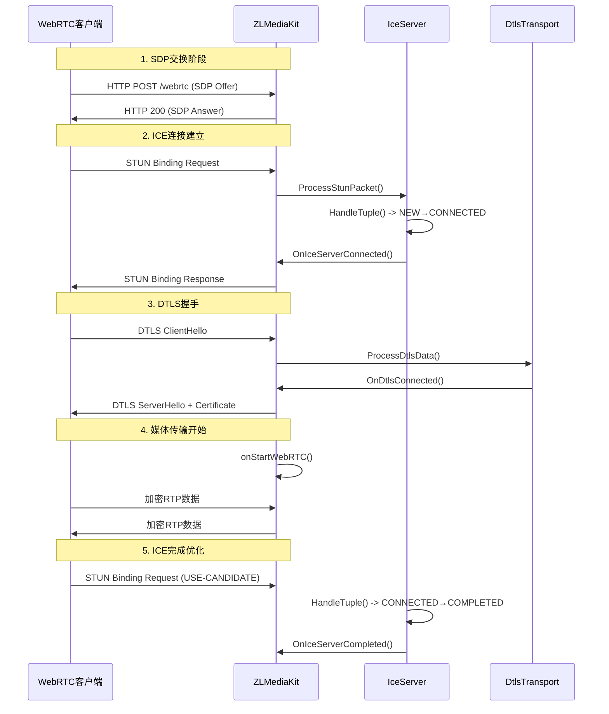
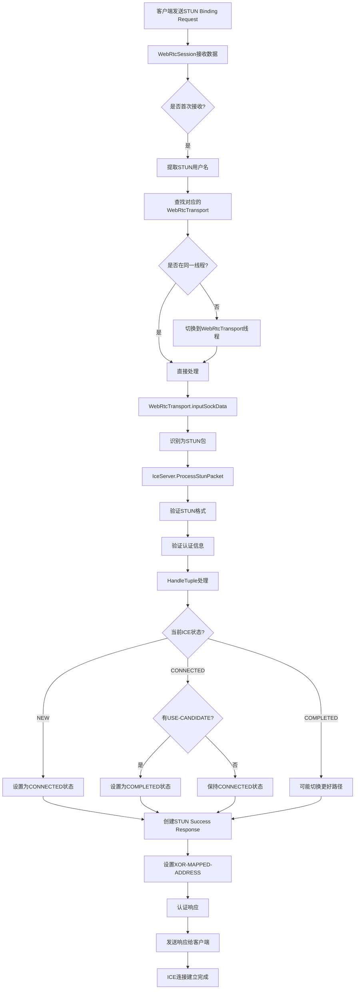

# ICE协议的工作原理

## 目录
- [1. ICE整体架构和基本概念](#1-ice整体架构和基本概念)
- [2. STUN协议详细解析](#2-stun协议详细解析)
- [3. 候选地址收集和类型分类](#3-候选地址收集和类型分类)
- [4. 连接检查和配对过程](#4-连接检查和配对过程)
- [5. ICE状态机和连接建立流程](#5-ice状态机和连接建立流程)
- [6. ZLMediaKit中的具体实现代码](#6-zlmediakit中的具体实现代码)
- [7. 总结](#7-总结)

---

## 1. ICE整体架构和基本概念

### ICE协议的核心目标

ICE (Interactive Connectivity Establishment) 协议解决的核心问题是**NAT穿透**，让位于不同网络环境的两个端点能够建立直接连接。



### ICE状态机

根据ZLMediaKit的实现，ICE服务器有四个主要状态：

```cpp
enum class IceState {
    NEW = 1,         // 初始状态
    CONNECTED,       // 已连接（至少一个候选对成功）
    COMPLETED,       // 完成状态（最佳候选对已确定）
    DISCONNECTED     // 断开连接
};
```

### 核心组件关系



---

## 2. STUN协议详细解析

### STUN数据包结构

STUN (Session Traversal Utilities for NAT) 是ICE的基础协议。

#### STUN消息头格式
```
 0                   1                   2                   3
 0 1 2 3 4 5 6 7 8 9 0 1 2 3 4 5 6 7 8 9 0 1 2 3 4 5 6 7 8 9 0 1
+-+-+-+-+-+-+-+-+-+-+-+-+-+-+-+-+-+-+-+-+-+-+-+-+-+-+-+-+-+-+-+-+
|0 0|     STUN Message Type       |         Message Length        |
+-+-+-+-+-+-+-+-+-+-+-+-+-+-+-+-+-+-+-+-+-+-+-+-+-+-+-+-+-+-+-+-+
|                         Magic Cookie                          |
+-+-+-+-+-+-+-+-+-+-+-+-+-+-+-+-+-+-+-+-+-+-+-+-+-+-+-+-+-+-+-+-+
|                                                               |
|                     Transaction ID (96 bits)                 |
|                                                               |
+-+-+-+-+-+-+-+-+-+-+-+-+-+-+-+-+-+-+-+-+-+-+-+-+-+-+-+-+-+-+-+-+
```

#### ZLMediaKit中的STUN识别
```cpp
static bool IsStun(const uint8_t* data, size_t len) {
    return (
        // STUN headers are 20 bytes.
        (len >= 20) &&
        // 前两位必须是00 (区分STUN和其他协议)
        (data[0] < 3) &&
        // Magic cookie must match (0x2112A442)
        (data[4] == StunPacket::magicCookie[0]) && 
        (data[5] == StunPacket::magicCookie[1]) &&
        (data[6] == StunPacket::magicCookie[2]) && 
        (data[7] == StunPacket::magicCookie[3])
    );
}
```

### STUN消息类型

```cpp
// STUN message class (消息类别)
enum class Class : uint16_t {
    REQUEST          = 0,  // 请求
    INDICATION       = 1,  // 指示（不需要响应）
    SUCCESS_RESPONSE = 2,  // 成功响应
    ERROR_RESPONSE   = 3   // 错误响应
};

// STUN message method (消息方法)
enum class Method : uint16_t {
    BINDING = 1  // ICE 主要使用 BINDING 方法
};
```

### STUN属性类型

```cpp
enum class Attribute : uint16_t {
    MAPPED_ADDRESS     = 0x0001,  // 映射地址
    USERNAME           = 0x0006,  // 用户名（ICE认证）
    MESSAGE_INTEGRITY  = 0x0008,  // 消息完整性（HMAC-SHA1）
    ERROR_CODE         = 0x0009,  // 错误代码
    UNKNOWN_ATTRIBUTES = 0x000A,  // 未知属性
    REALM              = 0x0014,  // 域
    NONCE              = 0x0015,  // 随机数
    XOR_MAPPED_ADDRESS = 0x0020,  // XOR映射地址（推荐）
    PRIORITY           = 0x0024,  // ICE优先级
    USE_CANDIDATE      = 0x0025,  // ICE使用候选
    SOFTWARE           = 0x8022,  // 软件标识
    ALTERNATE_SERVER   = 0x8023,  // 备用服务器
    FINGERPRINT        = 0x8028,  // 指纹（CRC32）
    ICE_CONTROLLED     = 0x8029,  // ICE受控角色
    ICE_CONTROLLING    = 0x802A   // ICE控制角色
};
```

### STUN消息处理流程

```cpp
void IceServer::ProcessStunPacket(RTC::StunPacket* packet, RTC::TransportTuple* tuple) {
    // 1. 验证消息方法必须是 BINDING
    if (packet->GetMethod() != RTC::StunPacket::Method::BINDING) {
        if (packet->GetClass() == RTC::StunPacket::Class::REQUEST) {
            // 返回 400 错误
            RTC::StunPacket* response = packet->CreateErrorResponse(400);
            response->Serialize(StunSerializeBuffer);
            this->listener->OnIceServerSendStunPacket(this, response, tuple);
            delete response;
        }
        return;
    }

    // 2. 验证 FINGERPRINT（除了 INDICATION）
    if (!packet->HasFingerprint() && 
        packet->GetClass() != RTC::StunPacket::Class::INDICATION) {
        // 返回 400 错误
        return;
    }

    // 3. 根据消息类别分别处理
    switch (packet->GetClass()) {
        case RTC::StunPacket::Class::REQUEST:
            handleBindingRequest(packet, tuple);
            break;
        case RTC::StunPacket::Class::INDICATION:
            handleBindingIndication(packet, tuple);
            break;
        // ... 其他类型
    }
}
```

### BINDING REQUEST处理详解

```cpp
// 处理绑定请求的关键步骤
void handleBindingRequest(RTC::StunPacket* packet, RTC::TransportTuple* tuple) {
    // 1. 验证必需属性
    if (!packet->HasMessageIntegrity() || 
        (packet->GetPriority() == 0u) || 
        packet->GetUsername().empty()) {
        // 返回 400 Bad Request
        return;
    }

    // 2. 验证用户名格式 (local:remote)
    std::string username = packet->GetUsername();
    size_t colonPos = username.find(':');
    if (colonPos == std::string::npos) {
        // 返回 400 Bad Request
        return;
    }

    std::string localUsername = username.substr(0, colonPos);
    std::string remoteUsername = username.substr(colonPos + 1);

    // 3. 验证本地用户名
    if (localUsername != this->usernameFragment && 
        localUsername != this->oldUsernameFragment) {
        // 返回 401 Unauthorized
        return;
    }

    // 4. 验证消息完整性（HMAC-SHA1）
    if (!packet->CheckAuthentication(this->password)) {
        if (localUsername == this->oldUsernameFragment && 
            packet->CheckAuthentication(this->oldPassword)) {
            // 使用旧密码验证成功
        } else {
            // 返回 401 Unauthorized
            return;
        }
    }

    // 5. 处理 ICE 控制属性
    bool isControlling = packet->HasIceControlling();
    bool isControlled = packet->HasIceControlled();
    
    if (isControlling && isControlled) {
        // 返回 400 Bad Request（不能同时是两种角色）
        return;
    }

    // 6. 处理元组（候选地址对）
    bool hasUseCandidate = packet->HasUseCandidate();
    HandleTuple(tuple, hasUseCandidate);

    // 7. 创建成功响应
    RTC::StunPacket* response = packet->CreateSuccessResponse();
    
    // 设置 XOR-MAPPED-ADDRESS（客户端的反射地址）
    response->SetXorMappedAddress(tuple->GetRemoteAddress());
    
    // 序列化并发送响应
    response->Serialize(StunSerializeBuffer);
    this->listener->OnIceServerSendStunPacket(this, response, tuple);
    delete response;
}
```

### 消息完整性验证

STUN使用HMAC-SHA1进行消息完整性验证：

```cpp
bool StunPacket::CheckAuthentication(const std::string& password) {
    // 1. 提取 MESSAGE-INTEGRITY 属性
    const uint8_t* messageIntegrity = this->GetMessageIntegrity();
    if (!messageIntegrity) return false;

    // 2. 计算 HMAC-SHA1
    // 密钥 = password
    // 消息 = STUN消息（不包括MESSAGE-INTEGRITY属性本身）
    uint8_t computedHash[20];
    size_t messageLen = this->GetSize() - 24; // 减去MESSAGE-INTEGRITY长度
    
    hmac_sha1(password.c_str(), password.length(),
              this->GetData(), messageLen,
              computedHash);

    // 3. 比较哈希值
    return memcmp(messageIntegrity, computedHash, 20) == 0;
}
```

---

## 3. 候选地址收集和类型分类

### ICE候选地址类型

ICE定义了四种候选地址类型：



### ZLMediaKit中的候选地址实现

#### SDP候选地址格式
```cpp
class SdpAttrCandidate : public SdpItem {
public:
    // RFC 5245: a=candidate:<foundation> <component-id> <transport> <priority> <address> <port> typ <cand-type>
    // 示例: a=candidate:4 1 udp 2130706431 192.168.1.7 58107 typ host
    
    std::string foundation;    // 基础标识符
    uint32_t component;        // 组件ID（1=RTP, 2=RTCP）
    std::string transport;     // 传输协议（udp/tcp）
    uint32_t priority;         // 优先级
    std::string address;       // IP地址
    uint16_t port;            // 端口
    std::string type;         // 候选类型
    std::vector<std::pair<std::string, std::string>> arr; // 额外属性
};
```

#### 候选地址创建函数
```cpp
SdpAttrCandidate::Ptr makeIceCandidate(std::string ip, uint16_t port, 
                                       uint32_t priority = 100, 
                                       std::string proto = "udp") {
    auto candidate = std::make_shared<SdpAttrCandidate>();
    
    // RTP组件 (component = 1)
    candidate->component = 1;
    candidate->transport = proto;
    candidate->foundation = proto + "candidate";
    candidate->priority = priority;
    candidate->address = std::move(ip);
    candidate->port = port;
    candidate->type = "host";  // ZLMediaKit主要使用host类型
    
    if (proto == "tcp") {
        candidate->type += " tcptype passive";  // TCP被动模式
    }
    
    return candidate;
}
```

### 候选地址收集过程

#### 1. 本地候选地址收集
```cpp
void WebRtcTransportImp::onRtcConfigure(RtcConfigure &configure) const {
    WebRtcTransport::onRtcConfigure(configure);
    
    // 如果有预设候选地址，直接使用
    if (!_cands.empty()) {
        for (auto &cand : _cands) {
            configure.addCandidate(cand);
        }
        return;
    }

    // 获取配置的端口
    GET_CONFIG(uint16_t, local_udp_port, Rtc::kPort);      // 默认8000
    GET_CONFIG(uint16_t, local_tcp_port, Rtc::kTcpPort);   // 默认8000
    
    // 获取外部IP配置
    GET_CONFIG_FUNC(std::vector<std::string>, extern_ips, Rtc::kExternIP, 
        [](string str) {
            std::vector<std::string> ret;
            if (str.length()) {
                ret = split(str, ",");  // 支持多个IP，逗号分隔
            }
            translateIPFromEnv(ret);    // 支持环境变量（如$EXTERN_IP）
            return ret;
        });
}
```

#### 2. 候选地址优先级计算
```cpp
// 外部IP优先级计算
if (extern_ips.empty()) {
    // 使用本地IP
    std::string local_ip = SockUtil::get_local_ip();
    if (local_udp_port) { 
        configure.addCandidate(*makeIceCandidate(local_ip, local_udp_port, 120, "udp")); 
    }
    if (local_tcp_port) { 
        // TCP优先级根据偏好设置
        uint32_t tcp_priority = _preferred_tcp ? 125 : 115;
        configure.addCandidate(*makeIceCandidate(local_ip, local_tcp_port, tcp_priority, "tcp")); 
    }
} else {
    // 使用外部IP列表，优先级递减
    const uint32_t delta = 10;
    uint32_t priority = 100 + delta * extern_ips.size();
    
    for (auto ip : extern_ips) {
        if (local_udp_port) { 
            configure.addCandidate(*makeIceCandidate(ip, local_udp_port, priority, "udp")); 
        }
        if (local_tcp_port) { 
            uint32_t tcp_priority = priority - (_preferred_tcp ? -5 : 5);
            configure.addCandidate(*makeIceCandidate(ip, local_tcp_port, tcp_priority, "tcp")); 
        }
        priority -= delta;  // 后面的IP优先级降低
    }
}
```

### 候选地址优先级算法

ICE使用复杂的优先级算法来排序候选地址：

```
Priority = (2^24) * (type preference) + 
           (2^8)  * (local preference) + 
           (2^0)  * (component preference)
```

#### 类型偏好值（Type Preference）
```cpp
// RFC 5245 推荐值
enum CandidateTypePreference {
    HOST_PREFERENCE = 126,           // 主机候选（最高）
    PEER_REFLEXIVE_PREFERENCE = 110, // 对等反射候选
    SERVER_REFLEXIVE_PREFERENCE = 100, // 服务器反射候选  
    RELAY_PREFERENCE = 0             // 中继候选（最低）
};
```

#### ZLMediaKit的简化优先级
```cpp
// ZLMediaKit 使用简化的优先级设置
void setWebRtcArgs(const WebRtcArgs &args, WebRtcInterface &rtc) {
    // UDP/TCP 优先级设置
    bool preferred_tcp = args["preferred_tcp"].as<bool>();
    
    vector<SdpAttrCandidate> cands;
    
    // UDP候选地址
    auto cand_str = trim(args["cand_udp"]);
    auto ip_port = toolkit::split(cand_str, ":");
    if (ip_port.size() == 2) {
        // UDP优先级：TCP偏好时100，否则120
        uint32_t udp_priority = preferred_tcp ? 100 : 120;
        auto ice_cand = makeIceCandidate(ip_port[0], atoi(ip_port[1].data()), 
                                        udp_priority, "udp");
        cands.emplace_back(std::move(*ice_cand));
    }
    
    // TCP候选地址  
    cand_str = trim(args["cand_tcp"]);
    ip_port = toolkit::split(cand_str, ":");
    if (ip_port.size() == 2) {
        // TCP优先级：TCP偏好时120，否则100
        uint32_t tcp_priority = preferred_tcp ? 120 : 100;
        auto ice_cand = makeIceCandidate(ip_port[0], atoi(ip_port[1].data()), 
                                        tcp_priority, "tcp");
        cands.emplace_back(std::move(*ice_cand));
    }
    
    if (!cands.empty()) {
        rtc.setIceCandidate(std::move(cands));
    }
}
```

### 候选地址交换

#### SDP中的候选地址表示
```sdp
# SDP 中的 ICE 候选地址示例
a=ice-ufrag:4ZcD          # ICE 用户名片段
a=ice-pwd:2/1yZth8prWXuzUMf+u7PzxX4   # ICE 密码

# 候选地址列表
a=candidate:1 1 udp 2130706431 192.168.1.100 54400 typ host
a=candidate:2 1 udp 2130706175 10.0.0.1 54400 typ host  
a=candidate:3 1 tcp 2130705663 192.168.1.100 9 typ host tcptype active
a=candidate:4 1 tcp 2130705407 10.0.0.1 9 typ host tcptype active
```

#### 候选地址解析
```cpp
void SdpAttrCandidate::parse(const std::string &str) {
    // 解析格式: candidate:4 1 udp 2130706431 192.168.1.7 58107 typ host
    std::vector<std::string> tokens = split(str, " ");
    
    if (tokens.size() >= 8) {
        foundation = tokens[0];           // "4"
        component = atoi(tokens[1]);      // 1
        transport = tokens[2];            // "udp"
        priority = atoi(tokens[3]);       // 2130706431
        address = tokens[4];              // "192.168.1.7"
        port = atoi(tokens[5]);          // 58107
        // tokens[6] = "typ"
        type = tokens[7];                 // "host"
        
        // 处理额外属性（如 tcptype）
        for (size_t i = 8; i < tokens.size(); i += 2) {
            if (i + 1 < tokens.size()) {
                arr.emplace_back(tokens[i], tokens[i + 1]);
            }
        }
    }
}
```

---

## 4. 连接检查和配对过程

### ICE连接检查原理

连接检查是ICE协议的核心，通过STUN Binding Request测试候选地址对的连通性。



### 元组（Tuple）管理

在ZLMediaKit中，`TransportTuple`表示一个网络连接端点：

```cpp
// TransportTuple 实际上是 toolkit::Session 的别名
using TransportTuple = toolkit::Session;

class IceServer {
private:
    std::list<RTC::TransportTuple *> tuples;        // 所有候选元组
    RTC::TransportTuple *selectedTuple { nullptr }; // 选中的元组
    std::weak_ptr<RTC::TransportTuple> lastSelectedTuple; // 上次选中的元组
};
```

### 元组处理核心逻辑

```cpp
void IceServer::HandleTuple(RTC::TransportTuple* tuple, bool hasUseCandidate) {
    // 1. 添加或查找元组
    RTC::TransportTuple* storedTuple = AddTuple(tuple);
    
    // 2. 根据 USE-CANDIDATE 标志和当前状态决定行为
    switch (this->state) {
        case IceState::NEW:
        case IceState::DISCONNECTED: {
            // 新状态或断开状态：选择第一个有效元组
            SetSelectedTuple(storedTuple);
            this->state = IceState::CONNECTED;
            
            // 通知监听器连接已建立
            this->listener->OnIceServerConnected(this);
            break;
        }
        
        case IceState::CONNECTED: {
            // 已连接状态：如果有 USE-CANDIDATE 标志，则完成 ICE
            if (hasUseCandidate) {
                SetSelectedTuple(storedTuple);
                this->state = IceState::COMPLETED;
                
                // 通知监听器 ICE 完成
                this->listener->OnIceServerCompleted(this);
            }
            break;
        }
        
        case IceState::COMPLETED: {
            // 完成状态：如果有 USE-CANDIDATE 标志，可能切换到新的最佳路径
            if (hasUseCandidate) {
                SetSelectedTuple(storedTuple);
                
                // 通知监听器元组已选择
                this->listener->OnIceServerSelectedTuple(this, storedTuple);
            }
            break;
        }
    }
}
```

### 元组存储和查找

```cpp
RTC::TransportTuple* IceServer::AddTuple(RTC::TransportTuple* tuple) {
    // 1. 检查是否已存在相同的元组
    RTC::TransportTuple* storedTuple = HasTuple(tuple);
    
    if (storedTuple) {
        return storedTuple;  // 返回已存在的元组
    }

    // 2. 添加新元组到列表
    this->tuples.push_back(tuple);
    
    MS_DEBUG_TAG(ice, "tuple added [tuple:%s]", tuple->ToString().c_str());
    
    return tuple;
}

RTC::TransportTuple* IceServer::HasTuple(const RTC::TransportTuple* tuple) const {
    // 遍历已存储的元组，查找匹配项
    for (auto it = this->tuples.begin(); it != this->tuples.end(); ++it) {
        RTC::TransportTuple* storedTuple = *it;
        
        // 比较 IP 地址和端口
        if (storedTuple->Compare(tuple)) {
            return storedTuple;
        }
    }
    
    return nullptr;
}
```

### 选中元组设置

```cpp
void IceServer::SetSelectedTuple(RTC::TransportTuple* storedTuple) {
    // 1. 保存之前选中的元组
    if (this->selectedTuple) {
        this->lastSelectedTuple = this->selectedTuple->shared_from_this();
    }
    
    // 2. 设置新的选中元组
    this->selectedTuple = storedTuple;
    
    MS_DEBUG_TAG(ice, "selected tuple [tuple:%s]", storedTuple->ToString().c_str());
    
    // 3. 通知监听器元组已选择
    this->listener->OnIceServerSelectedTuple(this, storedTuple);
}
```

### USE-CANDIDATE机制

USE-CANDIDATE是ICE协议中的关键机制，用于确认最终选择的候选地址对：

```cpp
// STUN 包中的 USE-CANDIDATE 属性处理
void handleBindingRequest(RTC::StunPacket* packet, RTC::TransportTuple* tuple) {
    // 检查是否包含 USE-CANDIDATE 属性
    bool hasUseCandidate = packet->HasUseCandidate();
    
    if (hasUseCandidate) {
        MS_DEBUG_TAG(ice, "STUN Binding Request has USE-CANDIDATE attribute");
    }
    
    // 处理元组，传递 USE-CANDIDATE 标志
    HandleTuple(tuple, hasUseCandidate);
    
    // 创建成功响应
    RTC::StunPacket* response = packet->CreateSuccessResponse();
    
    // ... 设置响应属性并发送
}
```

### 连接检查超时和重试

虽然ZLMediaKit的ICE实现相对简化，但标准ICE包含复杂的超时和重试机制：

```cpp
// 标准 ICE 连接检查状态机（概念性实现）
enum class CheckState {
    WAITING,    // 等待检查
    IN_PROGRESS, // 检查进行中
    SUCCEEDED,   // 检查成功
    FAILED,      // 检查失败
    FROZEN       // 冻结状态
};

class CandidatePair {
public:
    SdpAttrCandidate local;     // 本地候选
    SdpAttrCandidate remote;    // 远程候选
    CheckState state;           // 检查状态
    uint32_t priority;          // 配对优先级
    uint64_t lastCheckTime;     // 上次检查时间
    int retryCount;             // 重试次数
    
    // 计算配对优先级
    uint32_t calculatePriority() {
        uint32_t controlling = std::max(local.priority, remote.priority);
        uint32_t controlled = std::min(local.priority, remote.priority);
        return (controlling << 32) + (2 * controlled) + (controlling > controlled ? 1 : 0);
    }
};
```

### ICE控制和被控制角色

ICE定义了控制（Controlling）和被控制（Controlled）两种角色：

```cpp
// ICE 角色冲突解决
void resolveRoleConflict(RTC::StunPacket* packet, RTC::TransportTuple* tuple) {
    bool isControlling = packet->HasIceControlling();
    bool isControlled = packet->HasIceControlled();
    
    if (isControlling && isControlled) {
        // 错误：不能同时是两种角色
        RTC::StunPacket* response = packet->CreateErrorResponse(400);
        response->Serialize(StunSerializeBuffer);
        this->listener->OnIceServerSendStunPacket(this, response, tuple);
        delete response;
        return;
    }
    
    // 根据 tie-breaker 值解决角色冲突
    if (isControlling) {
        uint64_t remoteTieBreaker = packet->GetIceControlling();
        if (remoteTieBreaker >= this->localTieBreaker && this->isControlling) {
            // 切换为被控制角色
            this->isControlling = false;
            MS_DEBUG_TAG(ice, "switched to controlled role");
        }
    }
    
    if (isControlled) {
        uint64_t remoteTieBreaker = packet->GetIceControlled();
        if (remoteTieBreaker < this->localTieBreaker && !this->isControlling) {
            // 切换为控制角色
            this->isControlling = true;
            MS_DEBUG_TAG(ice, "switched to controlling role");
        }
    }
}
```

---

## 5. ICE状态机和连接建立流程

### ICE状态转换图



### 状态转换详细分析

#### 1. NEW → CONNECTED转换
```cpp
void IceServer::HandleTuple(RTC::TransportTuple* tuple, bool hasUseCandidate) {
    RTC::TransportTuple* storedTuple = AddTuple(tuple);
    
    switch (this->state) {
        case IceState::NEW:
        case IceState::DISCONNECTED: {
            // 关键时刻：从NEW状态转换到CONNECTED
            SetSelectedTuple(storedTuple);
            this->state = IceState::CONNECTED;
            
            MS_DEBUG_TAG(ice, "ICE state changed to CONNECTED");
            
            // 🔥 触发连接建立回调
            this->listener->OnIceServerConnected(this);
            break;
        }
    }
}
```

#### 2. CONNECTED → COMPLETED转换
```cpp
case IceState::CONNECTED: {
    // 只有收到 USE-CANDIDATE 才能完成 ICE
    if (hasUseCandidate) {
        SetSelectedTuple(storedTuple);
        this->state = IceState::COMPLETED;
        
        MS_DEBUG_TAG(ice, "ICE state changed to COMPLETED");
        
        // 🔥 触发 ICE 完成回调
        this->listener->OnIceServerCompleted(this);
    }
    break;
}
```

### WebRTC传输层的ICE集成

```cpp
class WebRtcTransportImp : public WebRtcTransport, 
                          public RTC::IceServer::Listener {
public:
    // ICE 服务器回调实现
    void OnIceServerConnected(const RTC::IceServer* iceServer) override;
    void OnIceServerCompleted(const RTC::IceServer* iceServer) override;
    void OnIceServerDisconnected(const RTC::IceServer* iceServer) override;
    void OnIceServerSelectedTuple(const RTC::IceServer* iceServer, 
                                 RTC::TransportTuple* tuple) override;
    void OnIceServerSendStunPacket(const RTC::IceServer* iceServer, 
                                  const RTC::StunPacket* packet, 
                                  RTC::TransportTuple* tuple) override;
};
```

#### ICE连接建立回调
```cpp
void WebRtcTransportImp::OnIceServerConnected(const RTC::IceServer* iceServer) {
    MS_DEBUG_TAG(ice, "ICE server connected");
    
    // 1. 标记 ICE 连接已建立
    _ice_connected = true;
    
    // 2. 如果 DTLS 也完成，则开始媒体传输
    if (_dtls_connected) {
        onStartWebRTC();  // 开始 WebRTC 会话
    }
}

void WebRtcTransportImp::OnIceServerCompleted(const RTC::IceServer* iceServer) {
    MS_DEBUG_TAG(ice, "ICE server completed");
    
    // ICE 协商完全完成，连接已优化
    _ice_completed = true;
}
```

### 完整的连接建立时序



### 数据包路由和处理

#### 入站数据包分发
```cpp
void WebRtcTransport::inputSockData(char *buf, int len, RTC::TransportTuple *tuple) {
    // 1. 判断数据包类型并分发
    if (RTC::StunPacket::IsStun((const uint8_t *)buf, len)) {
        // STUN 数据包 -> ICE 处理
        std::unique_ptr<RTC::StunPacket> packet(RTC::StunPacket::Parse((const uint8_t *)buf, len));
        if (packet) {
            _ice_server->ProcessStunPacket(packet.get(), tuple);
        }
        return;
    }
    
    if (isDtls(buf)) {
        // DTLS 数据包 -> DTLS 处理
        _dtls_transport->ProcessDtlsData((uint8_t *)buf, len);
        return;
    }
    
    if (isRtp(buf, len)) {
        // RTP 数据包 -> 媒体处理
        if (_srtp_session_recv && _srtp_session_recv->DecryptSrtp((uint8_t *)buf, &len)) {
            onRtp(buf, len, _ticker.createdTime());
        }
        return;
    }
    
    if (isRtcp(buf, len)) {
        // RTCP 数据包 -> 控制处理
        if (_srtp_session_recv && _srtp_session_recv->DecryptSrtcp((uint8_t *)buf, &len)) {
            onRtcp(buf, len);
        }
        return;
    }
}
```

#### 出站数据包发送
```cpp
void WebRtcTransportImp::OnIceServerSendStunPacket(const RTC::IceServer* iceServer, 
                                                   const RTC::StunPacket* packet, 
                                                   RTC::TransportTuple* tuple) {
    // 通过选中的元组发送 STUN 响应
    const uint8_t* data = packet->GetData();
    size_t len = packet->GetSize();
    
    // 发送到网络
    tuple->send(reinterpret_cast<const char*>(data), len);
}
```

### 连接保活和监控

#### ICE连接监控
```cpp
class WebRtcTransportImp {
private:
    Ticker _alive_ticker;  // 连接保活计时器
    
public:
    void onManager() override {
        // 定期检查连接状态
        GET_CONFIG(float, timeoutSec, Rtc::kTimeoutSec);
        if (_alive_ticker.elapsedTime() / 1000.0 > timeoutSec) {
            // 连接超时
            onShutdown(SockException(Err_timeout, "WebRTC connection timeout"));
        }
    }
    
    void updateTicker() {
        // 收到数据时更新保活时间
        _alive_ticker.resetTime();
    }
};
```

#### 元组有效性检查
```cpp
bool IceServer::IsValidTuple(const RTC::TransportTuple* tuple) const {
    // 检查元组是否在有效列表中
    for (auto storedTuple : this->tuples) {
        if (storedTuple->Compare(tuple)) {
            return true;
        }
    }
    return false;
}

void IceServer::RemoveTuple(RTC::TransportTuple* tuple) {
    // 移除无效的元组
    for (auto it = this->tuples.begin(); it != this->tuples.end(); ++it) {
        if (*it == tuple) {
            this->tuples.erase(it);
            MS_DEBUG_TAG(ice, "tuple removed [tuple:%s]", tuple->ToString().c_str());
            
            // 如果移除的是选中元组，需要重新选择
            if (this->selectedTuple == tuple) {
                this->selectedTuple = nullptr;
                // 可能需要切换到断开状态
                if (this->tuples.empty()) {
                    this->state = IceState::DISCONNECTED;
                    this->listener->OnIceServerDisconnected(this);
                }
            }
            break;
        }
    }
}
```

---

## 6. ZLMediaKit中的具体实现代码

### ICE服务器初始化

#### 1. WebRTC传输对象创建
```cpp
WebRtcTransport::WebRtcTransport(const EventPoller::Ptr &poller) {
    _poller = poller;
    
    // 生成唯一标识符：base64(ip+udp_port+tcp_port) + _ + 自增数字
    static auto prefix = getServerPrefix();
    _identifier = prefix + to_string(++s_key);
    
    // 初始化RTP包对象池（预分配64个）
    _packet_pool.setSize(64);
}

void WebRtcTransport::onCreate() {
    // 创建DTLS传输对象
    _dtls_transport = std::make_shared<RTC::DtlsTransport>(_poller, this);
    
    // 🔥 创建ICE服务器：传入监听器(this)、用户名片段、随机密码
    _ice_server = std::make_shared<RTC::IceServer>(this, _identifier, makeRandStr(24));
}
```

#### 2. ICE用户名和密码生成
```cpp
static std::string getServerPrefix() {
    // STUN用户名格式: base64(ip+udp_port+tcp_port) + _ + number
    GET_CONFIG(uint16_t, udp_port, Rtc::kPort);    // 8000
    GET_CONFIG(uint16_t, tcp_port, Rtc::kTcpPort); // 8000
    
    char buf[8];
    auto host = SockUtil::get_local_ip();  // 获取本地IP
    auto addr = SockUtil::make_sockaddr(host.data(), udp_port);
    
    // 打包: [4字节IP] + [2字节UDP端口] + [2字节TCP端口]
    memcpy(buf, &(reinterpret_cast<sockaddr_in *>(&addr)->sin_addr), 4);
    memcpy(buf + 4, &(reinterpret_cast<sockaddr_in *>(&addr)->sin_port), 2);
    
    addr = SockUtil::make_sockaddr(host.data(), tcp_port);
    memcpy(buf + 6, &(reinterpret_cast<sockaddr_in *>(&addr)->sin_port), 2);
    
    auto ret = encodeBase64(string(buf, 8)) + '_';
    return ret;  // 例如: "wKgBZB9AB9A_"
}

// 最终标识符示例: "wKgBZB9AB9A_12345"
// 密码: 24位随机字符串，如 "aBcDeFgHiJkLmNoPqRsTuVwX"
```

### STUN数据包处理的完整实现

#### 3. STUN认证处理详解
```cpp
// STUN 认证的三个结果
enum class Authentication {
    OK           = 0,  // 认证成功
    UNAUTHORIZED = 1,  // 认证失败（401错误）
    BAD_REQUEST  = 2   // 请求格式错误（400错误）
};

// 认证处理逻辑
switch (packet->CheckAuthentication(this->usernameFragment, this->password)) {
    case RTC::StunPacket::Authentication::OK: {
        // 认证成功，清理旧凭据
        if (!this->oldPassword.empty()) {
            MS_DEBUG_TAG(ice, "new ICE credentials applied");
            this->oldUsernameFragment.clear();
            this->oldPassword.clear();
        }
        break;
    }
    
    case RTC::StunPacket::Authentication::UNAUTHORIZED: {
        // 尝试使用旧凭据（支持凭据更新过程中的兼容性）
        if (!this->oldUsernameFragment.empty() && !this->oldPassword.empty() &&
            packet->CheckAuthentication(this->oldUsernameFragment, this->oldPassword) == 
            RTC::StunPacket::Authentication::OK) {
            MS_DEBUG_TAG(ice, "using old ICE credentials");
            break;
        }
        
        // 认证失败，返回401错误
        MS_WARN_TAG(ice, "wrong authentication in STUN Binding Request => 401");
        RTC::StunPacket* response = packet->CreateErrorResponse(401);
        response->Serialize(StunSerializeBuffer);
        this->listener->OnIceServerSendStunPacket(this, response, tuple);
        delete response;
        return;
    }
    
    case RTC::StunPacket::Authentication::BAD_REQUEST: {
        // 请求格式错误，返回400错误
        MS_WARN_TAG(ice, "cannot check authentication in STUN Binding Request => 400");
        RTC::StunPacket* response = packet->CreateErrorResponse(400);
        response->Serialize(StunSerializeBuffer);
        this->listener->OnIceServerSendStunPacket(this, response, tuple);
        delete response;
        return;
    }
}
```

#### 4. STUN成功响应创建
```cpp
// 创建成功响应
RTC::StunPacket* response = packet->CreateSuccessResponse();

// 获取对等方的真实地址（经过NAT转换后的地址）
sockaddr_storage peerAddr;
socklen_t addr_len = sizeof(peerAddr);
getpeername(tuple->getSock()->rawFD(), (struct sockaddr *)&peerAddr, &addr_len);

// 🔥 关键：设置XOR-MAPPED-ADDRESS属性
// 这告诉客户端它的公网地址是什么（NAT穿透的关键信息）
response->SetXorMappedAddress((struct sockaddr *)&peerAddr);

// 对响应进行认证（HMAC-SHA1签名）
if (this->oldPassword.empty())
    response->Authenticate(this->password);
else
    response->Authenticate(this->oldPassword);

// 序列化并发送响应
response->Serialize(StunSerializeBuffer);
this->listener->OnIceServerSendStunPacket(this, response, tuple);
delete response;

// 🔥 处理元组（可能触发状态转换）
HandleTuple(tuple, packet->HasUseCandidate());
```

### WebRTC会话管理器

#### 5. 多线程和会话管理
```cpp
// 从STUN包中提取用户名的关键函数
static string getUserName(const char *buf, size_t len) {
    if (!RTC::StunPacket::IsStun((const uint8_t *) buf, len)) {
        return "";
    }
    
    std::unique_ptr<RTC::StunPacket> packet(RTC::StunPacket::Parse((const uint8_t *) buf, len));
    if (!packet) {
        return "";
    }
    
    if (packet->GetClass() != RTC::StunPacket::Class::REQUEST ||
        packet->GetMethod() != RTC::StunPacket::Method::BINDING) {
        return "";
    }
    
    // 🔥 关键：提取用户名的本地部分
    // 用户名格式: "local_username:remote_username"
    auto vec = split(packet->GetUsername(), ":");
    return vec[0];  // 返回本地用户名部分
}

// 多线程处理逻辑
void WebRtcSession::onRecv_l(const char *data, size_t len) {
    if (_find_transport) {
        _find_transport = false;
        auto user_name = getUserName(data, len);
        auto transport = WebRtcTransportManager::Instance().getItem(user_name);
        CHECK(transport);

        // 🔥 关键：线程切换逻辑
        if (!transport->getPoller()->isCurrentThread()) {
            // WebRtcTransport在其他线程，需要切换线程处理
            auto sock = Socket::createSocket(transport->getPoller(), false);
            sock->cloneSocket(*(getSock()));  // 克隆socket，保持相同的文件描述符
            
            auto server = _server;
            std::string str(data, len);
            
            // 异步切换到WebRtcTransport所在线程
            sock->getPoller()->async([sock, server, str](){
                auto strong_server = server.lock();
                if (strong_server) {
                    auto session = static_pointer_cast<WebRtcSession>(strong_server->createSession(sock));
                    // 在正确的线程上重新处理STUN包
                    session->onRecv_l(str.data(), str.size());
                }
            });
            
            // 抛出异常销毁当前线程的会话
            throw std::runtime_error("webrtc over tcp change poller");
        }
        
        // 在同一线程，直接绑定传输对象
        _transport = std::static_pointer_cast<WebRtcTransportImp>(transport);
    }
    
    if (_transport) {
        // 将数据传递给WebRTC传输层处理
        _transport->inputSockData((char *)data, len, this);
    }
}
```

### 完整的ICE流程总结



---

## 7. 总结

通过深入分析ZLMediaKit的ICE实现，我们完整地了解了ICE协议的各个方面：

### 🎯 核心要点回顾

#### 1. ICE协议本质
- **目标**：解决NAT穿透问题，建立端到端连接
- **方法**：通过STUN协议进行连接检查和地址发现
- **结果**：选择最佳的网络路径进行媒体传输

#### 2. STUN协议细节
- **消息格式**：20字节固定头部 + 可变长度属性
- **认证机制**：基于HMAC-SHA1的消息完整性验证
- **关键属性**：USERNAME、MESSAGE-INTEGRITY、PRIORITY、USE-CANDIDATE、XOR-MAPPED-ADDRESS

#### 3. 候选地址类型
- **Host**：本地网卡地址（ZLMediaKit主要使用）
- **Server Reflexive**：通过STUN服务器发现的公网地址
- **Peer Reflexive**：通过对等连接发现的地址
- **Relay**：通过TURN服务器中继的地址

#### 4. 状态机转换
- **NEW** → **CONNECTED**：收到第一个有效STUN请求
- **CONNECTED** → **COMPLETED**：收到USE-CANDIDATE标志
- **任何状态** → **DISCONNECTED**：连接超时或失败

#### 5. ZLMediaKit的优化设计
- **简化实现**：主要使用Host类型候选地址
- **多线程优化**：自动线程切换，确保处理效率
- **内存管理**：对象池和智能指针，避免内存泄漏
- **高性能**：单端口多线程，支持大量并发连接

### 🚀 实际应用价值

这个ICE实现为ZLMediaKit提供了：

1. **可靠的连接建立**：即使在复杂的网络环境下也能建立连接
2. **高效的网络利用**：自动选择最佳网络路径
3. **良好的兼容性**：符合WebRTC标准，与主流浏览器兼容
4. **优秀的性能**：支持大规模并发连接

通过这个详细分析，我们不仅理解了ICE协议的工作原理，也看到了一个生产级WebRTC服务器是如何实现这些复杂功能的。这为我们理解整个WebRTC技术栈奠定了坚实的基础。
