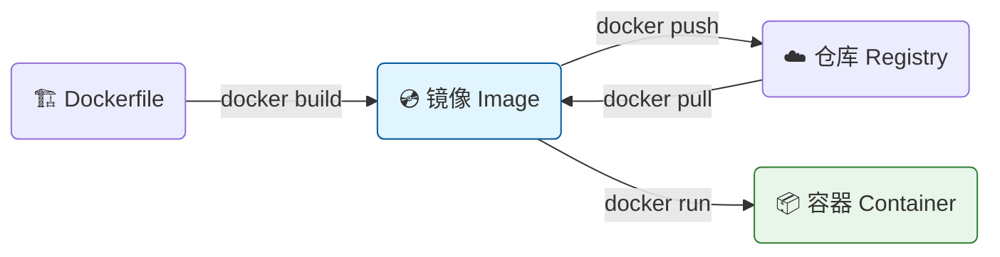
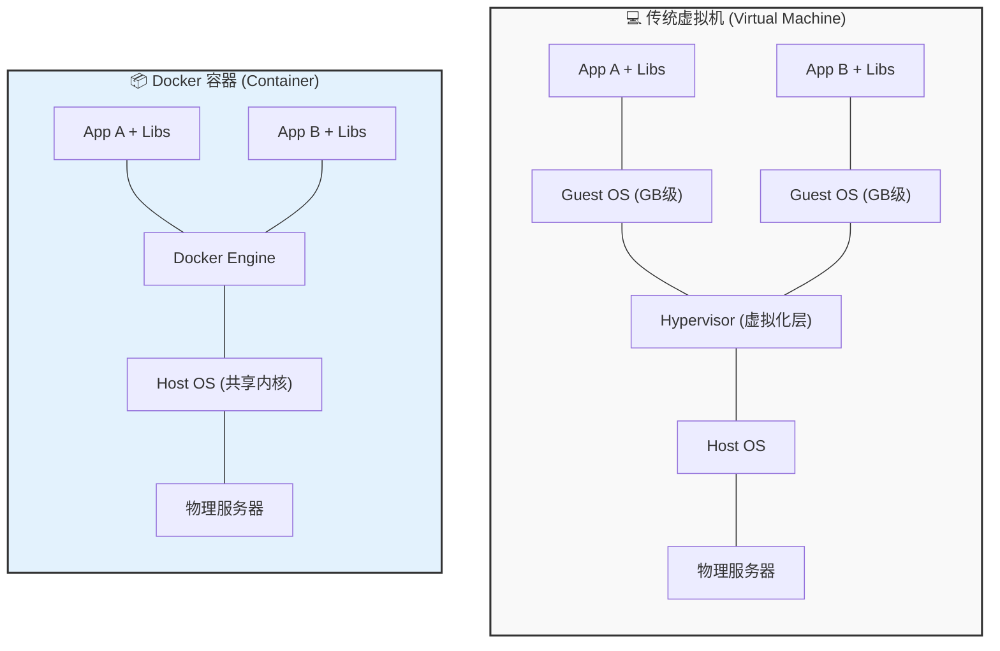

---

# 🐳 Docker核心架构与原理

> ℹ️ **定义**：Docker 是一个开源的应用容器引擎。它允许开发者将应用及其依赖包打包到一个可移植的**镜像 (Image)** 中，然后发布到任何流行的 Linux/Windows 机器上，也可以实现虚拟化。
> 
> **一句话总结**：Docker 就是软件行业的“集装箱”标准，解决了“在我的机器上能跑，在服务器上跑不起来”的经典难题。

---

## 🧩 核心概念三剑客 (The Big Three)

理解 Docker，必须搞懂三个核心对象：**镜像 (Image)**、**容器 (Container)**、**仓库 (Registry)**。

### 1. 镜像 (Image) —— "只读的模版"

- **类比**：面向对象编程中的 **`Class` (类)**，或者系统安装光盘 `.iso`。
    
- **特性**：
    
    - **静态**：镜像是一个静态的文件集合。
        
    - **分层 (Layered)**：它不是一个大文件，而是由多层文件系统（UnionFS）叠加而成。每一层代表 Dockerfile 中的一个指令（如 `apt-get install`）。
        
    - **只读**：构建完成后，镜像内容不可变。
        

### 2. 容器 (Container) —— "运行的实例"

- **类比**：面向对象编程中的 **`Object` (对象)** (即 `new Class()`)。
    
- **特性**：
    
    - **动态**：它是镜像运行时的实体，有进程、网络、内存消耗。
        
    - **可写层**：容器启动时，Docker 会在镜像的顶部挂载一个“读写层”。你在容器里修改文件，其实是修改的这个临时层（Copy-on-Write 机制）。
        
    - **隔离**：每个容器以为自己拥有独立的操作系统。
        

### 3. 仓库 (Registry) —— "代码仓库"

- **类比**：**GitHub** / Maven Repository。
    
- **特性**：用于存储和分发镜像。最著名的是 Docker Hub。企业通常搭建私有仓库 (Harbor)。
    

### 🏗️ 关系图谱

---

## 🆚 Docker 容器 vs 虚拟机 (Container vs VM)

这是架构选型中最关键的概念。**为什么 Docker 启动只要几秒，而虚拟机要几分钟？**

### 1. 架构对比图

### 2. 核心区别深度解析

|**特性**|**📦 Docker 容器**|**💻 虚拟机 (VM)**|**架构师解读**|
|---|---|---|---|
|**操作系统**|**共享 Host 内核**|**独立的 Guest OS**|**这是根本区别**。VM 需要模拟硬件并运行完整的 OS（很重）；Docker 直接利用宿主机内核（很轻）。|
|**启动速度**|**秒级**|分钟级|Docker 只是启动一个进程；VM 需要经历 BIOS 自检、OS 引导等全套流程。|
|**磁盘占用**|MB 级|GB 级|镜像分层复用，体积极小；VM 需要安装完整的操作系统文件。|
|**性能损耗**|**接近原生**|较高|Docker 是进程级隔离，指令直接由 CPU 执行；VM 需要 Hypervisor 转换指令。|
|**隔离性**|进程级 (较弱)|系统级 (强)|VM 隔离更彻底，更安全；Docker 若内核崩溃，所有容器受影响。|

---

## 🧬 底层技术揭秘 (Under the Hood)

Docker 并不是一项单一的新技术，而是对 Linux 内核特性的巧妙封装。架构师需要知道它是**如何实现隔离**和**资源限制**的。

### 1. Namespaces (命名空间) —— 实现"隔离"

Docker 让容器“产生幻觉”，以为自己独自拥有整个系统。

- **PID Namespace**：容器内的进程 ID 也是从 1 开始的，它看不到宿主机的其他进程。
    
- **Network Namespace**：容器拥有独立的网卡、IP 和路由表。
    
- **Mount Namespace**：容器拥有独立的文件系统挂载点。
    
- **User Namespace**：容器内的 root 用户在宿主机上可能只是一个普通用户。
    

### 2. Cgroups (控制组) —— 实现"限制"

如果没有 Cgroups，一个容器可能会吃光所有内存导致死机。

- **作用**：限制容器能使用的资源上限（CPU 核数、内存大小、磁盘 I/O 速度）。
    
- **命令体现**：`docker run --cpus=1.5 --memory=512m ...`
    

### 3. UnionFS (联合文件系统) —— 实现"分层"

Docker 镜像为什么能分层？为什么 `pull` 一个新镜像时，如果底层已经存在就不需要重新下载？

- **原理**：UnionFS 允许将多个目录（层）挂载到同一个虚拟文件系统下。
    
- **Copy-on-Write (写时复制)**：
    
    - 镜像层是 **Read-Only** 的。
        
    - 当容器需要修改镜像里的文件（比如 `etc/nginx.conf`）时，Docker 不会修改原始镜像，而是将该文件**复制**到容器的 **Writable Layer** 进行修改。
        
    - 这就是为什么你删除了容器，镜像本身毫发无损。
        

---

## 🚀 总结：为什么选择 Docker？

1. **一致性 (Consistency)**：Dev 环境和 Prod 环境完全一致（OS 依赖都打在包里了）。
    
2. **轻量级 (Lightweight)**：一台笔记本能跑几十个微服务容器，但跑不动几十个 VM。
    
3. **可移植性 (Portability)**：Build once, Run anywhere.
    
4. **弹性伸缩 (Scalability)**：配合 K8s，秒级扩容，应对流量洪峰。