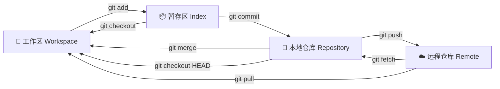

---
# 🐙 Git 分布式版本控制

> 💡 **核心理念**：Git 的本质是**状态机**。理解工作区 (Workspace)、暂存区 (Index/Stage)、本地仓库 (Repository) 和远程仓库 (Remote) 之间的流转是掌握 Git 的关键。

## 🧩 核心工作流原理 (Core Workflow)

在执行命令前，请先理解数据是如何在不同区域流转的：



---

## 🏗️ 第一章：初始化与配置 (Init & Setup)

|**命令**|**说明**|**场景**|
|---|---|---|
|`git init`|在当前目录新建代码库|项目起步|
|`git init [project-name]`|新建文件夹并初始化|全新项目|
|`git clone [url]`|下载项目及其完整历史|接手现有项目|

---

## 📦 第二章：代码暂存与提交 (Stage & Commit)

### 1. 文件管理 (Add/Rm/Mv)

```shell
# 🟢 添加文件
git add [file1] [file2] ...   # 添加指定文件
git add [dir]                 # 添加指定目录（含子目录）
git add .                     # 添加当前目录所有变动
git add -p                    # 交互式添加 (这也想提交? y/n) - 💡 代码审查神器

# 🔴 删除与移动
git rm [file1] [file2] ...    # 删除工作区文件，并记录删除操作
git rm --cached [file]        # 停止追踪文件 (保留工作区文件，常用于补加 .gitignore)
git mv [original] [renamed]   # 改名 (Git 会识别为 Rename 而非 Delete+Add)
```

### 2. 提交快照 (Commit)

```shell
# 💾 提交
git commit -m "feat: message"       # 提交暂存区
git commit [file1] ... -m "message" # 跳过 add 步骤，直接提交指定文件
git commit -a                       # 提交工作区自上次 commit 后的所有变化 (不含新文件)
git commit -v                       # 提交时显示 Diff 信息 (推荐，防写错)

# 🔧 修正提交 (修补历史)
# ⚠️ 注意：不要对已 Push 的 commit 使用 amend，会导致历史冲突
git commit --amend -m "new msg"     # 修改上一次提交的注释
git commit --amend [file1] ...      # 将漏掉的文件补入上一次提交
```

---

## 🌿 第三章：分支管理 (Branching)

分支是 Git 的杀手级特性，用于并行开发。

### 1. 查看与创建

|**命令**|**说明**|
|---|---|
|`git branch`|列出本地分支 (带 * 号为当前)|
|`git branch -r`|列出远程分支|
|`git branch -a`|列出所有分支 (本地+远程)|
|`git branch [name]`|新建分支 (停留在当前)|
|`git checkout -b [name]`|**新建并切换**到该分支 (最常用)|
|`git branch [name] [commit]`|基于指定 commit 创建分支|

### 2. 切换与追踪

```shell
# 🔀 切换
git checkout [branch-name]      # 切换分支
git checkout -                  # 切回上一个分支 (类似 TV遥控器的“回看”)

# 🔗 追踪关系 (Upstream)
# 建立当前分支与远程分支的追踪关系
git branch --set-upstream [branch] [remote-branch]
# 新建分支时直接建立追踪
git branch --track [new-branch] [remote-branch]
```

### 3. 合并与删除

```shell
# 🤝 合并
git merge [branch]              # 将指定分支合并到当前分支
git cherry-pick [commit]        # 🍒 摘樱桃：只把某个 commit 合并过来

# 🗑️ 删除
git branch -d [branch-name]     # 删除本地分支 (未合并会报错)
git branch -D [branch-name]     # 强制删除
git push origin --delete [name] # 删除远程分支
git branch -dr [remote/branch]  # 删除本地的远程分支引用
```

---

## 🏷️ 第四章：标签管理 (Tags)

用于标记发布版本（Release）。

```shell
# 📌 打标签
git tag                         # 列出所有 tag
git tag [tag]                   # 在当前 commit 打标签 (如 v1.0)
git tag [tag] [commit]          # 给历史 commit 补打标签

# 📤 推送与删除
git push [remote] [tag]         # 推送指定 tag
git push [remote] --tags        # 推送所有 tags
git tag -d [tag]                # 删除本地 tag
git push origin :refs/tags/[v1] # 删除远程 tag
```

---

## 🔍 第五章：审计与日志 (Logs & Diff)

### 1. 历史记录 (Log)

```shell
# 📜 基础日志
git status                      # 查看当前状态 (必用)
git log                         # 查看提交历史
git log --stat                  # 显示每次提交的文件增删行数
git reflog                      # 🚑 救命命令：查看所有 HEAD 变动 (包括被回滚的)

# 🔍 搜索与过滤
git log -S [keyword]            # 搜索代码变动 (是谁写了这行代码？)
git log [tag] HEAD --grep feat  # 搜索 commit message
git log --follow [file]         # 查看文件历史 (含改名记录)
git blame [file]                # 锅是谁的？查看文件每行是谁修改的
```

### 2. 差异对比 (Diff)

```shell
git diff                        # 工作区 vs 暂存区
git diff --cached [file]        # 暂存区 vs 上次 commit
git diff HEAD                   # 工作区 vs 上次 commit
git diff [branch1]...[branch2]  # 对比两个分支的差异
```

---

## ☁️ 第六章：远程同步 (Remote Sync)

```shell
# 📡 远程仓库管理
git remote -v                   # 查看远程地址
git remote add [name] [url]     # 添加远程仓库
git remote show [remote]        # 查看详细信息

# 📥 拉取
git fetch [remote]              # 下载变动 (不合并，最安全)
git pull [remote] [branch]      # 下载 + 合并 (Fetch + Merge)

# 📤 推送
git push [remote] [branch]      # 推送分支
git push [remote] --force       # ⚠️ 强推 (覆盖远程历史，慎用！)
git push [remote] --all         # 推送所有分支
```

---

## ↩️ 第七章：撤销与回滚 (Undo & Reset)

### 1. 撤销修改 (Checkout/Revert)

```shell
# 🔙 撤销工作区修改
git checkout [file]             # 丢弃工作区对文件的修改 (危险！)
git checkout .                  # 丢弃工作区所有修改

# 🛡️ 撤销提交 (生成新提交)
git revert [commit]             # 生成一个反向 commit 来抵消指定提交 (安全，适合公共分支)
```

### 2. 重置版本 (Reset) - 核心难点

`git reset` 有三种模式，请务必分清：

|**模式**|**命令**|**暂存区 (Index)**|**工作区 (Work)**|**适用场景**|
|---|---|---|---|---|
|**Soft**|`git reset --soft [commit]`|✅ 保留|✅ 保留|想重新提交 commit，但保留代码|
|**Mixed**|`git reset [commit]`|❌ 重置|✅ 保留|(默认) 想撤销 `git add` 的操作|
|**Hard**|`git reset --hard [commit]`|❌ 重置|❌ 重置|**彻底回滚**，放弃所有修改 (慎用)|

### 3. 现场保存 (Stash)

当你正在修 Bug，突然要切换分支，但不想 commit 半成品时：

```shell
git stash                       # 暂存当前工作现场
git stash pop                   # 恢复并删除最近一次暂存
git stash list                  # 查看暂存列表
```

---

## 🎁 附录：生成发布包

```shell
# 将 master 分支打包为 zip
git archive --format zip --output "./output.zip" master
```