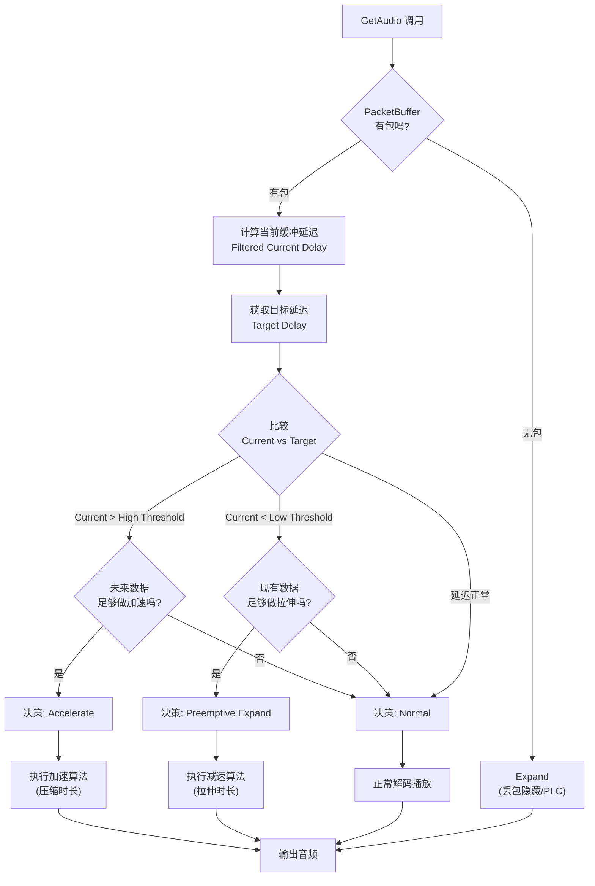
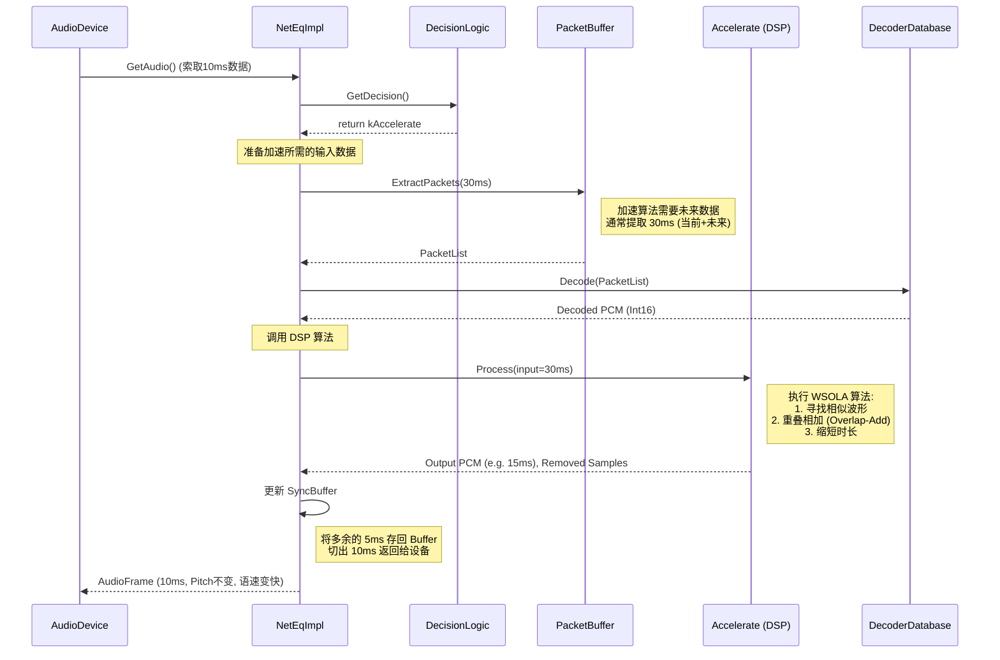

------
### 第一部分：控制逻辑与决策流程

NetEq 的大脑是 `DecisionLogic` 类。它的核心任务是在每次 `GetAudio`（通常每 10ms 调用一次）时，决定下一步该做什么。

#### 1. 控制逻辑流程图 (Mermaid)

这个流程图展示了 NetEq 如何判断是否需要加速（追帧）或减速。




#### 2. 源码分析：`DecisionLogic::GetDecision`

主要逻辑位于 `audio_coding/neteq/decision_logic.cc`。

```C++
// 源码文件: audio_coding/neteq/decision_logic.cc

NetEq::Operation DecisionLogic::GetDecision(const NetEqController::NetEqStatus& status,
                                            bool* reset_decoder) {
  // ... (省略部分重置逻辑)

  // 1. 获取当前缓冲区延迟 (经过滤波平滑后的值，单位 ms)
  // 这是 NetEq 对当前积压程度的评估
  const int current_delay_ms = status.filtered_current_delay_ms;
  
  // 2. 检查是否检测到“峰值”模式 (网络突然抖动)，这种情况下通常避免激进操作
  const bool peak_found = delay_manager_->PeakFound();

  // 3. 计算目标延迟 (Target Delay)
  // 这是 DelayManager 根据网络抖动统计出来的理想延迟值
  const int target_level_ms = delay_manager_->TargetDelayMs();
  
  // 4. 计算阈值 (迟滞区间，防止频繁切换)
  // 高水位：目标延迟 + 阈值 (通常是 20ms 或 packet_len / 2)
  const int high_threshold = target_level_ms + high_threshold_offset_;
  // 低水位：目标延迟 - 阈值
  const int low_threshold = target_level_ms - low_threshold_offset_;

  // ...

  // === 核心判断逻辑 ===
  
  // 场景 A: 积压过多，需要加速 (Accelerate)
  if (current_delay_ms > high_threshold && !peak_found) {
     // 检查是否有足够的“未来数据”来执行加速算法。
     // WSOLA 算法通常需要至少 30ms 的数据来寻找相关性。
     if (status.packet_buffer_info.span_samples >= kMinSamplesForAccelerate) {
         return NetEq::Operation::kAccelerate; // -> 触发追帧
     }
  }
  
  // 场景 B: 存货不足，需要减速 (Preemptive Expand)
  else if (current_delay_ms < low_threshold) {
     // 检查是否还有数据可拉伸。
     if (status.packet_buffer_info.span_samples >= kMinSamplesForPreemptiveExpand) {
         return NetEq::Operation::kPreemptiveExpand; // -> 触发慢放
     }
  }

  // 场景 C: 正常
  return NetEq::Operation::kNormal;
}
```

------
### 第二部分：追帧加速 (Accelerate) 的执行细节

当 `DecisionLogic` 返回 `kAccelerate` 后，进入执行阶段。

#### 1. 时序图：追帧加速调用栈



#### 2. 详细源码分析：输入、处理与输出


这部分逻辑主要涉及 `NetEqImpl::GetAudio` 和 `Accelerate::Process`。

步骤 1: NetEqImpl 准备数据

在 audio_coding/neteq/neteq_impl.cc 中：

```C++
int NetEqImpl::GetAudio(...) {
  // ... 获取决策 ...
  if (operation == kAccelerate) {
     // 关键点：加速需要更多的数据！
     // 标准输出是 10ms，但为了做 WSOLA，我们需要提取更多数据（例如 30ms）
     // 以便在里面找到可以重叠的部分。
     ExtractPackets(kAccelerateInputSamples, &packet_list); 
     
     // 解码这些包，得到原始 PCM 数据
     Decode(&packet_list, &decoded_buffer); 
     
     // 调用 Accelerate 模块
     // algorithm_buffer_ 是用于 DSP 处理的中间容器
     // decoded_buffer 包含了解码后的线性 PCM (int16)
     int16_t samples_removed = 0;
     accelerate_->Process(decoded_buffer, ..., &algorithm_buffer_, &samples_removed);
  }
}
```

步骤 2: Accelerate 执行 WSOLA 算法

这是最核心的“黑魔法”。文件位于 audio_coding/neteq/accelerate.cc。它继承自 TimeStretch 类（audio_coding/neteq/time_stretch.cc）。

- **输入 (Input)**: `decoded_buffer`。通常包含 `30ms` 的语音数据（比如 3 个 10ms 的包）。
- **处理 (Process)**:
  1. **特征分析**: 算法分析这 30ms 数据的**自相关性**（Auto-correlation）。
  2. **寻找匹配**: 它试图找到两个波形非常相似的区域（基音周期）。例如，发现第 5ms-10ms 的波形和第 15ms-20ms 的波形极其相似。
  3. **重叠相加 (Merge)**: 算法将这两段相似的波形“捏”在一起（Cross-fade）。
  4. **剪切**: 这样就安全地“吃掉”了中间的 10ms 数据，而不会产生爆音或改变音调（Pitch）。
- **输出 (Output)**: `algorithm_buffer_`。如果输入是 30ms，处理后可能剩下 20ms 或 15ms。
- **结果**: 时长变短了，相当于播放速度变快了，从而追上了网络延迟。

```C++
// 源码文件: audio_coding/neteq/accelerate.cc

Accelerate::ReturnCodes Accelerate::Process(const int16_t* input,
                                            size_t input_len,
                                            bool fast_accelerate,
                                            AudioMultiVector* output,
                                            size_t* length_change_samples) {
  // 1. 调用基类 TimeStretch 的逻辑
  // CheckCriteriaAndStretch 是通用的伸缩逻辑
  return CheckCriteriaAndStretch(input, input_len, ..., output, ...);
}

// 源码文件: audio_coding/neteq/time_stretch.cc

TimeStretch::ReturnCodes TimeStretch::CheckCriteriaAndStretch(...) {
  // ... 
  // 1. 自动相关性计算 (Auto-correlation)
  // 寻找最佳匹配点 (Best Match)
  // best_correlation 是相关性分数，peak_index 是匹配的位置
  
  // 2. 判断是否有足够的相似度
  if ((best_correlation > kCorrelationThreshold) ...) {
      // 3. 执行合并 (Overlap and Add)
      // 将 input 的两段数据合并，使得输出长度 < 输入长度
      MergeSamples(input, peak_index, ..., output);
      return kSuccess;
  }
  
  // 如果找不到相似波形（比如是杂音或清音），为了保证音质，可能放弃加速
  return kNoStretch; 
}
```

### 总结

1. **如何判断**: `DecisionLogic` 比较 **滤波后的当前延迟** 与 **目标延迟**。如果 `当前 > 目标 + 阈值` 且 `Buffer里数据足够`，则判断为 `kAccelerate`。
2. **输入了什么**: 输入了比正常播放所需更多的数据（通常是 **30ms** 的 PCM 样本），包含当前帧和未来的帧。
3. **干了什么**: 执行了 **WSOLA** 算法。它利用语音的周期性，找到两个相似的波形片段并将它们融合（Overlap-Add），从而在**不改变音高**的前提下剔除了部分数据。
4. **输出了什么**: 输出了比输入更短的音频流（例如输入 30ms，输出 15-20ms），从而降低了缓冲区的水位，实现了“追帧”。