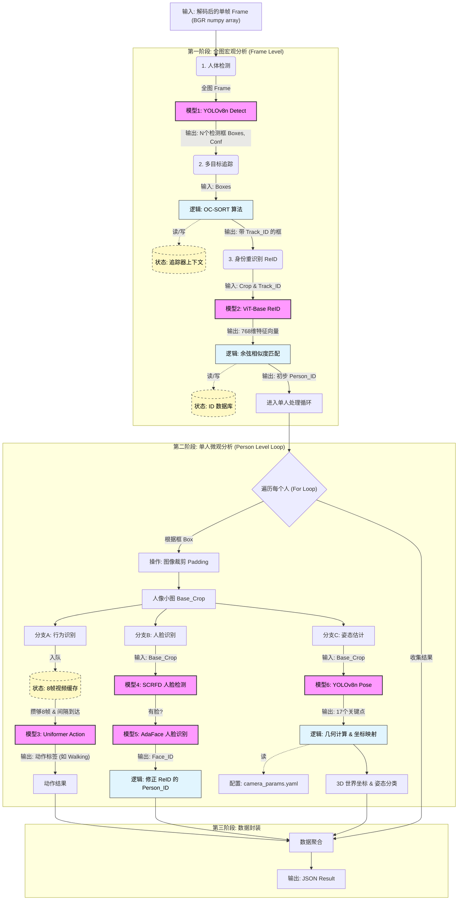

```mermaid
graph TD
    %% 定义样式
    classDef model fill:#f9f,stroke:#333,stroke-width:2px,color:black;
    classDef logic fill:#e1f5fe,stroke:#333,stroke-width:1px,color:black;
    classDef state fill:#fff9c4,stroke:#333,stroke-width:1px,stroke-dasharray: 5 5,color:black;

    %% === 全局输入 ===
    SubGraph_Input["输入: 解码后的单帧 Frame (BGR numpy array)"] --> Step1

    %% === 第一阶段 ===
    subgraph Stage1_Global ["第一阶段: 全图宏观分析 (Frame Level)"]
        direction TB
        Step1("1. 人体检测") -->|全图 Frame| Model_YOLO["模型1: YOLOv8n Detect"]:::model
        Model_YOLO -->|"输出: N个检测框 Boxes, Conf"| Step2("2. 多目标追踪")
        
        Step2 -->|输入: Boxes| Logic_OCSORT["逻辑: OC-SORT 算法"]:::logic
        Logic_OCSORT -.->|读/写| State_Tracker[("状态: 追踪器上下文")]:::state
        Logic_OCSORT -->|"输出: 带 Track_ID 的框"| Step3
        
        Step3("3. 身份重识别 ReID") -->|"输入: Crop & Track_ID"| Model_ViT["模型2: ViT-Base ReID"]:::model
        Model_ViT -->|输出: 768维特征向量| Logic_Match["逻辑: 余弦相似度匹配"]:::logic
        Logic_Match -.->|读/写| State_Identity[("状态: ID 数据库")]:::state
        Logic_Match -->|输出: 初步 Person_ID| Split["进入单人处理循环"]
    end

    Split --> Loop_Start

    %% === 第二阶段 ===
    subgraph Stage2_Local ["第二阶段: 单人微观分析 (Person Level Loop)"]
        direction TB
        Loop_Start{"遍历每个人 (For Loop)"} -->|根据框 Box| Op_Crop["操作: 图像裁剪 Padding"]
        Op_Crop --> Data_Crop["人像小图 Base_Crop"]

        %% 分支A
        Data_Crop --> Branch_Action["分支A: 行为识别"]
        Branch_Action -->|入队| State_Buffer[("状态: 8帧视频缓存")]:::state
        State_Buffer --"攒够8帧 & 间隔到达"--> Model_Action["模型3: Uniformer Action"]:::model
        Model_Action -->|"输出: 动作标签 (如 Walking)"| Res_Action["动作结果"]

        %% 分支B
        Data_Crop --> Branch_Face["分支B: 人脸识别"]
        Branch_Face -->|输入: Base_Crop| Model_SCRFD["模型4: SCRFD 人脸检测"]:::model
        Model_SCRFD --"有脸?"--> Model_AdaFace["模型5: AdaFace 人脸识别"]:::model
        Model_AdaFace -->|输出: Face_ID| Logic_Correct["逻辑: 修正 ReID 的 Person_ID"]:::logic

        %% 分支C
        Data_Crop --> Branch_Pose["分支C: 姿态估计"]
        Branch_Pose -->|输入: Base_Crop| Model_Pose["模型6: YOLOv8n Pose"]:::model
        Model_Pose -->|输出: 17个关键点| Logic_Geo["逻辑: 几何计算 & 坐标映射"]:::logic
        Logic_Geo -.->|读| Config_Camera["配置: camera_params.yaml"]
        Logic_Geo --> Res_World["3D 世界坐标 & 姿态分类"]
    end

    Loop_Start -->|收集结果| Aggregator
    Logic_Correct --> Aggregator
    Res_Action --> Aggregator
    Res_World --> Aggregator

    %% === 第三阶段 ===
    subgraph Stage3_Output ["第三阶段: 数据封装"]
        Aggregator["数据聚合"] --> Output_JSON["输出: JSON Result"]
    end
```

