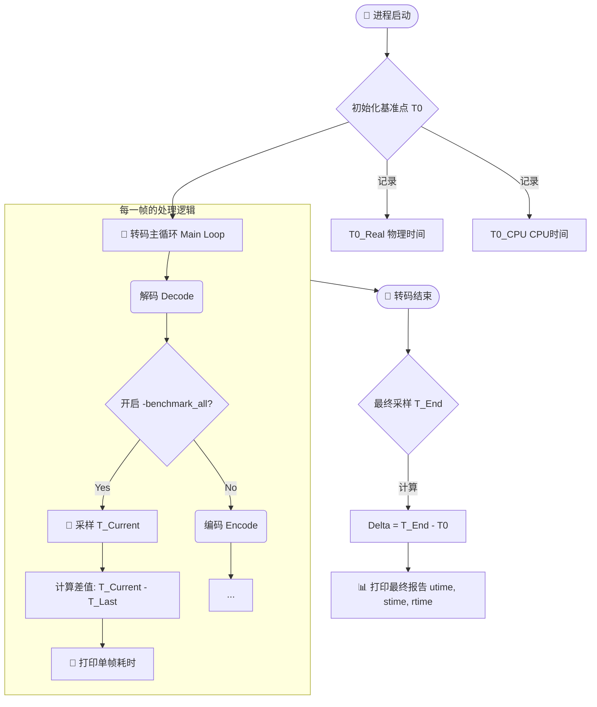

---

# ⏱️ FFmpeg Benchmark 全指南：命令行实战与源码内幕

> ℹ️ **定义**：FFmpeg 的 Benchmark 机制是一套性能审计工具。
> 
> - **对运维/QA**：它是命令行参数，用于通过 `-benchmark` 诊断转码慢是卡在 CPU 还是网络 I/O。
>     
> - **对开发者**：它是基于 OS 系统调用 (`getrusage`/`GetProcessTimes`) 的资源探测逻辑，用于量化每一帧的计算成本。
>     

---

## 🏗️ 第一部分：命令行实战 (CLI Operations)

_(这是您要求的被恢复的内容，针对日常测试和运维场景)_

### 1. 核心参数速查 (Command Specs)

|**参数 (Param)**|**作用范围**|**性能损耗**|**说明 (Description)**|
|---|---|---|---|
|`-benchmark`|全局|🟢 极低|程序结束时输出**总耗时**和**最大内存**。最常用的性能概览参数。|
|`-benchmark_all`|逐帧|🔴 高|**极度详细**。在每次解码、编码、刷新操作后输出耗时。用于定位具体哪一帧处理慢。|
|`-stats`|过程|🟢 低|默认开启。在 CLI 底部显示实时编码速率、FPS、码率等。|
|`-vstats`|视频|🟡 中|将详细的视频编码统计（包括 QP、帧类型等）输出到日志文件。|

### 2. 输出格式深度解析 (Log Analysis)

#### 🅰️ 概览模式 (`-benchmark`)

程序结束时打印，格式如下：

```Plaintext
bench: utime=2.340s stime=0.120s rtime=2.580s
bench: maxrss=1024kB
```

|**字段**|**全称**|**含义与判定**|
|---|---|---|
|**utime**|User CPU Time|**纯计算时间**。若此值低但 `rtime` 高，说明 CPU 在等待（如等网络数据）。|
|**stime**|System CPU Time|**内核开销**。若过高，检查磁盘 I/O 或内存分配（Swapping）。|
|**rtime**|Real (Wall) Time|**物理时间**。用户感知的总时长。|
|**maxrss**|Max Resident Set|**峰值内存**。用于评估内存泄漏或 OOM 风险。|

#### 🅱️ 详细模式 (`-benchmark_all`)

每一帧处理完都会打印：


```Plaintext
bench: 120 user 0 sys 150 real encode_video 0.0
```

|**位置**|**示例值**|**含义**|
|---|---|---|
|1|`120`|本次操作消耗的 **User Time** (微秒)|
|2|`0`|本次操作消耗的 **Sys Time** (微秒)|
|3|`150`|本次操作消耗的 **Real Time** (微秒)|
|4|`encode_video`|操作类型 (`decode/encode/flush` + `video/audio`)|
|5|`0.0`|流索引 (`文件ID.流ID`)|

### 3. 辅助调试参数 (Auxiliary Debugging)

当 Benchmark 显示 `rtime` 异常时，配合以下参数排查：

|**参数**|**类型**|**建议值**|**说明**|
|---|---|---|---|
|`-rw_timeout`|网络|`5000000` (5s)|TCP/RTMP 读写超时，防止拉流卡死导致 `rtime` 虚高。|
|`-probesize`|缓冲|`10M`|探测流格式时读取的数据量。|
|`-err_detect`|纠错|`ignore_err`|遇到错误时的策略，避免测试中途崩溃。|

---

## 🧬 第二部分：源码核心逻辑 (Internal Mechanism)

### 1. 工作流 (Workflow)

命令行之所以能打印出上述数据，是因为 FFmpeg 内部维护了一个资源“快照”机制。




### 2. 核心算法伪代码 (C++ Pseudo-Code)

这是 `fftools/ffmpeg.c` 内部逻辑的抽象复刻。

#### 数据结构与探针


```C++
// 资源快照结构 (对应 CLI 输出的 user/sys/real)
struct BenchmarkTimeStamps {
    int64_t real_usec;  // 墙钟时间
    int64_t user_usec;  // 用户态 CPU 时间
    int64_t sys_usec;   // 内核态 CPU 时间
};

// 操作系统 API 包装
// 内部封装了 Linux getrusage() 或 Windows GetProcessTimes()
BenchmarkTimeStamps get_system_metrics() {
    BenchmarkTimeStamps stats;
    stats.real_usec = av_gettime_relative(); 
    stats.user_usec = os_get_cpu_user();     
    stats.sys_usec  = os_get_cpu_sys();      
    return stats;
}
```

#### 主循环逻辑 (The "Stopwatch" Logic)

展示了 `-benchmark` 和 `-benchmark_all` 如何共存。

```C++
void main_transcode_process() {
    // 1. 【全局计时开始】对应 -benchmark
    BenchmarkTimeStamps global_start = get_system_metrics();
    
    // 游标：用于 -benchmark_all 记录"上一帧"时刻
    BenchmarkTimeStamps last_snapshot = global_start; 

    while (AVPacket* pkt = read_packet()) {
        
        // --- 解码阶段 ---
        AVFrame* frame = decode(pkt);
        
        // [逻辑分支] 如果用户加了 -benchmark_all
        if (config.benchmark_all) {
            BenchmarkTimeStamps current = get_system_metrics();
            
            // 核心算法：本次耗时 = 当前时刻 - 上次时刻
            print_delta(current, last_snapshot, "decode_video");
            
            // 关键：将游标向前移动
            last_snapshot = current; 
        }
            
        // --- 编码阶段 ---
        encode(frame);
        
        if (config.benchmark_all) {
            BenchmarkTimeStamps current = get_system_metrics();
            print_delta(current, last_snapshot, "encode_video");
            last_snapshot = current;
        }
    }

    // 2. 【全局计时结束】对应 -benchmark
    BenchmarkTimeStamps global_end = get_system_metrics();
    
    // 打印最终总结 (Total Time)
    print_summary(global_end, global_start);
}
```

---

## 📊 第三部分：性能诊断指南 (Diagnosis Guide)


通过对比 `utime` (CPU) 和 `rtime` (物理时间) 的关系，我们可以精准定位瓶颈。

### 场景 A：计算密集型 (CPU Bound)

- **现象**：`utime` 很高，`rtime` 接近 `utime / 核心数`。
    
- CLI 输出示例：
    
    bench: utime=58s stime=1s rtime=10s (假设6核CPU，满载)
    
- **代码逻辑判据**：
    
    ```    C++
    if ((utime + stime) / rtime >= 0.9) // CPU 利用率极高
    ```
    
- **对策**：使用更快的 Preset (`-preset veryfast`)，或升级 CPU。
    

### 场景 B：I/O 阻塞型 (I/O Bound)

- **现象**：`rtime` 很大，但 `utime` 很小。CPU 在“空转”等待数据。
    
- CLI 输出示例：
    
    bench: utime=2s stime=0.5s rtime=60s
    
- **代码逻辑判据**：
    
    ```C++
    if (rtime > (utime + stime) * 2) // 大部分时间不在做计算
    ```
    
- **对策**：
    
    - 检查网络带宽（若是拉流）。
        
    - 增加 `-probesize` 或 `-analyzeduration`。
        
    - 检查磁盘读写速度。
        

### 场景 C：系统过载 (System Overhead)

- **现象**：`stime` 异常高，接近 `utime`。
    
- CLI 输出示例：
    
    bench: utime=10s stime=8s rtime=20s
    
- **代码逻辑判据**：
    
    ```    C++
    if (stime > utime * 0.5) // 内核态时间占比过大
    ```
    
- **对策**：
    
    - 检查是否发生 **Swap (内存交换)**。
        
    - 检查是否缓冲区 (`-buffer_size`) 太小导致频繁的系统调用。
## 📝 总结 (Summary)

1. **逻辑核心**：**快照相减法**。在操作前后分别给 CPU 和时钟“拍照”，然后算差值。
    
2. **精度差异**：
    
    - `-benchmark` 是 **进程级** 的总账，逻辑简单，开销小。
        
    - `-benchmark_all` 是 **操作级** 的流水账，逻辑是在每一步插入探针，开销大。
        
3. **多核逻辑**：`utime` 是所有 CPU 核心时间的**总和**。所以在 8 核 CPU 上，`utime` 理论上最高可以是 `rtime` 的 8 倍。