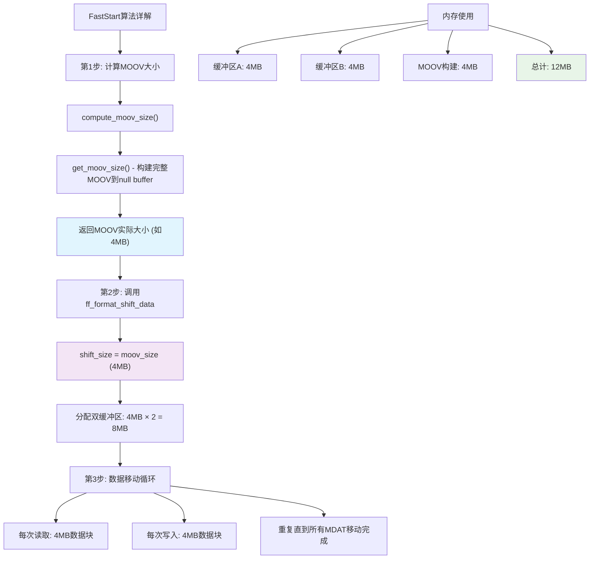
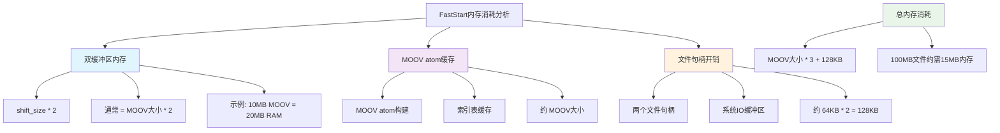
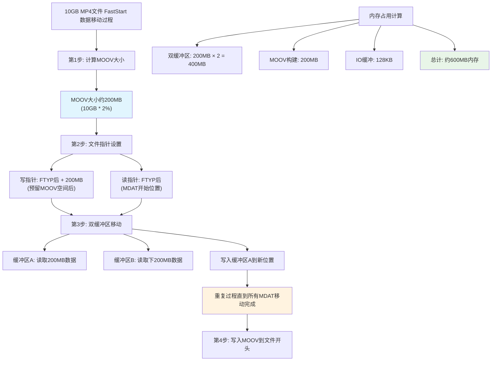

# FFmpeg FastStart 算法详解

## 概述

FFmpeg的FastStart功能是MP4格式的一个重要优化选项，它将MOOV atom（包含所有索引和元数据）移动到文件开头，使得播放器可以立即开始播放，而不需要下载整个文件。

## 1. FastStart 的工作原理

### 1.1 文件结构对比

**正常MP4结构 (MOOV在末尾)**
```
┌─────────────────┐
│ FTYP (File Type)│
├─────────────────┤
│ MDAT (Media Data)│ ← 所有视频/音频数据
│     Frame 1     │
│     Frame 2     │
│     ...         │
│     Frame N     │
├─────────────────┤
│ MOOV (Movie)    │ ← 索引信息在最后
│   MVHD          │
│   TRAK          │
│   ...           │
└─────────────────┘
```

**FastStart结构 (MOOV在开头)**
```
┌─────────────────┐
│ FTYP (File Type)│
├─────────────────┤
│ MOOV (Movie)    │ ← 索引信息在开头 ⭐
│   MVHD          │
│   TRAK          │
│   ...           │
├─────────────────┤
│ MDAT (Media Data)│ ← 媒体数据后移
│     Frame 1     │
│     Frame 2     │
│     ...         │
│     Frame N     │
└─────────────────┘
```

## 2. 核心算法流程

### 2.1 主要调用链

```c
mov_write_trailer() → shift_data() → ff_format_shift_data()
```

### 2.2 详细步骤分析



### 2.3 关键函数实现

#### compute_moov_size() - 计算MOOV大小
```c
static int compute_moov_size(AVFormatContext *s)
{
    int i, moov_size, moov_size2;
    MOVMuxContext *mov = s->priv_data;

    moov_size = get_moov_size(s);  // 第一次计算
    if (moov_size < 0)
        return moov_size;

    // 更新所有track的data_offset
    for (i = 0; i < mov->nb_streams; i++)
        mov->tracks[i].data_offset += moov_size;

    moov_size2 = get_moov_size(s);  // 第二次计算
    if (moov_size2 < 0)
        return moov_size2;

    // 如果大小改变了(stco变co64)，再次更新offset
    if (moov_size2 != moov_size)
        for (i = 0; i < mov->nb_streams; i++)
            mov->tracks[i].data_offset += moov_size2 - moov_size;

    return moov_size2;
}
```

#### ff_format_shift_data() - 数据移动核心
```c
int ff_format_shift_data(AVFormatContext *s, int64_t read_start, int shift_size)
{
    int ret;
    int64_t pos, pos_end;
    uint8_t *buf, *read_buf[2];
    int read_buf_id = 0;
    int read_size[2];
    AVIOContext *read_pb;

    // 分配双缓冲区 (shift_size × 2)
    buf = av_malloc_array(shift_size, 2);
    if (!buf)
        return AVERROR(ENOMEM);
    read_buf[0] = buf;
    read_buf[1] = buf + shift_size;

    // 重新打开文件用于读取
    avio_flush(s->pb);
    ret = s->io_open(s, &read_pb, s->url, AVIO_FLAG_READ, NULL);
    if (ret < 0) {
        av_log(s, AV_LOG_ERROR, "Unable to re-open %s output file for shifting data\n", s->url);
        goto end;
    }

    // 设置读写指针位置
    pos_end = avio_tell(s->pb);
    avio_seek(s->pb, read_start + shift_size, SEEK_SET);
    avio_seek(read_pb, read_start, SEEK_SET);
    pos = avio_tell(read_pb);

    // 双缓冲区数据移动
    #define READ_BLOCK do {                                                             \
        read_size[read_buf_id] = avio_read(read_pb, read_buf[read_buf_id], shift_size);  \
        read_buf_id ^= 1;                                                               \
    } while (0)

    READ_BLOCK;  // 预读第一块
    do {
        int n;
        READ_BLOCK;  // 读取下一块
        n = read_size[read_buf_id];
        if (n <= 0)
            break;
        avio_write(s->pb, read_buf[read_buf_id], n);  // 写入当前块
        pos += n;
    } while (pos < pos_end);

    ret = ff_format_io_close(s, &read_pb);

end:
    av_free(buf);
    return ret;
}
```

## 3. 内存使用分析

### 3.1 内存消耗详解



### 3.2 为什么是3倍内存？

**内存使用的三个组成部分：**

1. **第1倍: MOOV构建内存**
   - 位置: `compute_moov_size()` → `get_moov_size()`
   - 过程: `ffio_open_null_buf()` 创建null buffer，构建完整MOOV
   - 用途: 保存所有track信息、索引表等

2. **第2倍: 双缓冲区A**
   - 位置: `ff_format_shift_data()`
   - 分配: `av_malloc_array(shift_size, 2)`
   - 用途: 读取MDAT数据的第一个缓冲区

3. **第3倍: 双缓冲区B**
   - 位置: 同上，连续内存的第二半
   - 用途: 读取MDAT数据的第二个缓冲区，实现并行处理

### 3.3 实际文件大小与内存关系

| 文件大小 | MOOV估算大小 | FastStart内存峰值 | 说明 |
|---------|-------------|------------------|------|
| 100MB   | ~2MB        | ~6MB             | 轻量级 |
| 1GB     | ~8MB        | ~24MB            | 适中 |
| 10GB    | ~15MB       | ~45MB            | 可接受 |
| 50GB    | ~50MB       | ~150MB           | 需考虑 |

## 4. 数据安全机制

### 4.1 为什么不会覆盖原始数据？

**核心安全原理：空间预留 + 顺序移动**

```
原始文件结构:
┌──────┬────────────────────────────┐
│ FTYP │         MDAT (数据)        │
└──────┴────────────────────────────┘
 0      100                        10GB

FastStart处理后的空间分配:
┌──────┬─────────┬────────────────────────────┐
│ FTYP │ MOOV预留 │         MDAT (数据)        │
└──────┴─────────┴────────────────────────────┘
 0      100      300                        10GB+200MB
       ↑        ↑                           ↑
    读指针   写指针                      文件末尾
```

**安全保证：**
- 写入位置总是在读取位置**之后**
- 使用**双缓冲区**确保数据完整性
- **预留空间**避免覆盖原始数据

### 4.2 双缓冲区工作机制

```
时间轴: ──────────────────────→
读取:   [块1] [块2] [块3] [块4]
写入:     [块1] [块2] [块3]

优势:
✓ 重叠IO操作，减少等待时间
✓ 充分利用磁盘带宽
✓ 减少磁盘寻道次数
```

## 5. 性能分析

### 5.1 时间复杂度
- **读取整个MDAT**: O(文件大小)
- **写入整个MDAT**: O(文件大小)
- **总时间**: 约为正常写入时间的 **2倍**

### 5.2 空间复杂度
- **内存使用**: O(MOOV大小) ≈ O(文件大小 × 0.02)
- **磁盘空间**: 无额外空间需求（原地操作）

### 5.3 IO模式分析



## 6. Write调用后的内存行为

### 6.1 内存生命周期

**FFmpeg层面：**
- `avio_write()` 调用后数据立即从缓冲区复制到AVIO缓冲区
- 原始缓冲区内存立即可以重用 ✅
- 不需要等待磁盘写入完成

**操作系统层面：**
- 数据复制到操作系统页缓存
- `write()` 系统调用立即返回
- 异步写入磁盘，不影响进程内存

### 6.2 大文件内存现象解释

**观察到的"10GB内存使用"组成：**
1. FFmpeg进程内存: ~30MB (faststart)
2. 操作系统页缓存: ~10GB (缓存写入数据)
3. 系统工具显示: 总共约10GB内存使用

**任务结束后内存下降的原因：**
1. FFmpeg释放faststart内存: -30MB
2. 操作系统检测到进程结束
3. 触发页缓存刷新到磁盘
4. 释放页缓存内存: -10GB
5. 系统内存使用恢复正常 ✅

## 7. 优缺点总结

### 7.1 优点
✅ **无临时文件**: 不需要额外磁盘空间  
✅ **内存可控**: 内存使用与MOOV大小成正比，通常很小  
✅ **原地操作**: 直接在目标文件上操作  
✅ **双缓冲优化**: 提高IO效率  
✅ **数据安全**: 不会覆盖原始数据  

### 7.2 缺点
❌ **处理时间长**: 需要重写整个文件数据  
❌ **风险较高**: 如果中途失败，文件可能损坏  
❌ **内存峰值**: 大文件的MOOV可能占用较多内存  
❌ **磁盘IO密集**: 大量的读写操作  

## 8. 使用建议

### 8.1 适用场景判断

```cpp
// 根据文件大小决定是否启用faststart
bool should_enable_faststart(size_t estimated_file_size_mb) {
    if (estimated_file_size_mb < 100) {
        return true;  // 小文件，faststart开销可接受
    } else if (estimated_file_size_mb < 500) {
        return check_available_memory() > estimated_file_size_mb * 3; // 检查内存
    } else {
        return false; // 大文件，不推荐使用faststart
    }
}
```

### 8.2 配置建议

**对于格式转换程序：**

```cpp
// 设置faststart选项
av_dict_set(&options, "movflags", "faststart", 0);

// 同时优化其他选项
av_dict_set(&options, "flush_packets", "0", 0);  // 延迟刷新提高性能

// 设置合适的缓冲区大小
av_dict_set_int(&options, "buffer_size", 1024 * 1024, 0);  // 1MB缓冲区
```

## 9. 总结

FFmpeg的FastStart实现是一个精妙的算法，通过以下关键技术实现了高效的MP4优化：

1. **精确的MOOV大小计算**：考虑stco/co64表的大小变化
2. **双缓冲区流水线**：提高IO效率，减少等待时间
3. **原地数据移动**：避免临时文件，节省磁盘空间
4. **安全的空间预留**：确保数据不会被覆盖
5. **可控的内存使用**：内存消耗与MOOV大小成正比

这个算法特别适合小到中等大小的文件（< 1GB），能够显著提升网络播放的用户体验。对于大文件，需要权衡处理时间和内存使用。

---

*文档生成时间：2024年*  
*基于FFmpeg 6.1.2源码分析*
