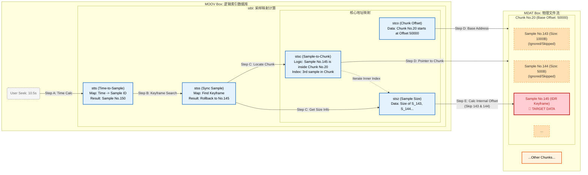

---

# 📘 深度笔记：MP4 文件结构与 Seek 算法全解

> 💡 **核心洞察**：MP4 的本质是 **“物理分离，逻辑关联”**。
> 
> - **物理上**：数据（mdat）是线性堆叠的，像仓库里的集装箱。
>     
> - **逻辑上**：索引（moov）是多维目录，通过复杂的映射表（stbl）指向具体数据的字节位置。
>     

## 🏗 一、物理视图：MP4 文件布局 (Physical Layout)

MP4 文件不是数据库，而是一个由 **Box (Atom)** 线性拼接的二进制流。

**核心特征**：

1. **线性存储**：Box 一个接一个，互不重叠。
    
2. **元数据分离**：
    
    - **`moov` (大脑)**：存放 stbl 等所有索引表。
        
    - **`mdat` (躯干)**：存放所有裸流数据（H.264 NALU / AAC Frame）。
        

### 🖼 物理结构树 (ASCII View)

```Plaintext
[文件开始 (File Start)]
 |
 +-- [ftyp] (20-32 bytes) : 📝 身份证 (协议版本声明)
 |
 +-- [moov] (Metadata)    : 🧠 大脑 (索引区)
 |    |
 |    +-- [mvhd] : 全局头 (时长、Timescale)
 |    +-- [trak] : 视频轨道 (Video Track)
 |    |    +-- [stbl] : 🔥 核心映射表 (5张神表)
 |    +-- [trak] : 音频轨道 (Audio Track)
 |
 +-- [mdat] (Media Data)  : 📦 仓库 (数据区 - 巨大)
 |    |
 |    +-- [Chunk 1 (Video)] --> 包含 Sample 1, Sample 2...
 |    +-- [Chunk 2 (Audio)] --> 包含 Sample 1, Sample 2...
 |    +-- [Chunk 3 (Video)] --> 包含 Sample 3...
 |
[文件结束 (EOF)]
```

> **⚠️ 注意**：`moov` 和 `mdat` 顺序不固定。流媒体（边下边播）必须将 `moov` 挪到文件头部（Fast Start），否则播放器必须下载完几 GB 的 `mdat` 才能读到索引。

---

## 🧠 二、逻辑视图：stbl 核心表解剖

`stbl` (Sample Table) 是最复杂的盒子，它不存数据，只存**映射关系**。

### 关键术语定义

- **Sample (样本)**：解码最小单元（一帧视频/音频）。
    
- **Chunk (块)**：磁盘 I/O 最小单元（包含 n 个连续 Sample）。
    

### 📊 五张核心表 (The 5 Pillars)

|**Box**|**全称**|**作用**|**核心字段结构 (C++ 对应)**|
|---|---|---|---|
|**stts**|Time-to-Sample|**⏱ 时间解码**<br><br>  <br><br>定义 Sample 时长|`struct { uint32 count; uint32 duration; }`<br><br>  <br><br>_(RLE 压缩存储)_|
|**stss**|Sync Sample|**🔑 关键帧索引**<br><br>  <br><br>所有 IDR 帧序号|`std::vector<uint32_t>`<br><br>  <br><br>_(只存关键帧 ID，1-based)_|
|**stsc**|Sample-to-Chunk|**🗺 样本-块映射**<br><br>  <br><br>Chunk 内部结构描述|`struct { uint32 first_chunk; uint32 samples_per_chunk; ... }`<br><br>  <br><br>_(最复杂，压缩了 Chunk 规则)_|
|**stsz**|Sample Size|**📏 样本大小**<br><br>  <br><br>每个 Sample 字节数|`std::vector<uint32_t>`<br><br>  <br><br>_(下标=帧号，值=大小)_|
|**stco**|Chunk Offset|**📍 物理偏移**<br><br>  <br><br>Chunk 在文件的绝对位置|`std::vector<uint32_t>`<br><br>  <br><br>_(指向 mdat 内部基准地址)_|

---

## 三、 映射视图：寻址原理 (核心架构图)

```Plaintext
+----------------------------------------------------------------+
|                    MOOV 索引区 (元数据数据库)                    |
+----------------------------------------------------------------+
|                                                                |
|  [stco 表] (Chunk 物理偏移量)                                   |
|  +-----------+----------------------+                          |
|  | Chunk ID  | 文件绝对偏移 (Offset) |                          |
|  +-----------+----------------------+                          |
|  |    #1     |        1000          | --(1. 定位基地址)-----+    |
|  |    #2     |        5000          |                      |    |
|  +-----------+----------------------+                      |    |
|                                                            |    |
|  [stsc 表] (Chunk 内部结构映射)                                 |
|  +-----------+-------------------+                         |    |
|  | Start Chk | Samples Per Chunk |                         |    |
|  +-----------+-------------------+                         |    |
|  |    #1     |         2         | --(2. 确定内部结构)--+    |    |
|  |    #2     |         1         |                      |    |    |
|  +-----------+-------------------+                      |    |    |
|                                                         |    |    |
|  [stsz 表] (Sample 大小)                                |    |    |
|  +-----------+-------------------+                      |    |    |
|  | Sample ID | Size (Bytes)      |                      |    |    |
|  +-----------+-------------------+                      |    |    |
|  |    #1     |       500         | --(3. 跳过前序帧)-+  |    |    |
|  |    #2     |       500         | --(4. 读取目标帧)-|--|---|--+
|  +-----------+-------------------+                   |  |   |  |
|                                                      |  |   |  |
+------------------------------------------------------+  |   |  |
                                                          |   |  |
             +--------------------------------------------+   |  |
             |                                                |  |
             v                                                v  v
+----------------------------------------------------------------+
|                    MDAT 数据区 (物理文件流)                      |
+----------------------------------------------------------------+
|  文件偏移: 1000                                                 |
|  [ Chunk #1 容器 ------------------------------------------- ] |
|  |                                                           | |
|  |    [ Sample #1 (数据) ]  <-- (被 stsz 计算跳过 500 字节)     | |
|  |    --------------------                                   | |
|  |    [ Sample #2 (目标) ]  <-- (最终读取位置 = 1000 + 500)     | |
|  |                                                           | |
|  [ --------------------------------------------------------- ] |
+----------------------------------------------------------------+
```

---
#### 📝 核心机制：二级寻址 (Two-Stage Addressing)

这张图揭示了 MP4 寻址的本质是 **“先定大楼，再找房间”** 的二级过程：

1. **第一级：宏观定位 (Chunk Level)**
    
    - **依赖表**：`stco` (Chunk Offset)
        
    - **逻辑**：MP4 不会记录每一个 Sample 的绝对物理地址（那样表会太大）。它只记录 **Chunk（集装箱）** 的起始位置。
        
    - **作用**：通过 `stco`，我们迅速定位到数据在磁盘上的 **基准地址 (Base Offset)**。
        
2. **第二级：微观定位 (Sample Level)**
    
    - **依赖表**：`stsc` (结构) + `stsz` (大小)
        
    - **逻辑**：进入 Chunk 内部后，数据是紧密排列的。我们要找到第 N 个 Sample，必须知道它前面所有 Sample 的大小总和。
        
    - **作用**：`stsc` 告诉我们在当前 Chunk 里目标是第几个；`stsz` 提供每个兄弟 Sample 的大小，用于累加计算 **内部偏移 (Internal Offset)**。
        

> **💡 总结**：`最终物理位置 = Chunk基准地址(stco) + Chunk内部累加偏移(stsz)`

## 四、 算法流程视图 (Detailed Flow)


寻址公式：

$$\text{FileOffset} = \text{stco}[ChunkID] + \sum_{i=Start}^{Target-1} \text{stsz}[i]$$

---
#### 📝 核心逻辑链：时空穿梭 (Time-Space Translation)

这个流程图展示了 Seek 操作如何在三个不同的“维度”之间转换：

1. **时间域 (Time Domain) -> 逻辑域 (Logical ID)**
    
    - **Step A (STTS)**：用户输入的是“秒”（如 10.5s），计算机只认“帧号”（Sample ID）。`stts` 通过累加时长（Duration），将连续的时间轴切割成离散的帧号。
        
2. **逻辑域对齐 (Keyframe Alignment)**
    
    - **Step B (STSS)**：这是最容易被忽略但最关键的一步。直接跳到计算出的 Sample ID 通常是 P 帧或 B 帧（依赖前向参考），直接解码会导致**花屏**。`stss` 强制将指针“回退”到最近的一个 IDR 关键帧，确保画面清晰完整。
        
3. **逻辑域 -> 物理域 (Physical Domain)**
    
    - **Step C & D (STSC/STCO/STSZ)**：这是最复杂的“解压缩”过程。
        
        - **STSC (Sample-to-Chunk)**：它是一个高度压缩的“规则表”。算法必须遍历这个表，计算出目标 Sample ID 到底落在哪一个 Chunk 编号里，以及是该 Chunk 里的老几。
            
        - **STSZ (Size)**：一旦确定了位置，就需要通过 `stsz` 一个个累加字节数，算出精确的物理偏移量。
            

> **💡 避坑指南**：整个流程中，**Step C (利用 STSC 计算 Chunk ID)** 是代码实现中 Bug 最多的地方。因为 `stsc` 存储的是“范围规则”（Range），而不是一一对应的数组，必须写循环去匹配 Sample ID 所在的范围。


## 💻 四、Seek 算法全流程实现 (C++ Production)

### 📥 输入

`target_time_sec` (秒, double)

### Step 1: 时间定位 (Time -> Sample ID)

利用 `stts` 将时间轴转换为帧号。

```C++
// 🔍 逻辑：累加 duration 直到覆盖 target_ticks
uint32_t TimeToSampleId(double target_time_sec) {
    uint64_t target_ticks = target_time_sec * timescale_;
    uint64_t current_ticks = 0;
    uint32_t sample_id = 1; // ⚠️ MP4 Sample ID 从 1 开始！

    for (const auto& entry : stts_) {
        uint64_t entry_duration = (uint64_t)entry.count * entry.duration;
        if (current_ticks + entry_duration > target_ticks) {
            // 目标在当前 entry 内
            uint64_t diff = target_ticks - current_ticks;
            return sample_id + (diff / entry.duration);
        }
        current_ticks += entry_duration;
        sample_id += entry.count;
    }
    return sample_id > 1 ? sample_id - 1 : 1;
}
```

### Step 2: 关键帧回退 (Sample ID -> KeyFrame ID)

利用 `stss` 确保 Seek 到 IDR 帧，防止花屏。

```C++

// 🔍 逻辑：二分查找找到 stss 中 <= sample_id 的最大值
uint32_t GetNearestKeyFrame(uint32_t target_sample_id) {
    if (stss_.empty()) return target_sample_id; // 音频通常无 stss

    auto it = std::upper_bound(stss_.begin(), stss_.end(), target_sample_id);
    if (it == stss_.begin()) return *it; 
    return *(--it); // 回退一个位置
}
```

### Step 3: 物理块定位 (KeyFrame ID -> Chunk ID)

利用 `stsc` 确定 Sample 在哪个 Chunk，以及是该 Chunk 的第几个。**（最易错步骤）**


```C++
// 🔍 逻辑：解析压缩的 stsc 表，找到 sample 所在的 group
void GetChunkInfo(uint32_t sample_id, uint32_t& out_chunk_index, uint32_t& out_index_inner) {
    uint32_t current_sample = 1;

    for (size_t i = 0; i < stsc_.size(); ++i) {
        uint32_t first_chunk = stsc_[i].first_chunk;
        // 计算当前 group 包含多少个 chunk (需处理最后一个 entry 的边界)
        uint32_t next_first_chunk = (i + 1 < stsc_.size()) ? stsc_[i+1].first_chunk : (stco_.size() + 1);
        uint32_t num_chunks = next_first_chunk - first_chunk;
        uint32_t samples_per_chunk = stsc_[i].samples_per_chunk;
        uint32_t samples_in_group = num_chunks * samples_per_chunk;

        // 判断目标是否在这个 group 里
        if (sample_id < current_sample + samples_in_group) {
            uint32_t diff = sample_id - current_sample;
            out_chunk_index = first_chunk + (diff / samples_per_chunk); // 1-based
            out_index_inner = diff % samples_per_chunk;              // 0-based
            return;
        }
        current_sample += samples_in_group;
    }
}
```

### Step 4: 计算最终偏移 (Chunk ID -> File Offset)

利用 `stco` 和 `stsz` 计算绝对字节位置。


```C++
// 🔍 逻辑：Base Offset + Internal Offset
uint64_t CalculateFileOffset(uint32_t chunk_index, uint32_t index_inside_chunk, uint32_t final_sample_id) {
    // 1. 获取 Chunk 基地址 (stco)
    // ⚠️ chunk_index 是 1-based，vector 是 0-based
    uint64_t base_offset = stco_[chunk_index - 1]; 

    // 2. 累加 Chunk 内部之前所有帧的大小 (stsz)
    uint64_t internal_offset = 0;
    uint32_t start_sample_of_chunk = final_sample_id - index_inside_chunk;

    for (uint32_t i = 0; i < index_inside_chunk; ++i) {
        internal_offset += stsz_[start_sample_of_chunk + i - 1]; // stsz 也是 0-based
    }

    return base_offset + internal_offset;
}
```

---

## 🚀 总结 (Actionable Takeaways)

> **一句话总结**：Seek 过程就是一次 **“时空穿梭”**——从 **时间域** (`stts`) 跳到 **逻辑域** (`stss/stsc`)，最后在 **物理域** (`stco`) 落地。

- ✅ **严谨处理 1-based 索引**：MP4 标准极其另类，Sample ID 和 Chunk ID 均从 1 开始，写代码时时刻记得 `-1`。
    
- ✅ **stsc 是个压缩表**：不要试图把 `stsc` 想象成数组，它是一组“规则范围”，解析时必须计算 `range`。
    
- ✅ **Seek 必找 IDR**：不做 Step 2 (关键帧回退)，视频必花屏。
    

---